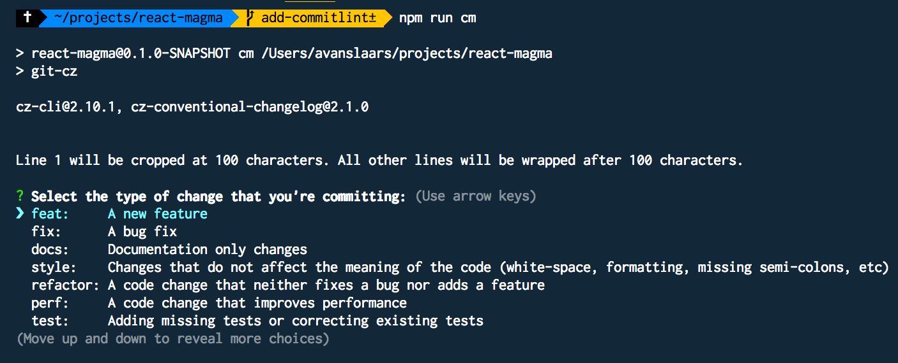
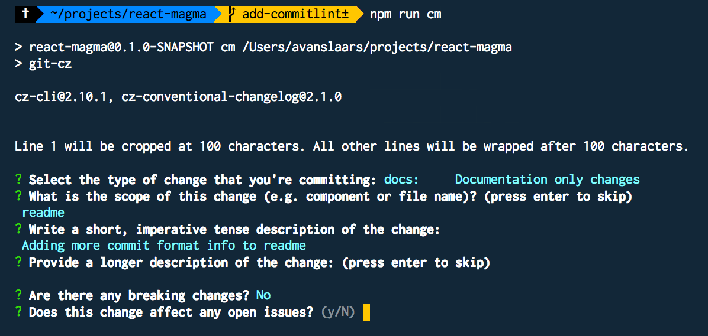
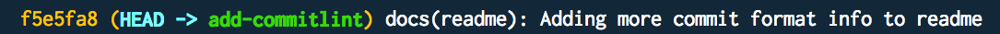

# React Magma

## Getting started with React Magma in your application

### Setup Requirements

1. Your project needs to be running **React v17**

### Add the react-magma components to your project

```sh
npm install --save react-magma-dom
```

### Documentation Site

For more information on using React Magma, see the [React Magma Documentation](https://react-magma.cengage.com/version/latest/)

This site has general usage information, as well as information on all of the available components, including code examples and demos. It also has design guidelines from the UX team with more details about the why and when to use each component in your project.

## Contributing to React Magma

### System Dependencies

Node v14.x or greater with npm 7.1.x or greater

### Steps to Run Documentation locally

1. Clone this repo:

```sh
git clone git@github.com:cengage/react-magma.git
```

2. Install the project's dependencies with the `npm ci` command

   <details>
     <summary>Why npm ci?</summary>

   Using `npm ci` instead of `npm install` will install dependencies based on `package-lock.json` so you will get specific package versions and it should also speed up the install.

   </details>

```sh
npm ci
```

3.  Run Storybook to view examples of each component with

```
npm run storybook
```

View Storybook examples at [http://localhost:6006/](http://localhost:6006/).

4. Run the development server for the docs site. You can run the docs from the repository root with

```
npm run docs
```

or from the package directory with

```
cd packages/react-magma-docs
npm run develop
```

Visit the docs at [http://localhost:8000](http://localhost:8000). The docs will not reflect local changes in the CodeSandbox examples.

### Project Structure

The project is built using a monorepo structure with the help of [Lerna](https://github.com/lerna/lerna).

Each folder under the `packages` folder is it's own, independent package. Each package can be built and deployed as a node module, or in the case of an app like `react-magma-docs`, it can be built and served as if it had its own repository.

Lerna handles dependencies within the monorepo, using symlinks to connect dependent packages. For example,`react-magma-docs` uses `react-magma-dom`. When a dependent project is build the consuming project automatically gets the latest build.

#### Source Organization

The project is broken out into multiple packages.

The `react-magma-dom` package is the React components for use in a browser. We followed this naming convention to leave room for `react-magma-native` and potentially other render targets in the future.

The `react-magma-docs` package handles the React Magma documentation, and is built on the <a href="https://www.gatsbyjs.org/">Gatsby framework</a>.

The `react-magma-icons` package handles all of the SVG icons in the React Magma library. Being in a separate package allows for changes or additions to the icons to happen without consumers having to update the whole component library.

### Adding new components

React-Magma uses [PlopJS](https://plopjs.com/) to scaffold new components. This simultaneously increases consistency with new components and speeds up the time it takes a developer to get started with a new component. Simply run `npm run plop` and answer the prompts. This will create a skeleton for the component with stories, tests and a page in the documentation.

### Building

Once you have finished making your code changes within a package run `npm run build` or `npm run build-watch` from inside that package.

You must build before your changes will be reflected in the browser.

### Running Tests

Each package has a `test` command. You can run them from the individual package, or you can run them from the root of the project.

Running `npm run test` or `npm run test-watch` from inside a specific package will run the tests for that package.

Running `npm run test` from the repository root will run the `test` command for all packages that include tests.

You can also run specific tests from the repository root with:

```sh
# run the dom tests
npm run test-dom
```

`npm run covg` to see the generated lcov coverage reports.

#### Wallaby.js

[](https://wallabyjs.com/oss/)

This repository contributors are welcome to use
[Wallaby.js OSS License](https://wallabyjs.com/oss/) to get
test results immediately as you type, and see the results in
your editor right next to your code.

### Updating the Docs

The `react-magma-docs` is the project for the documentation site. Any changes to the public API of an existing component or the creation of a new component **must** be accurately captured documented here.

This project uses [MDX](https://mdxjs.com/), allowing the combination of Markdown and React components.

Each component has its own `.mdx` file. If you have created a new component you will need to create a new `.mdx` file under the `pages/api` folder. If you have updated an existing component, you will need to review the existing docs page
and update it as needed.

#### Creating a Docs Page

Add in the navigation details at the top of the page in the front matter.

```yaml
---
pageTitle: '{ComponentName} API'
title: '{ComponentName}'
props:
  - {ComponentName}Props
---
```

Import the `ScopeableLayout` component. You may also need other things, such as components from `react-magma-dom` to use outside of examples (such as an `Alert`), or the`Link` from `gatsby` to link to other pages.

```js
import { ScopeableLayout } from '../../components/layout';
```

Add the `ScopeableLayout` component to the bottom of the file.

```
export default props => <ScopeableLayout {...props} />;
```

#### Page Heading

The heading for the docs page can be created by using markdown with the following syntax:

```
[{ComponentName}]("/design/{component} 'api')
```

The URL following the name of the component is the link to respective Designs Docs page, and is optional. The `api` string indicates that the page is in the `Component API`.


#### CodeSandbox Examples

Create a basic usage example and an example for each of the different use cases of the component, using [CodeSandbox](https://https://codesandbox.io/).

````
```tsx codesandbox=magma
import React from 'react';
import { ComponentName } from 'react-magma-dom';

export function Example() {
  return <ComponentName />;
}
```
````

#### Interfaces and Property Tables

The property tables that we use are generated automatically, but require some wiring up. The interface in the typescript file must be annotated with typedoc comments. You will also need to add the needed props to the frontmatter in the `mdx` file. This will allow for our props table component to match the props referenced in the frontmatter to build out the props table. For example:

```typescript
/**
 * @children required
 */
export interface SomeComponentProps
  extends React.HTMLAttributes<HTMLDivElement> {
  /**
   * The description for a component prop.
   * @default "the default prop value"
   */
  someOptionalComponentProp?: string;
}
```

```mdx
---
pageTitle: Some Component API
title: Some Component
props:
  - SomeComponentProps
---

## Examples

...

## props

<SomeComponentProps />
```

### Storybook Examples

React Magma uses [Storybook](https://storybook.js.org/) for local testing of individual UI components. Each component should have a Storybook story that reflects each of its variations in state. TThe story files live along side the individual component files. Run Storybook from the root folder:

```
npm run storybook
```

### Committing Code

This project adheres to [SemVer](https://semver.org/) and enforces a specific commit message format.

Commit messages for this project follow [the conventional commit format](https://www.conventionalcommits.org/en/v1.0.0-beta.2/).

This is enforced with a `commit-msg` hook via [Husky](https://github.com/typicode/husky) which also runs linting, prettier and tests prior to allowing a commit.

To make it easier to adhere to this format, there is a root level npm script that will help format your commit message.

**After adding your files to the git stage**, run:

```
npm run cm
```

<details>
  <summary>Learn more about SemVer and the commit message format:</summary>

SemVer is just a responsible way to release packages and it's the right thing to do.

Enforcing a commit message format allows us to automate version number changes, manage release channels (`latest`, `next`, `previous`, `x.x.x-beta.x`, etc.), and automate the creation of a consistent changelog and automate releases.

All commits will have a topic and short description with an optional subject.

There is a short version of the format that will pass the `commit-msg` check and a longer version for handling changes that need more explanation and for marking commits that contain breaking changes.

#### Commit Message Components:

- type (required)
- subject
- description (required)
- body
- footer (required _if_ there are breaking changes)

##### Types

The type is key in determining how to bump the version number in the next version number change. Available types are:

- `feat` - commit adds a new feature
- `fix` - commit fixes a bug
- `docs` - commit changes documentation only
- `test` - commit adds missing tests or corrects existing tests
- `refactor` - commit only has refactoring, code has changed but behavior and tests retain original functionality
- `perf` - like refactor, but the focus is on performance
- `build` - changes that affect the build system or external dependencies
- `ci` - commit changes CI configuration files
- `revert` - reverts a previous commit
- `style` - Changes that do not affect the meaning of the code (white-space, formatting, missing semi-colons, etc)
- `chore` - other changes that don't modify source or test files

##### Subject

The subject is an optional identifier. For example, if adding a new feature to a `Modal` component, you might use `modal` as your subject to provide context.

##### Description

Short description of the commit. The `commitlint` rules enforce a max length of 72 characters for the header, which is made up of the type, subject and description, along with the added characters to match the commit format, for example: `feat(modal):added support for closing via esc key`

##### Body

If the short description isn't enough to cover the details of your change, you can add more text in the body to expand on what the commit does and provide all the details you want.

##### Footer

The footer is where you designate a breaking change. So if you add a feature and that necessitates breaking changes to the existing API, you would use `feat` for the type and in the footer, you would add `BREAKING CHANGE: description of the breaking change`

#### Short commit message format

```bash
#format - with subject
git commit -m "<topic>(<subject>): <short description>"

#example - with subject
git commit -m "feat(button): Added icon capabilities to button"

#format - no subject
git commit -m "<topic>: <short description>"

#example - no subject
git commit -m "feat: Added icon capabilities to button"
```

#### Long commit message format (with a breaking change)

```bash
#format
git commit -m "<type>(subject): <short description>

<optional body>

<optional footer>"

#example
git commit -m "feat(button): Added icon capabilities to button

More verbose description of what was added with the icon feature of the button.

BREAKING CHANGE: description of what part of the API brakes with this commit"
```

#### Commit Tooling

To facilitate getting the commit format right, you can create your commit messages by adding the files you want to commit with `git add <files>` then by running `npm run cm`, which will step you through the individual parts of the commit message.

##### Selecting a topic from the predefined list



##### Walking through the remaining questions



##### The resulting commit produced by the wizard



##### Retry

If the `pre-commit` scripts prevent your commit due to a test or linting failure, you can fix those items, `git add` those updates and rather than going through the commit message wizard again, you can retry with `npm run cm-retry`.


</details>
