import DocsHeading from '../../components/docs-heading'
import { Input, PasswordInput, Textarea } from 'react-magma-dom'

<DocsHeading to="/api/input/" type="code">
  Inputs
</DocsHeading>

## Usage

Text fields let users enter and edit text. This includes text fields, text areas, password fields, and number inputs. They typically appear in forms and dialogs.

## Principles

### Discoverable

Inputs should stand out and indicate that users can input information.

### Clear

Input states should be clearly differentiated from one another.

### Efficient

Text fields should make it easy to understand the requested information and to address any errors.

## Types

### Text Field

<Input
  id="input1"
  labelText="Email"
  placeholder="john.doe@gmail.com"
  required={false}
/>

### Text Area

<Textarea id="textarea" labelText="Comments" />

### Password

<PasswordInput labelText="Password" placeholder="Enter your password" />

### Number

<Input id="inputNum" labelText="Number" type="number" inputStyle={{ width: '80px' }} />

## Anatomy

<figure>
  

    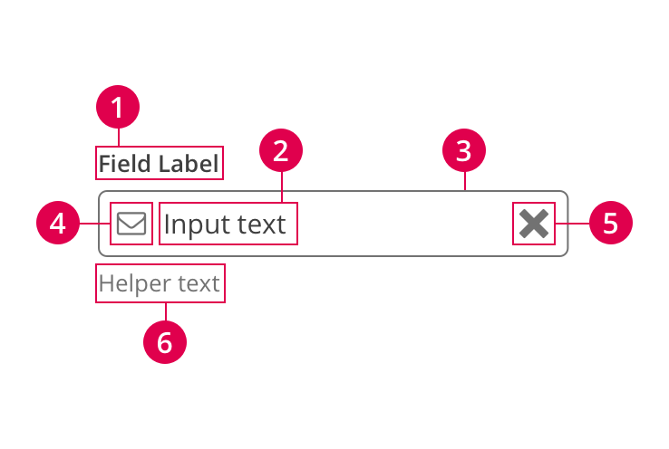
  

</figure>

1. Field label
1. Input text
1. Container
1. Leading icon
1. Trailing icon
1. Helper text

### Field Label

The field label tells the user what information is being requested. Most inputs should have a field label, unless you make sure the placeholder text, and other text available to screen readers, very clear about what the input is asking for from the user. For example, search fields don't typically have a visible field label, but instead rely on the placeholder text to make it clear what you're searching.

Do not truncate text labels. Try to keep text labels as short and clear as possible to avoid wrapping to multiple lines.

  

    

      <figure>
        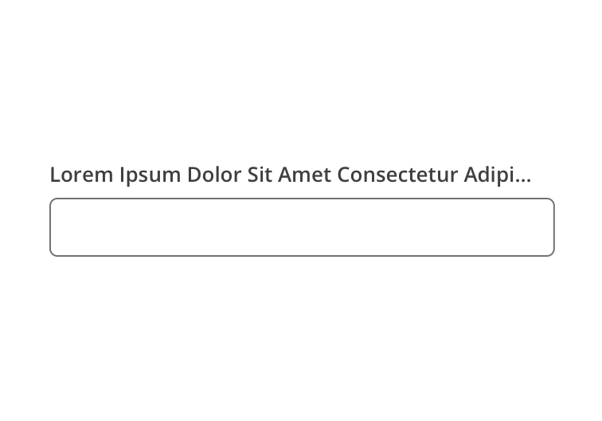
        <figcaption>
          
Incorrect

          
Do not truncate field labels.

        </figcaption>
      </figure>
    

    

      <figure>
        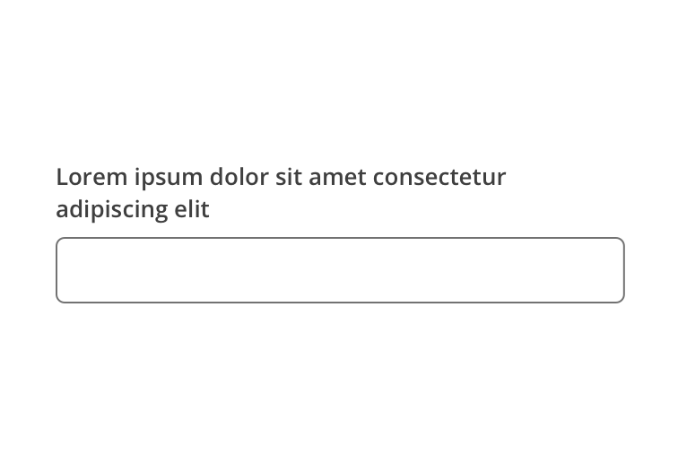
        <figcaption>
          
Caution

          

            Wrapping long field labels is acceptable, but try to avoid at all
            costs. Labels are best kept simple and short enough to fit on a
            single line.
          

        </figcaption>
      </figure>
    

  

#### Required Text Indicator

Required fields should be indicated by putting an asterisk (\*) at the end of the label. If there are very few required inputs in the form, you can use the helper text to inform the user what the asterisk means. If there are a relatively large number of required fields in the form, you can put a legend at the top of the form and just tell them once.

  

    

      <figure>
        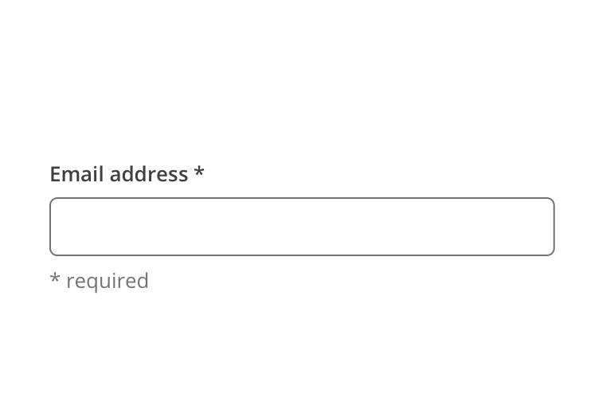
        <figcaption>
          
Correct

          

            A required field is indicated with an asterisk. If there aren't many
            required fields, you may use the Helper Text to tell the user what
            the asterisk means.
          

        </figcaption>
      </figure>
    

    

      <figure>
        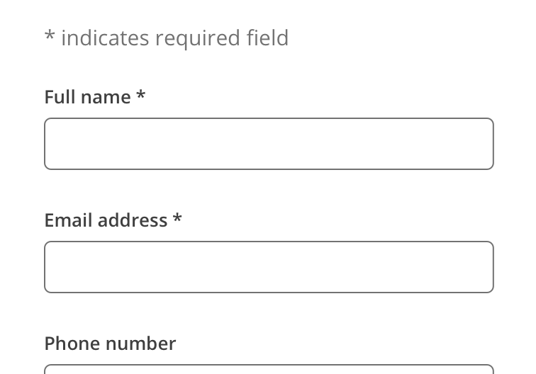
        <figcaption>
          
Correct

          

            If there are multiple required fields, you may explain the meaning
            of the asterisk one time above the form.
          

        </figcaption>
      </figure>
    

  

  

    

      <figure>
        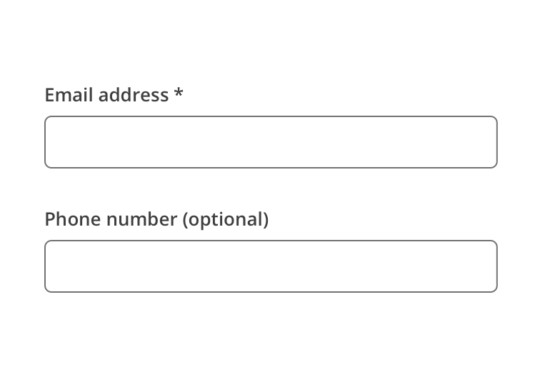
        <figcaption>
          
Incorrect

          

            Only required fields are called out as such. Do not mark optional
            fields.
          

        </figcaption>
      </figure>
    

    

  

### Container

Containers improve the discoverability of inputs by creating enough contrast between the input and the surrounding content.

#### Fill and Border

Inputs have a white fill which provides optimal visibility on dark backgrounds. The border of inputs on a white background are 1px wide and use the color neutral03 (#727272). The border of inputs on a white background is 1px wide and white.

#### Rounded Corners

Inputs have a 5px border radius to be consistent with buttons, which often accompany inputs.

  

    

      <figure>
        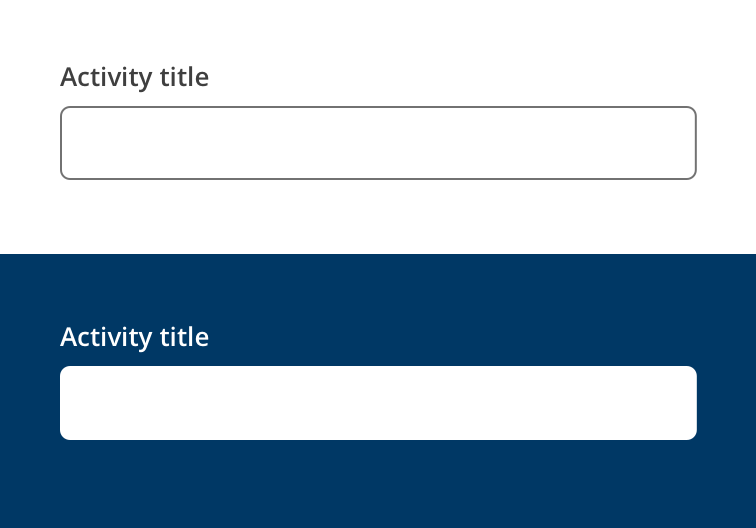
        <figcaption>
          
Examples of text fields on light and dark backgrounds.

        </figcaption>
      </figure>
    

    

  

### Input Text

Input text is text the user has entered into a text field. You can also use placeholder text to help inform the user how their input should be formatted.

  

    

      <figure>
        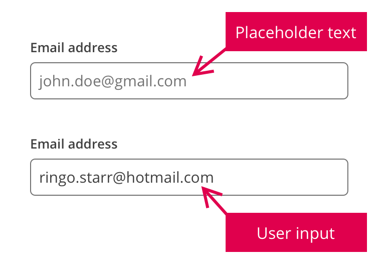
        <figcaption>
          
Example of placeholder text and user input

        </figcaption>
      </figure>
    

    

  

### Assistive Elements

#### Helper Text

Helper text is extra guidance for the input such as how the input will be used. Try to keep helper text limited to a single line.

  

    

      <figure>
        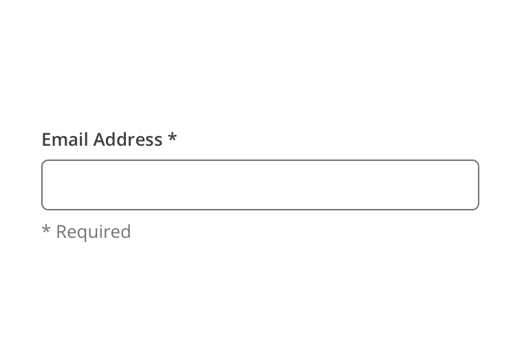
        <figcaption>
          
Example of input helper text

        </figcaption>
      </figure>
    

    

  

#### Error Message

When the input provided is invalid, an error message should be used to provide instructions on how to fix the error. The error message will replace the helper text until it is fixed.

  

    

      <figure>
        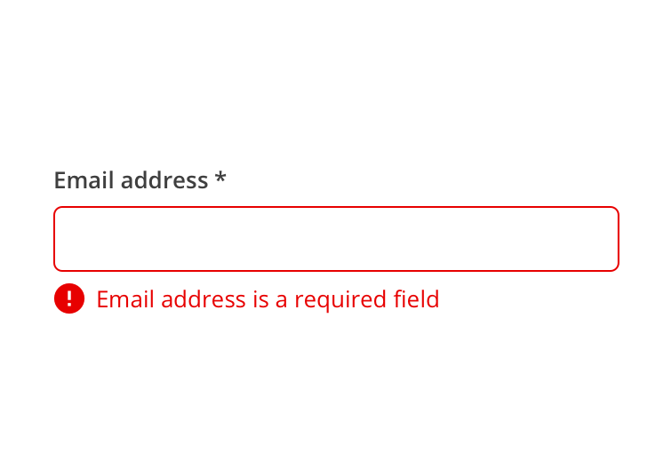
        <figcaption>
          
Example of input with error message

        </figcaption>
      </figure>
    

    

  

#### Icons

Icons can be used to help provide clarity or functionality. Leading icons are typically used to help clarify the type of input, such as email or phone. Trailing icons are typically also buttons that can be used to clear the input or trigger something else like a calendar component.

  

    

      <figure>
        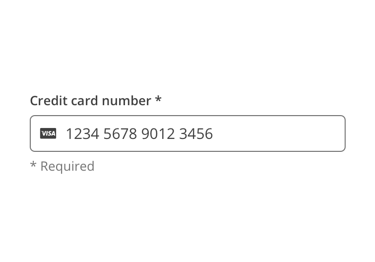
        <figcaption>
          

            Example of input with leading icon. The Visa icon helps identify the
            specific kind of credit card entered.
          

        </figcaption>
      </figure>
    

    

      <figure>
        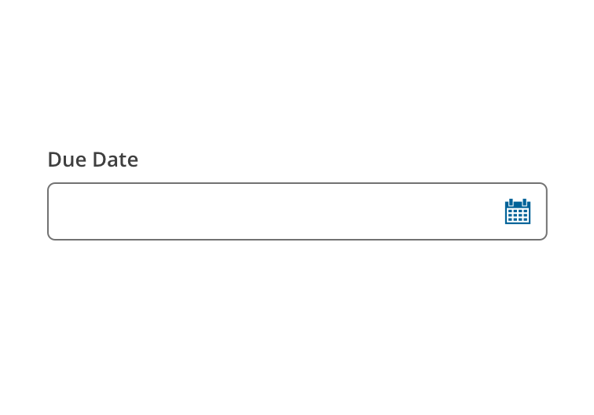
        <figcaption>
          

            Example of input with trailing icon. The calendar icon is a button
            that opens a calendar widget.
          

        </figcaption>
      </figure>
    

  

#### Help Link

The Help Link icon can be added to inputs that might require more explanation or clarification to the user than the helper text can handle. The icon can be configured to simply display a message within the tooltip or also trigger actions like opening a modal or navigating to another location.

  

    

      <figure>
        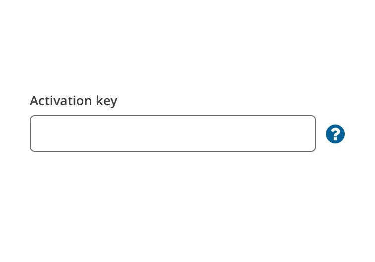
        <figcaption>
          
Example of input with Help Link icon

        </figcaption>
      </figure>
    

    

  

## States

  

    

      <figure>
        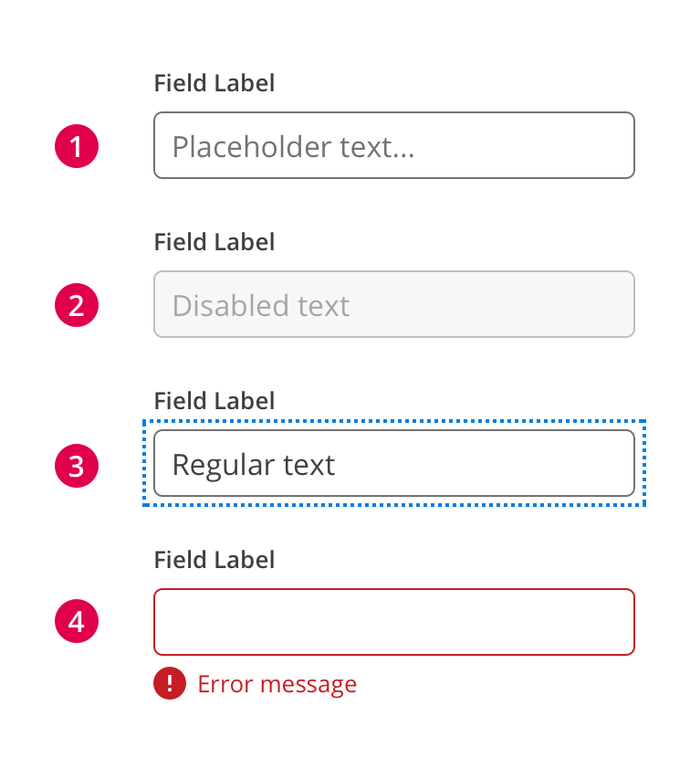
        <figcaption>
          

            Inputs can display the following states: active, disabled, focused,
            and error.
          

        </figcaption>
      </figure>
    

    

  

1. Active
1. Disabled
1. Focus
1. Error

## Sizes

<figure>
  

    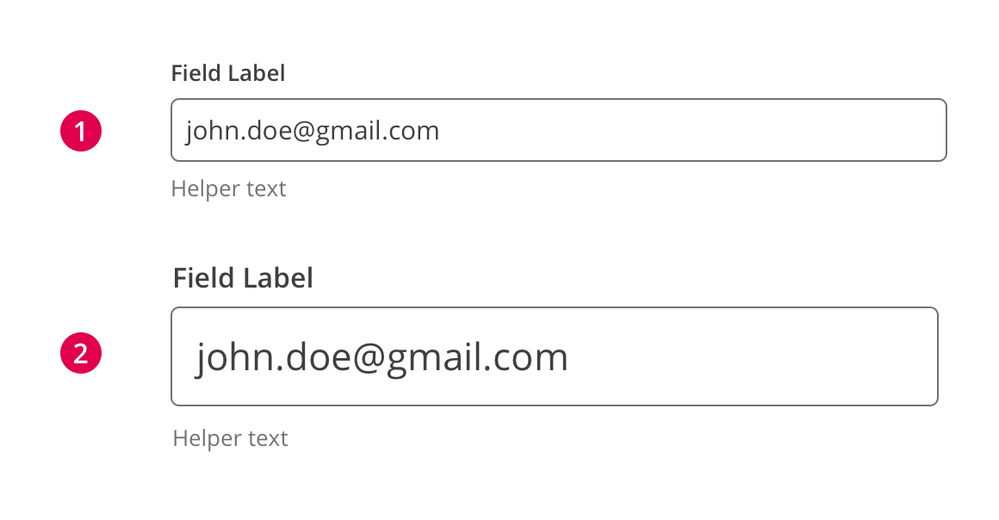
  

</figure>

1. Regular
1. Large

The regular sized inputs should be used in all cases, unless you are creating an interface that justifies the use of the large input. One example could be a page focusing entirely on search. Inputs should not be customized outside of these two standards without review and approval by the UX Department.

