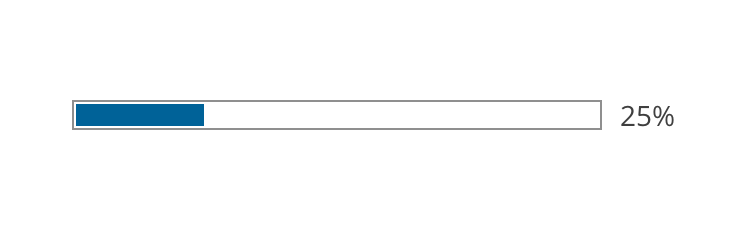
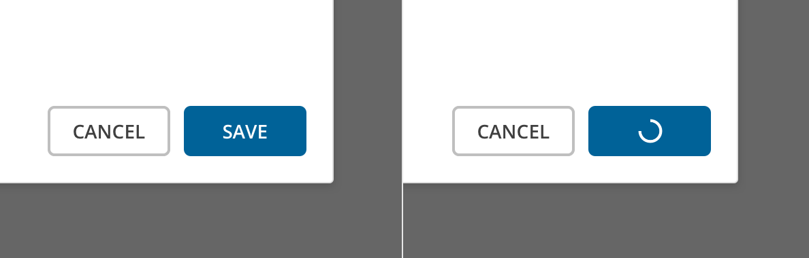
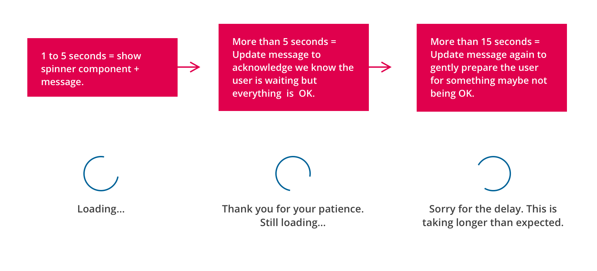

import { Link } from 'gatsby'
import './design-guidelines-styles.css'
import DocsHeading from '../../components/docs-heading'

<DocsHeading to="/api/loading-indicator/" type="code">Loading Indicators</DocsHeading>

Loading indicators communicate to the user that the action they requested is working, or the content they're going to see is not quite ready.

## Usage
React Magma provides loading indicators ranging from small circular spinners, to larger components designed for loading large amounts of data.  These loading indicators allow us to communicate with the user when information or an action they requested is taking some time to complete.

## Principles

### Clear
Loading indicators look and animate in ways that reflect the status of a process. They are never simply decorative.

### Relevant
Loading indicators should have a clear and helpful relationship to the content or task they represent.

## Types

### Indeterminate

Circular spinners are used when the amount of time needed to run a process or load some content is unknown.  The circular spinner can be applied to any surface, and should be placed in a way that makes it clear what it is related to.  This means the size of the spinner can vary depending on where it's used, but the size should be set in multiples of 10px.

  

    

      <figure>
        
      </figure>
    

    

    

  

### Determinate

Progress bars should be used when real progress data can be fed to it, and you also know it could take several seconds or longer to complete.  This could include the uploading of files, loading pages, loading large areas of data, etc.

  

    

      <figure>
        
      </figure>
    

    

    

  

## Behavior

### Small Amounts of Data

Many actions like saving updates, submitting a form, or loading small amounts of data happen very quickly, but there's still typically a delay between the user clicking an action and the action itself completing.

If you know that it will take less than a second to complete an action, then no loading indicator is necessary.  If you know the action is going to take 1 - 5 seconds to complete, you should use a circular spinner.

<figure>
  
  <figcaption>
    
Replace the label in the button with the circular spinner after clicking on it.

  </figcaption>
</figure>

### Large Amounts of Data

If you are loading large amounts of data like an entire page or large areas of data, the amount of time it takes to load can vary greatly.  We need to effectively communicate with the user what is happening, but that takes some informed decisions on our part.

1. If there is no way of measuring how long it will take in real-time, but you know from testing that it typically takes 1 - 5 seconds, you should use the component that uses the circular spinner plus message.  The component allows for three messages in case the loading takes longer than expected.  It will automatically transition to the second message after 5 seconds, and then to the third message after 15 seconds.  These messages can be customized to simply let the user know that it's still loading and everything is fine, or to prepare them for something possibly being wrong.

<figure>
  
  <figcaption>
    
In this example, we are using a loading indicator while the Learning Path in MindTap loads.  You could also do this when switching from one view to the other.

  </figcaption>
</figure>

<figure>
  
  <figcaption>
    
Messaging should tell the user what is happening and what to expect.

  </figcaption>
</figure>

2. If you know from testing that it typically takes more than 15 seconds to load, **AND** you can measure the progress in real-time, you should use the component that uses the progress bar plus message.  This component also allows for three messages, although at different intervals.  The second message appears after 15 seconds, and the third message appears after 30 seconds.

<figure>
  

    
  

  <figcaption>
    
In this example, testing shows that it always takes at least 15 seconds to load, and can track progress, so we use the progress bar with message to let the user know what to expect.

  </figcaption>
</figure>

