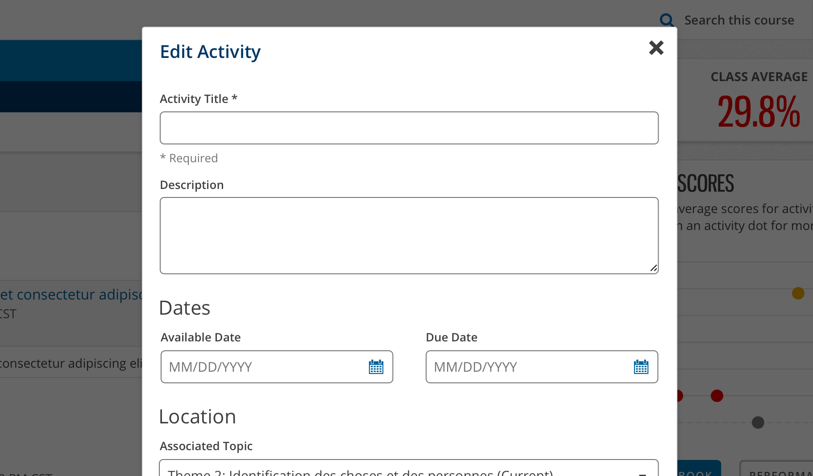
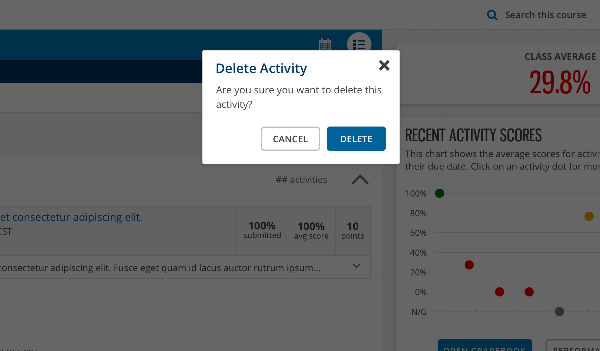

import { Link } from 'gatsby'
import './design-guidelines-styles.css'
import { DemoModal } from '../../components/demo-modal'
import DocsHeading from '../../components/docs-heading'
import { Button, Modal } from 'react-magma-dom'

<DocsHeading to="/api/modal/" type="code">
  Modal
</DocsHeading>

Modals inform users about a task and can contain critical information, require decisions, or involve multiple tasks.

## Usage

A modal is a type of window that appears in front of app content to provide critical information or ask for a decision. Modals disable all app functionality when they appear, and remain on screen until confirmed, dismissed, or a required action has been taken.

They can also be used to provide more complex actions or processes to the user, but within reason. Consider the following:

1. Would the content or action within the proposed modal be a significantly better experience on its own page?
1. Is it important to keep the user within the context of the current interface or page?

Modals are purposefully interruptive, so they should be used responsibly.

<figure>
  
  <figcaption>
    
Visual example of medium-sized modal

  </figcaption>
</figure>

<figure>
  
  <figcaption>
    
Visual example of small-sized modal

  </figcaption>
</figure>

## Principles

### Focused

Modals focus user attention to ensure their content is addressed.

### Direct

Modals should be direct in communicating information and dedicated to completing a task.

### Helpful

Modals should appear in response to a user task or an action, with relevant or contextual information.

## Sizes

### Small

The default width of the small modal is 300px. Works well for basic alerts and confirmations.

<DemoModal size="small" />

### Medium

The default width of the medium modal is 600px. Works well for standard single-column forms.

<DemoModal size="medium" />

### Large

The default width of the large modal is 900px. Works well for UI’s requiring multi-column layouts. If you are considering the large modal, you should also be seriously considering using a new page instead.

<DemoModal size="large" />

### Responsive Behavior

All three modal sizes have the same responsive behavior. When the viewport or frame containing the modal is below 768px wide, the modals go full-screen with 10px of space around their edges.

