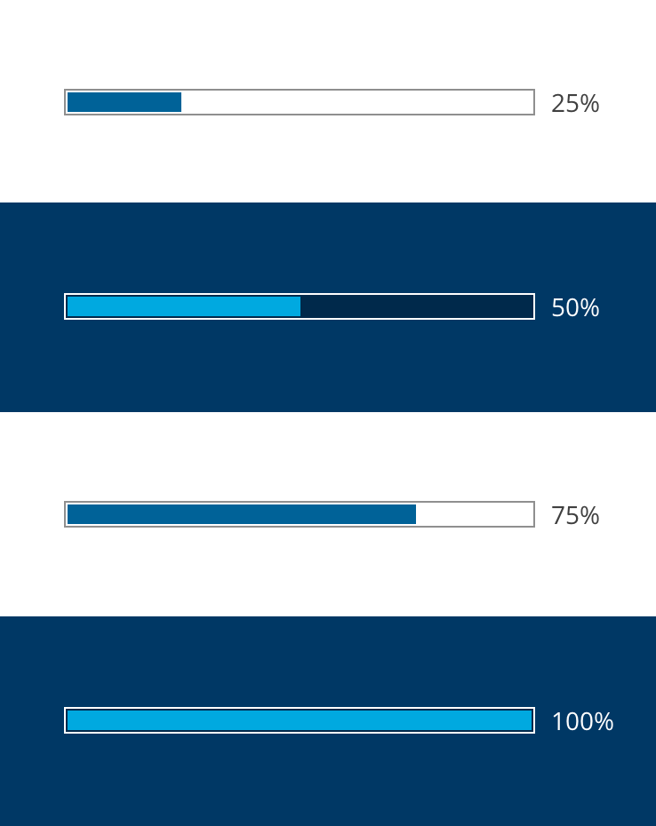
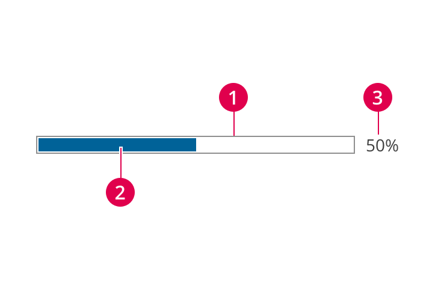
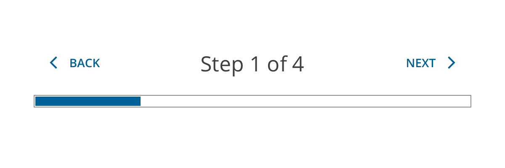
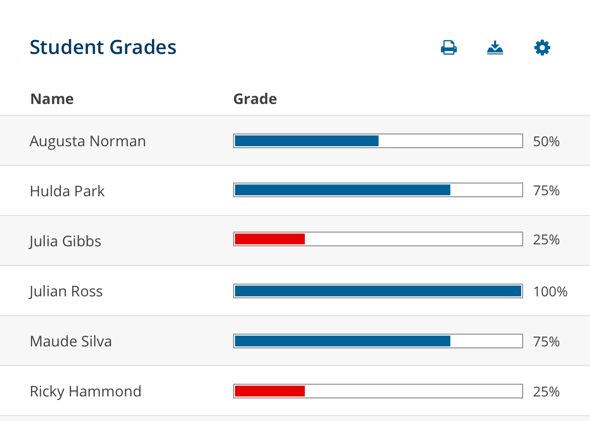
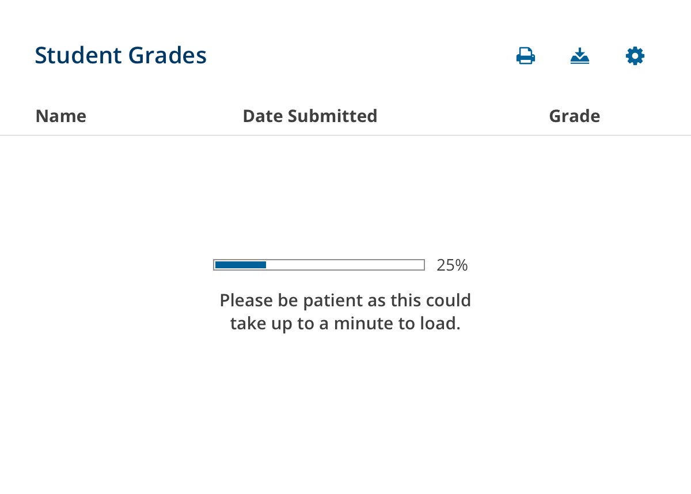
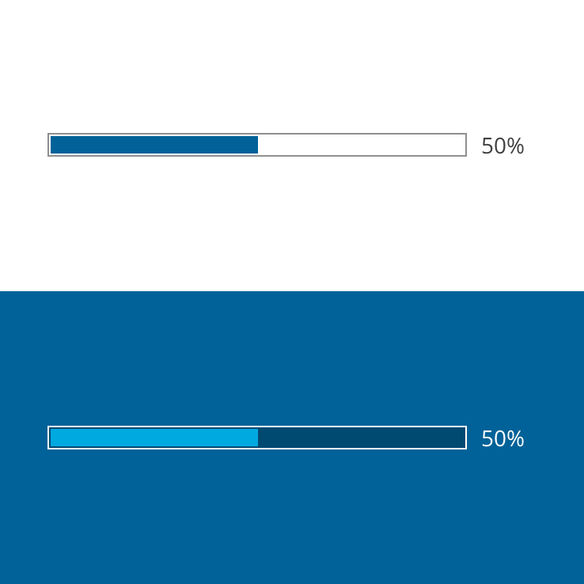
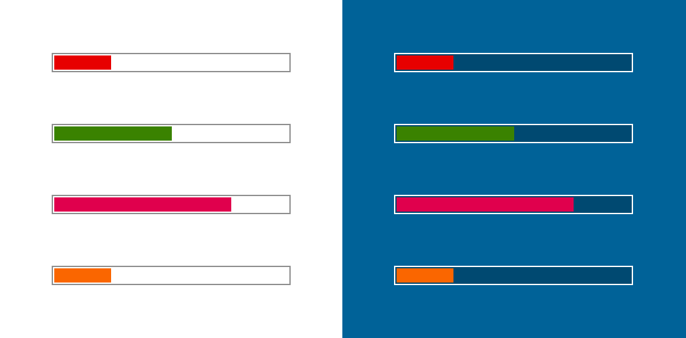

import { Link } from 'gatsby'
import './design-guidelines-styles.css'
import DocsHeading from '../../components/docs-heading'

<DocsHeading to="/api/progress-bar/" type="code">Progress Bars</DocsHeading>

Progress bars communicate the percentage of a whole, which can be used in multiple contexts.

## Usage

Progress bars can be used in different ways depending on where they are used or what data they are communicating to the user.  This could be to communicate the status of a dynamic process like loading a page, or isolated to a discrete point in time like what step you are on in a multi-step process.

Perhaps most importantly, the progress bar should reflect real data or progress, and not be faked in order to just give the impression of progress.

To see how progress bars are used as loading indicators, view the [loading indicator component](/design/loading-indicators/).

<figure>
  

    
  

</figure>

## Principles

### Clear
Progress bars are simple to understand.

### Helpful
Progress bars help bring clarity and understanding to the elements around them.

## Anatomy

<figure>
  

    
  

</figure>

1. **Track -** The track provides the boundaries for the indicator to travel along and represents 100% when filled.
1. **Indicator -** The indicator fills up the track to a specified percentage provided to the component.
1. **Value label (optional) -** This label presents the specific value being represented by the progress bar, and should be used when the precise value is what's most important to what the user needs to know.

### Size
The default height of the progress bar is 15px, but can be customized for where it's being used.  This means you can make it taller or shorter if you need to, but the height should be set in increments of 5px.  The smallest recommended height is 10px to maintain maximum legibility.

The width of the progress bar is controlled by the container it is within.  For maximum responsive behavior, you should avoid setting a specific width on the progress bar, and you should instead manipulate the container.

## Behavior

### Static
When a static progress bar is used, it represents the progress of something at that point in time and does not change until an explicit action is performed that updates the progress bar.

<figure>
  

    
  

  <figcaption>
    
Example of using progress bar to help communicate that the user is on step one out of four.

  </figcaption>
</figure>

<figure>
  

    
  

  <figcaption>
    
Progress bars can be used to visually display the same data point for multiple students, perhaps providing a quicker way to identify low performance.

  </figcaption>
</figure>

### Dynamic
When a dynamic progress bar is used, it means it's updating in real-time while you wait for a series of processes outside of your control to complete.

<figure>
  

    
  

  <figcaption>
    
Example of using progress bar to help communicate that the data is loading and to expect a wait.

  </figcaption>
</figure>

## Colors

How we use color within the progress bar component is extremely important for meeting accessibility requirements (WCAG 2.1).

### Track
The default track has a white background and the border is #8F8F8F.  This gray was specifically added to the palette as the lightest gray possible to meet the 3:1 contrast ratio required for accessibility (WCAG 2.1).  It is especially useful for borders like this.

The track on the dark/inverse progress bar has a black background at 25% opacity, and a white border.  This ensures the necessary contrast between the track and the background color it is put on, as well as the contrast between the track and the indicator inside it.

**Note:** *The colors of the track should not be customized unless you are designing a new theme, and then it's your responsibility to make sure the new design meets accessibility requirements.*

<figure>
  

    
  

</figure>

### Indicator

The indicator's color by default is **primary** and the inverse default color is **foundation03**.  It's important to make sure the contrast ratio between the indicator and the background of the track is at least  3:1.  For that reason, we are currently limiting the colors you may use to danger, success01, pop01, and pop02.

<figure>
    
</figure>
