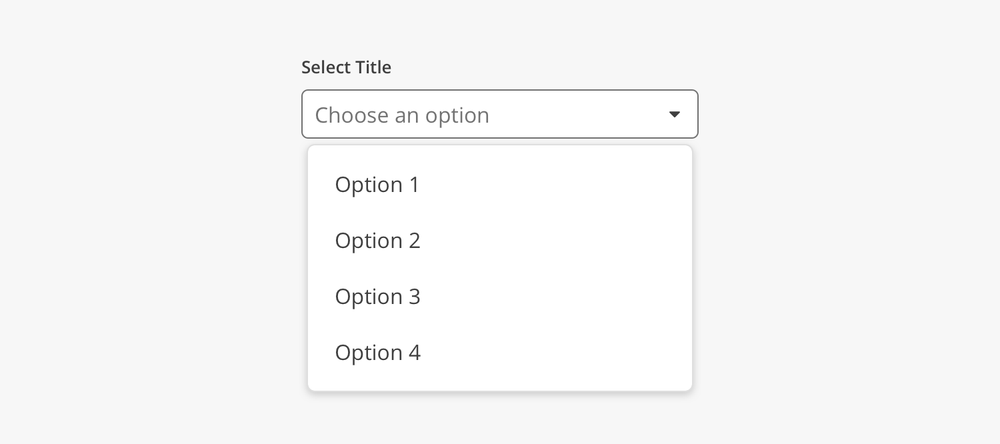
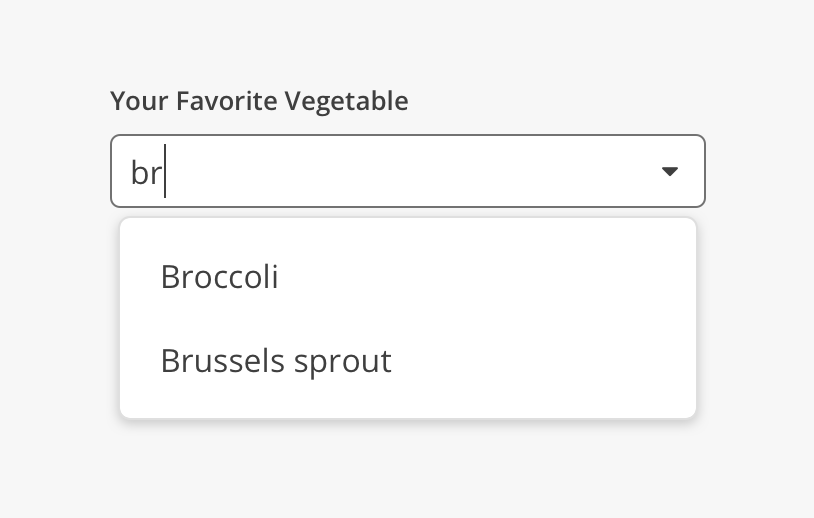

import { Link } from 'gatsby';
import './design-guidelines-styles.css';
import { Divider } from '../../components/Divider';
import { DocsHeading } from '../../components/DocsHeading';
import { LeadParagraph } from '../../components/LeadParagraph';

<DocsHeading to="/api/select/" type="design">
  Selects
</DocsHeading>
<LeadParagraph>
  The Select component allows users to choose one or more options from a list.
  It is used in forms for users to submit data.
</LeadParagraph>

<figure>
  
</figure>

<Divider />

## Principles

### Discoverable

Selects should stand out and indicate that users can input information.

### Clear

The various states of a Select component should be clearly differentiated from one another.

### Efficient

Selects should make it easy to understand the requested information and clearly describe any errors.

<Divider />

## Select vs. Dropdown

While the Select and Dropdown components can look similar, they have different functions.

- Use the Select component inside a form where users are selecting from a list of options and submitting data.
- Use the Dropdown component to display menus and filter or sort content on a page.

<Divider />

## Advanced Selects

### Multiselect

Multiselects are exactly what the name implies – A Select input that allows the user to choose multiple values to be submitted at the same time. Previously selected options may be removed with the associated close/remove button.

<figure>
  
</figure>

### Combobox

A Combobox is similar to a Select component, in that it is used for collecting user provided information from a list of options. However, a combobox also allows users to type in the field, either to create their own option or to see typeahead suggestions. This can also be combined with the Multiselect functionality.

View <Link to="/api/combobox/">component API</Link> for Combobox.

<figure>
  
</figure>

