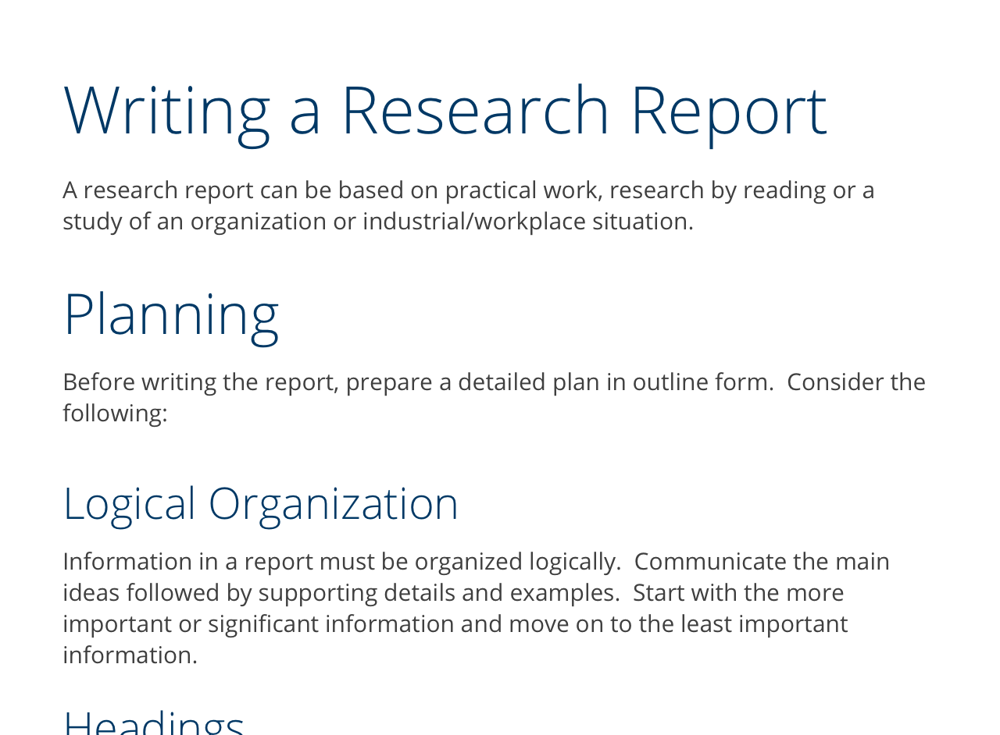
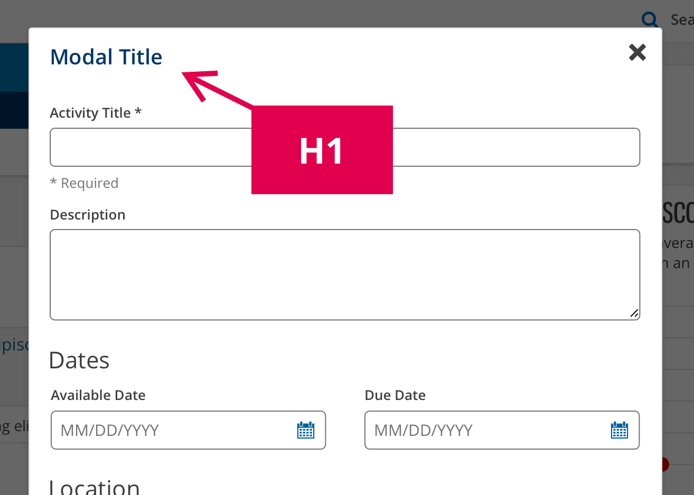

import { Link } from 'gatsby';
import './design-guidelines-styles.css';
import DocsHeading from '../../components/docs-heading';
import { Button } from 'react-magma-dom';

# Typography

Cengage applications need clear and consistent headings, highly legible body paragraphs, and clear labels. Our typefaces are chosen for legibility and maximum support for mathematical characters.

By consistently tying typographic styles to appropriate functions in the interface, we create a clear visual pattern for students and faculty to follow while they’re interacting with our products.

## Included Typefaces

### Open Sans

Our primary typface is Open Sans. It’s clear, approachable and has a great mathematical glyph set. It is great for headlines, subheads, navigation and body copy.

<a href="https://fonts.google.com/specimen/Open+Sans" target="_blank">
  Download Open Sans
</a>

  

    

      <figure>
        
      </figure>
    

    

      Open Sans is a humanist sans serif typeface designed by Steve Matteson,
      Type Director of Ascender Corp. This version contains the complete 897
      character set, which includes the standard ISO Latin 1, Latin CE, Greek
      and Cyrillic character sets. Open Sans was designed with an upright
      stress, open forms and a neutral, yet friendly appearance. It was
      optimized for print, web, and mobile interfaces, and has excellent
      legibility characteristics in its letterforms.
    

  

## Font Styles

We use font styles like size, weight, and line height to maximize the readability of our content.

### Font Sizes

The font sizes defined for our base font and headings are the primary way we display a visual hierarchy to our users. Our base font starts at 16px. From there we have six heading styles that align with the current branding guide for Cengage.

  

    <h1>Heading One</h1>
    

      

        Font Size: <strong>42px</strong>
      

      

        Line Height: <strong>1.2em</strong>
      

      

        Font: <strong>Open Sans</strong>
      

      

        Font Weight: <strong>Light 300</strong>
      

    

  

  

    <h2>Heading Two</h2>
    

      

        Font Size: <strong>36px</strong>
      

      

        Line Height: <strong>1.2em</strong>
      

      

        Font: <strong>Open Sans</strong>
      

      

        Font Weight: <strong>Light 300</strong>
      

    

  

  

    <h3>Heading Three</h3>
    

      

        Font Size: <strong>28px</strong>
      

      

        Line Height: <strong>1.2em</strong>
      

      

        Font: <strong>Open Sans</strong>
      

      

        Font Weight: <strong>Light 300</strong>
      

    

  

  

    <h4>Heading Four</h4>
    

      

        Font Size: <strong>22px</strong>
      

      

        Line Height: <strong>1.3em</strong>
      

      

        Font: <strong>Open Sans</strong>
      

      

        Font Weight: <strong>Regular 400</strong>
      

    

  

  

    <h5>Heading Five</h5>
    

      

        Font Size: <strong>16px</strong>
      

      

        Line Height: <strong>1.4em</strong>
      

      

        Font: <strong>Open Sans</strong>
      

      

        Font Weight: <strong>Semibold 600</strong>
      

    

  

  

    <h6>Heading Six</h6>
    

      

        Font Size: <strong>13px</strong>
      

      

        Line Height: <strong>1.5em</strong>
      

      

        Font: <strong>Open Sans</strong>
      

      

        Font Weight: <strong>Bold 700</strong>
      

    

  

  

    Body Text
    

      

        Font Size: <strong>16px</strong>
      

      

        Line Height: <strong>1.75em</strong>
      

      

        Font: <strong>Open Sans</strong>
      

      

        Font Weight: <strong>Regular 400</strong>
      

    

  

### Font Weights

Relationships between text can be created using different weights to emphasize or de-emphasize pieces of text. The weights available in React Magma are `light (300)`, `regular (400)`, `semi-bold (600)` and `bold (700)`. All of these weights can also be italicized.

  

    

      <figure>
        
      </figure>
    

    

  

### Line Height

Line height is used to create a vertical rhythm on the page and impacts the density of a block of text. It is applied as a multiplier of the font size. For example, a line height of `1.75em` on a font size of `16px` equals a line height of `28px`.

As the size of the font increases, for instance in headings, the line height multiplier is reduced to maximize readability and prevent the lines from getting too loose.

## Headings

Headings used in a traditional heading/subheading/paragraph context should use the default styles defined in Magma and not be customized without good reason.

<figure>
  
</figure>

When using an H1 as the title of a component like a modal, it’s the structure that is important so customizing the styles is acceptable. Also, don't use a heading just because you want the style of that heading. If using a heading doesn't make sense for the HTML structure of your component or interface, you’ll be better off styling that element to match the heading.

<figure>
  
</figure>

