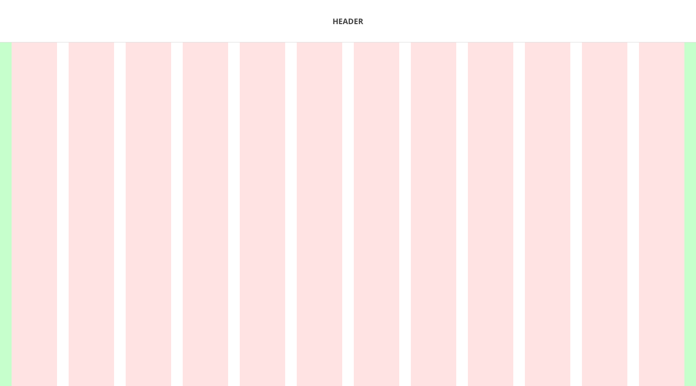
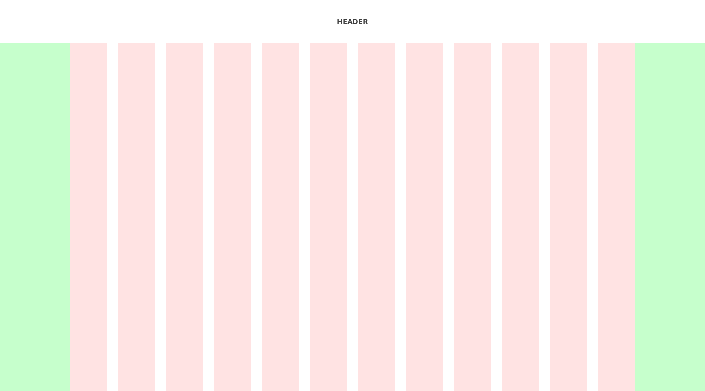
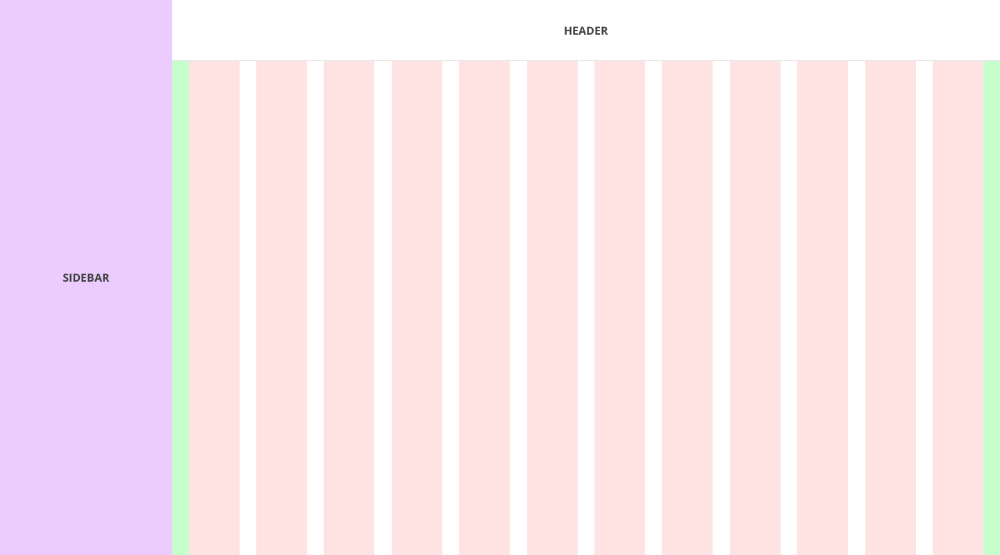

<PageContent componentName="page_templates" type="api_intro">

<LeadParagraph>
  Get started on your project more quickly with these ready-made page templates.
</LeadParagraph>

## Full-width Template

This template is ideal for applications that need as much of the screen as possible.

<figure>
  
</figure>

```tsx
import React from 'react';

import {
  Drawer,
  DrawerPosition,
  Grid,
  GridItem,
  GridJustifyContent,
  magma,
  useMediaQuery,
  AppBar,
} from 'react-magma-dom';

export function Example() {
  const [showDrawer, setShowDrawer] = React.useState(false);

  const isSmallerScreen = useMediaQuery(
    `(max-width:${magma.breakpoints.small}px)`
  );

  return (
    <Grid
      gridJustifyContent={GridJustifyContent.center}
      gridTemplateColumns={'repeat(4, 1fr)'}
      gridTemplateRows={'0.2fr 1.5fr 1.2fr 0.8fr'}
      gridGap="0.5em"
    >
      <GridItem gridColumn="1 / 5">
        <AppBar
          isInverse
          logo={<strong>LOGO</strong>}
          breakpoint={magma.breakpoints.large}
          isCompact={isSmallerScreen}
          onMenuButtonClick={() => setShowDrawer(true)}
        />
      </GridItem>

      <Drawer
        onClose={() => setShowDrawer(false)}
        isOpen={showDrawer}
        position={DrawerPosition.left}
      >
        Content
      </Drawer>

      <GridItem
        gridColumn="1 / 5"
        style={{
          backgroundColor: magma.colors.primary500,
          color: magma.colors.neutral100,
          textAlign: 'center',
          padding: magma.spaceScale.spacing05,
          width: 'calc(100% - 48px)',
          margin: '0 auto',
        }}
      >
        Main
      </GridItem>
      <GridItem
        gridColumn={isSmallerScreen ? '1 / 5' : '1 / 3'}
        style={{
          backgroundColor: magma.colors.primary100,
          textAlign: 'center',
          padding: magma.spaceScale.spacing05,
          width: isSmallerScreen ? 'calc(100% - 48px)' : 'auto',
          margin: isSmallerScreen ? '0 auto' : '0 0 0 25px',
        }}
      >
        Content
      </GridItem>
      <GridItem
        gridColumn={isSmallerScreen ? '1 / 5' : '3 / 4'}
        style={{
          backgroundColor: magma.colors.primary300,
          color: magma.colors.neutral100,
          textAlign: 'center',
          padding: magma.spaceScale.spacing05,
          width: isSmallerScreen ? 'calc(100% - 48px)' : 'auto',
          margin: isSmallerScreen ? '0 auto' : '0',
        }}
      >
        Content
      </GridItem>
      <GridItem
        gridColumn={isSmallerScreen ? '1 / 5' : '4 /5'}
        style={{
          backgroundColor: magma.colors.primary400,
          color: magma.colors.neutral100,
          textAlign: 'center',
          padding: magma.spaceScale.spacing05,
          width: isSmallerScreen ? 'calc(100% - 48px)' : 'auto',
          margin: isSmallerScreen ? '0 auto' : '0 25px 0 0',
        }}
      >
        Content
      </GridItem>
      <GridItem
        gridColumn="1 / 5"
        style={{
          backgroundColor: magma.colors.primary600,
          color: magma.colors.neutral100,
          textAlign: 'center',
          padding: magma.spaceScale.spacing05,
          width: 'calc(100% - 48px)',
          margin: '0 auto',
        }}
      >
        Footer
      </GridItem>
    </Grid>
  );
}
```

---

## Restricted-width Template

This template is great for pages that focus more on reading content like marketing materials, articles, etc.

<figure>
  
</figure>

```tsx
import React from 'react';

import {
  Drawer,
  DrawerPosition,
  Grid,
  GridItem,
  magma,
  useMediaQuery,
  AppBar,
} from 'react-magma-dom';

export function Example() {
  const [showDrawer, setShowDrawer] = React.useState(false);

  const isSmallerScreen = useMediaQuery(
    `(max-width:${magma.breakpoints.small}px)`
  );

  return (
    <Grid
      gridTemplateColumns={'auto 1fr'}
      gridTemplateRows={'auto 1fr'}
      gridGap="1em"
    >
      <GridItem gridColumn="1 / 3">
        <AppBar
          logo={<strong>LOGO</strong>}
          breakpoint={magma.breakpoints.large}
          isCompact={isSmallerScreen}
          onMenuButtonClick={() => setShowDrawer(true)}
          style={{
            backgroundColor: magma.colors.warning400,
            color: magma.colors.neutral100,
          }}
        />
      </GridItem>

      <Drawer
        position={DrawerPosition.left}
        onClose={() => setShowDrawer(false)}
        isOpen={showDrawer}
      >
        Sidebar
      </Drawer>

      <GridItem
        gridColumn="1 / 3"
        style={{
          textAlign: 'center',
          backgroundColor: magma.colors.warning500,
          color: magma.colors.neutral100,
          width: 'calc(100% - 148px)',
          maxWidth: '952px',
          justifySelf: 'center',
          padding: magma.spaceScale.spacing05,
          height: 'calc(70vh - 122px)',
        }}
      >
        content
      </GridItem>

      <GridItem
        gridColumn={isSmallerScreen ? '1 / 3' : '1 /  2'}
        style={{
          textAlign: 'center',
          backgroundColor: magma.colors.warning300,
          color: magma.colors.neutral100,
          padding: magma.spaceScale.spacing05,
          justifySelf: isSmallerScreen ? 'center' : 'stretch',
          width: isSmallerScreen ? 'calc(100% - 148px)' : 'auto',
          margin: isSmallerScreen ? '0 auto' : '0 0 0 75px',
        }}
      >
        article 1
      </GridItem>
      <GridItem
        gridColumn={isSmallerScreen ? '1 / 3' : '2 / 3'}
        style={{
          textAlign: 'center',
          backgroundColor: magma.colors.warning300,
          color: magma.colors.neutral100,
          padding: magma.spaceScale.spacing05,
          justifySelf: isSmallerScreen ? 'center' : 'stretch',
          width: isSmallerScreen ? 'calc(100% - 148px)' : 'auto',
          margin: isSmallerScreen ? '0 auto' : '0 75px 0 0 ',
        }}
      >
        article 2
      </GridItem>
    </Grid>
  );
}
```

---

## Global Header with Sidebar

This template includes a screen region for a left sidebar and includes all of the necessary responsive behavior.

<figure>
  
</figure>

```tsx
import React from 'react';

import {
  Drawer,
  DrawerPosition,
  Grid,
  GridItem,
  magma,
  useMediaQuery,
  AppBar,
} from 'react-magma-dom';

export function Example() {
  const [openDrawer, setOpenDrawer] = React.useState(false);

  const isLargeScreen = useMediaQuery(
    `(max-width:${magma.breakpoints.large}px)`
  );

  const isSmallerScreen = useMediaQuery(
    `(max-width:${magma.breakpoints.small}px)`
  );

  return (
    <Grid
      gridTemplateColumns={'auto 1fr'}
      gridTemplateRows={'auto 1fr'}
      gridTemplateAreas={('sidebar header header', 'sidebar content content')}
      gridGap={'0.25em'}
    >
      {isLargeScreen ? (
        <Drawer position={DrawerPosition.left} isOpen={openDrawer}>
          <div
            style={{
              background: magma.colors.secondary700,
              padding: magma.spaceScale.spacing05,
              width: '240px',
              height: 'calc(100vh - 32px)',
            }}
          >
            Sidebar
          </div>
        </Drawer>
      ) : (
        <GridItem
          as={'sidebar'}
          gridColumn="1 / 2"
          gridRow="1 / 3"
          style={{ background: magma.colors.secondary700, width: '240px' }}
        >
          Sidebar
        </GridItem>
      )}

      <GridItem as={'header'} gridColumn="2 / 3">
        <AppBar
          isInverse
          logo={<strong>LOGO</strong>}
          breakpoint={magma.breakpoints.large}
          isCompact={isSmallerScreen}
          onMenuButtonClick={() => {
            setOpenDrawer(!openDrawer);
          }}
        />
      </GridItem>

      <GridItem
        as="content"
        gridColumn="2 / 3"
        style={{
          maxWidth: '1600px',
          width: '100%',
          justifySelf: 'center',
          background: magma.colors.secondary500,
          padding: magma.spaceScale.spacing05,
          margin: '0 auto',
          height: 'calc(100vh - 122px)',
        }}
      >
        Content
      </GridItem>
    </Grid>
  );
}
```

---

## Application Header with Sidebar

This template also includes the sidebar screen region, but the header extends all the way across the top of the page.

<figure>
  
</figure>

```tsx
import React from 'react';

import {
  Drawer,
  DrawerPosition,
  Grid,
  GridItem,
  magma,
  useMediaQuery,
  GridJustifyContent,
  AppBar,
} from 'react-magma-dom';

export function Example() {
  const [openDrawer, setOpenDrawer] = React.useState(false);

  const isLargeScreen = useMediaQuery(
    `(max-width:${magma.breakpoints.large}px)`
  );

  const isSmallerScreen = useMediaQuery(
    `(max-width:${magma.breakpoints.small}px)`
  );

  return (
    <Grid
      gridJustifyContent={GridJustifyContent.center}
      gridTemplateColumns="auto 1fr"
      gridTemplateRows="auto 1fr"
      gridTemplateAreas={('header header', 'sidebar content', 'sidebar footer')}
      gridGap="2px"
    >
      <GridItem as="header" gridColumn="1 / 4">
        <AppBar
          isInverse
          logo={<strong>LOGO</strong>}
          breakpoint={magma.breakpoints.large}
          isCompact={isSmallerScreen}
          onMenuButtonClick={() => {
            setOpenDrawer(!openDrawer);
          }}
        />
      </GridItem>

      {isLargeScreen ? (
        <Drawer position={DrawerPosition.left} isOpen={openDrawer}>
          <div
            style={{
              background: magma.colors.primary200,
              padding: magma.spaceScale.spacing05,
              width: '240px',
              height: 'calc(100vh - 32px)',
            }}
          >
            Sidebar
          </div>
        </Drawer>
      ) : (
        <GridItem
          as="sidebar"
          gridColumn="1 / 2"
          gridRow="2 / 4"
          style={{
            width: '240px',
            background: magma.colors.primary200,
            padding: magma.spaceScale.spacing05,
            height: 'calc(100vh - 95px)',
          }}
        >
          Sidebar
        </GridItem>
      )}

      <GridItem
        as="content"
        gridColumn="2 / 4"
        gridRow="2"
        style={{
          maxWidth: '1600px',
          width: '100%',
          justifySelf: 'center',
          background: magma.colors.primary500,
          color: magma.colors.neutral100,
          padding: magma.spaceScale.spacing05,
          height: 'calc(100vh - 122px)',
        }}
      >
        Content
      </GridItem>

      <GridItem
        as="footer"
        gridColumn="2 / 4"
        gridRow="3"
        style={{
          maxWidth: '1600px',
          width: '100%',
          justifySelf: 'center',
          background: magma.colors.primary700,
          color: magma.colors.neutral100,
          padding: magma.spaceScale.spacing05,
          height: '10vh',
        }}
      >
        Footer
      </GridItem>
    </Grid>
  );
}
```

</PageContent>
