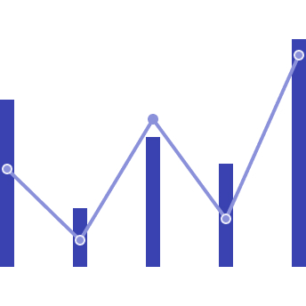

import { LeadParagraph } from '../../components/LeadParagraph';
import './chart-types.css';

<PageContent componentName="chart_types" type="data_visualization">

<LeadParagraph>
  Begin by identifying the objective of the visualization, and then choose the
  chart type that best fits the purpose.
</LeadParagraph>

## Comparisons

Comparison charts compare data between multiple distinct categories.

  

    <figure>
      
    </figure>
    

      <h2>Simple Bar</h2>
      

        Bar charts use vertical or horizontal markers to compare values,
        allowing for assessment of discrete data or trends over time.
      

      <a href="../chart-demos/#bar_(simple)">View Demo</a>
    

  

  

    <figure>
      
    </figure>
    

      <h2>Grouped Bar</h2>
      

        A grouped bar chart, also known as a clustered bar graph, multi-set bar
        chart, or grouped column chart, is used to compare values across
        multiple categories.
      

      <a href="../chart-demos/#bar_(grouped)">View Demo</a>
    

  

  

    <figure>
      
    </figure>
    

      <h2>Floating Bar</h2>
      

        A floating bar chart uses horizontal bars to represent data, spanning
        between the minimum and maximum values, and floating freely rather than
        being anchored to an axis.
      

      <a href="../chart-demos/#bar_(floating)">View Demo</a>
    

  

  

    <figure>
      
    </figure>
    

      <h2>Bubble</h2>
      

        A bubble chart, or bubble plot, uses bubbles to represent data points
        and their relationships in a two-dimensional plot.
      

      <a href="../chart-demos/#bubble">View Demo</a>
    

  

  

    <figure>
      
    </figure>
    

      <h2>Radar</h2>
      

        A radar chart, or spider chart, web chart, or star chart, is a
        two-dimensional graph displaying multiple quantitative variables in a
        single visual.
      

      <a href="../chart-demos/#radar">View Demo</a>
    

  

  

    <figure>
      
    </figure>
    

      <h2>Lollipop</h2>
      

        A lollipop chart is a variation of a bar chart ideal for highlighting
        individual data points or illustrating the relationship between numeric
        and categorical variables.
      

      <a href="../chart-demos/#lollipop">View Demo</a>
    

  

  

    <figure>
      
    </figure>
    

      <h2>Combo</h2>
      

        A Combo Chart is a data visualization that combines two or more chart
        types (e.g., bar and line charts) into a single graph.
      

      <a href="../chart-demos/#combo">View Demo</a>
    

  

## Trends

Trend charts show data over a period of time, to reveal trends or make comparisons across multiple categories.

  

    <figure>
      
    </figure>
    

      <h2>Line</h2>
      

        Line charts depict data at regular intervals, connecting points with
        lines. They are valuable for illustrating trends over time and comparing
        multiple datasets.
      

      <a href="../chart-demos/#line">View Demo</a>
    

  

  

    <figure>
      
    </figure>
    

      <h2>Area</h2>
      

        Area charts share similarities with line charts, distinguished by the
        filled areas below the lines.
      

      <a href="../chart-demos/#area_(simple)">View Demo</a>
    

  

  

    <figure>
      
    </figure>
    

      <h2>Boxplot</h2>
      

        A boxplot, or box and whisker plot, summarizes a set of data, showing
        its distribution and any outliers.
      

      <a href="../chart-demos/#boxplot">View Demo</a>
    

  

  

    <figure>
      
    </figure>
    

      <h2>Histogram</h2>
      

        A histogram is a statistical chart depicting the distribution of a
        continuous dataset using bars, with each bar representing a specific
        category or class interval.
      

      <a href="../chart-demos/#histogram">View Demo</a>
    

  

  

    <figure>
      
    </figure>
    

      <h2>Sparkline</h2>
      

        A Sparkline Chart is a small, simple chart that provides a compact
        visual representation of trends in data.
      

      <a href="../chart-demos/#sparkline">View Demo</a>
    

  

  

    <figure>
      
    </figure>
    

      <h2>Step</h2>
      

        A Step Chart is a type of line chart that displays data as a series of
        steps rather than a smooth trend.
      

      <a href="../chart-demos/#step">View Demo</a>
    

  

## Part-to-whole

Part-to-whole charts show how partial elements add up to a total.

  

    <figure>
      
    </figure>
    

      <h2>Pie</h2>
      

        A pie chart visually summarizes nominal data or illustrates the
        distribution of values, such as percentage distribution.
      

      <a href="../chart-demos/#pie">View Demo</a>
    

  

  

    <figure>
      
    </figure>
    

      <h2>Donut</h2>
      

        A donut chart is a type of pie chart with a hole in the middle. It shows
        the relationship of parts to a whole and the percentage each value
        contributes to the total.
      

      <a href="../chart-demos/#donut">View Demo</a>
    

  

  

    <figure>
      
    </figure>
    

      <h2>Stacked Bar</h2>
      

        A stacked bar chart, also called a stacked bar graph or stacked column
        chart, compares multiple variables over time.
      

      <a href="../chart-demos/#bar_(stacked)">View Demo</a>
    

  

  

    <figure>
      
    </figure>
    

      <h2>Bullet</h2>
      

        Bullet charts are commonly used in dashboards to effectively compare
        metrics against target benchmarks or predefined ranges.
      

      <a href="../chart-demos/#bullet">View Demo</a>
    

  

  

    <figure>
      
    </figure>
    

      <h2>Stacked area</h2>
      

        A stacked area chart is a graph that shows how the values of multiple
        groups change over time.
      

      <a href="../chart-demos/#area_(stacked)">View Demo</a>
    

  

  

    <figure>
      
    </figure>
    

      <h2>Meter</h2>
      

        Meter charts are used to measure the rate of change of a quantity
        against pre-defined targets.
      

      <a href="../chart-demos/#meter">View Demo</a>
    

  

  

    <figure>
      
    </figure>
    

      <h2>Gauge</h2>
      

        A gauge chart, also known as a dial or speedometer chart, displays a
        single data value quantitatively.
      

      <a href="../chart-demos/#gauge">View Demo</a>
    

  

## Correlations

Correlation charts show the relationship between two or more variables.

  

    <figure>
      
    </figure>
    

      <h2>Scatter</h2>
      

        Scatter plots use data points to plot two measures along a scale,
        allowing exploration of correlations between different variables.
      

      <a href="../chart-demos/#scatter">View Demo</a>
    

  

</PageContent>
