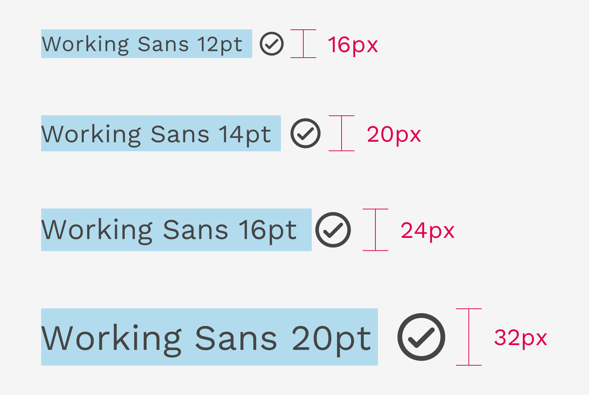
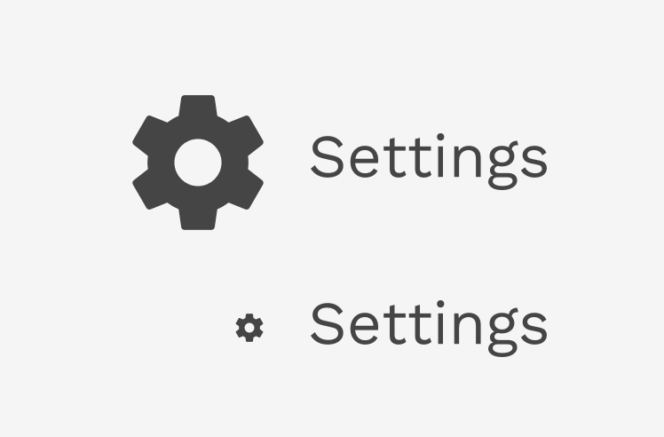

<DocsHeading to="/api/icon/" type="design">Icons</DocsHeading>

Icons are visual symbols used to represent objects or actions. They communicate messages at a glance, clarify the nature of an interactive element, and draw attention to important information.

## Icon Resources

React Magma primarily uses the beautiful icons from Material Design. Specifically we use the [rounded variant](https://material.io/resources/icons/?style=round). We also have a group of custom icons when Material doesn't have what we need, but we take great care to design those icons with the same [principles](https://material.io/design/iconography/system-icons.html#design-principles) that Google does.

We do our best to keep up with any updates that happen to Material Design's icons, and that includes updating the [Sketch icon library you can download](https://www.dropbox.com/sh/kt8oaf7am443794/AAArcOLft67q5Fk90wcXSmida?dl=0). If you are a designer at Cengage, and you are a current Abstract user, then you'll find the Sketch libraries there instead.

---

## Sizing

When choosing a size for your icon, you should choose a size that is evenly divisible by 8 in order for it to harmonize with the spacing system. If you are pairing the icon with a line of text, try to choose a size that matches the line-height of that text.

The first example below shows a sample of acceptable icon sizes: 16px, 20px, 24px, 32px, 48px, 64px, 80px. The one exception to the sizing rule is the 20px icon. It is divisible by the smaller sub-unit of 4px, and is primarily for pairing with 14px text with a line-height of 20px.

This example illustrates how 12px, 14px, 16px, and 20px text strings are paired with icons sized to match their line-heights.

  

    

      <figure>
        
        <figcaption>
          
Correct

          

            Maintain the balance of icons with text by using the line-height as
            a guide.
          

        </figcaption>
      </figure>
    

    

      <figure>
        
        <figcaption>
          
Incorrect

          

            Don't let icons get too large or too small when paired with text.
            Use the line-height of the text as a guide.
          

        </figcaption>
      </figure>
    

  

---

## Color

Our icons are simple monochromatic symbols, and any color from the color palette may be applied to one. But responsible use of color is important.

The color of an icon needs to hit a minimum color contrast ratio of 3:1 with the background it appears on. The color of the icon can help reflect the importance or nature of the action the icon is representing, but shouldn't rely on color alone. Text labels or tooltips are still important elements that can help make the action clearer to users.

  

    

      <figure>
        
        <figcaption>
          
Correct

          

            It's nearly always a good idea to match the color of the icon with
            the text label, but sometimes you may want the icon to be a list
            more subtle than the text.
          

        </figcaption>
      </figure>
    

    

      <figure>
        
        <figcaption>
          
Incorrect

          

            In this example, the icon only hits a contrast ratio of 1.7:1.
            Despit the fact there is a text label, the icons should still hit a
            minimum of 3:1.
          

        </figcaption>
      </figure>
    

  

  

    

      <figure>
        
        <figcaption>
          
Incorrect

          

            Do not mix colors when combining an icon with text, unless you are
            using different shades of the same color or using our default text
            color (#3F3F3F).
          

        </figcaption>
      </figure>
    

    

  

---

## Alignment

When positioning an icon next to text you should always center-align them.

  

    

      <figure>
        
        <figcaption>
          
Correct

          

            Always center-align icons with text when they're next to each other.
          

        </figcaption>
      </figure>
    

    

      <figure>
        
        <figcaption>
          
Incorrect

          

            Don't bottom-align or top-align icons with text when they're next to
            each other.
          

        </figcaption>
      </figure>
    

  

