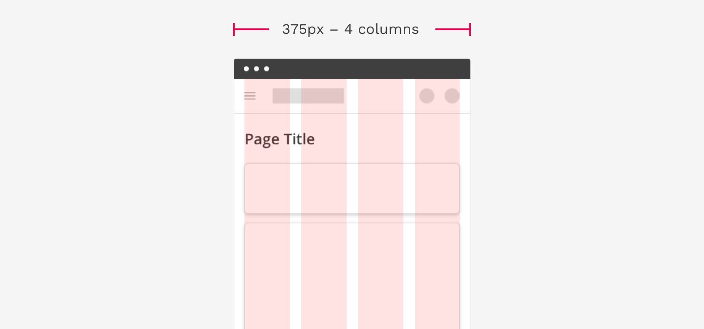
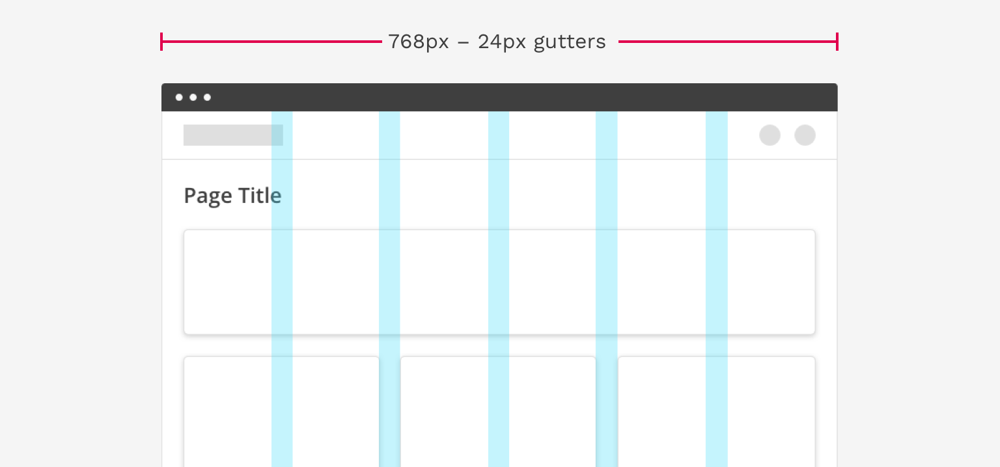
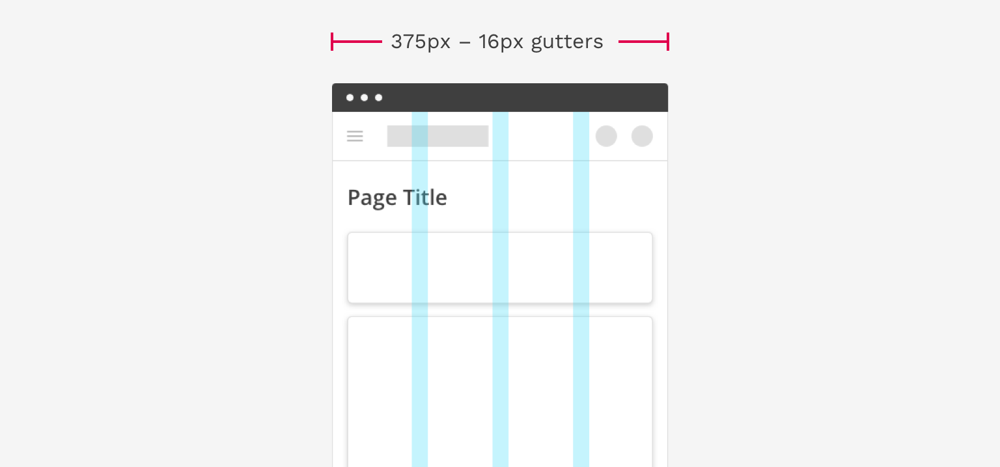
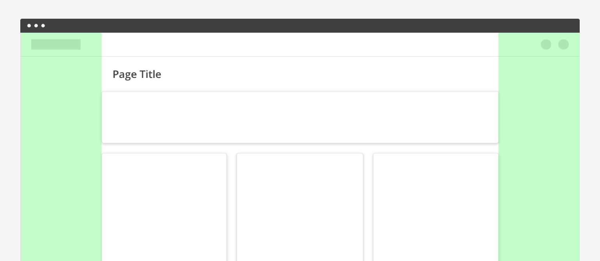
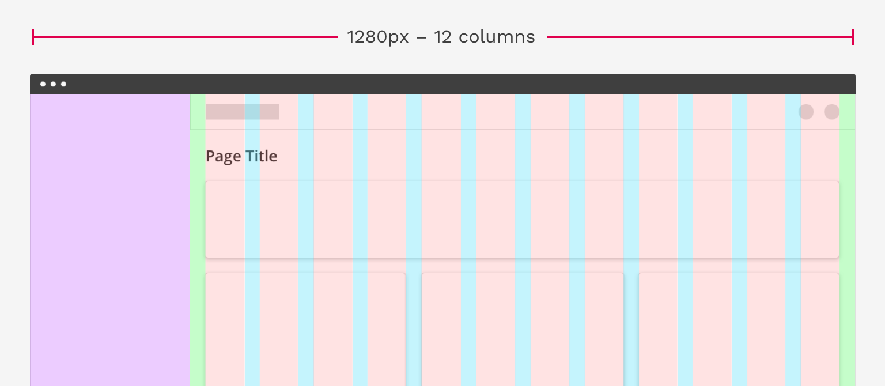

import {
  Table,
  TableHead,
  TableRow,
  TableHeaderCell,
  TableBody,
  TableCell,
} from 'react-magma-dom';

<PageContent componentName="layout" type="design_intro">

<LeadParagraph>
  The React Magma responsive layout adapts to screen size and orientation,
  ensuring a great experience across layouts.
</LeadParagraph>

---

## Columns, Gutters, and Margins

Every layout is made up of columns, gutters, and margins that respond accordingly to the size of the viewport.

<figure>
  
</figure>

1. Columns
2. Gutters
3. Margins

### Columns

The columns indicate where the content of the page goes. The widths of the columns are fluid, allowing content to scale and resize depending on the width of the device. The number of columns is determined by pre-defined breakpoint ranges.

<figure>
  
  <figcaption>
    When the viewport is greater than 768px wide, the layout has 12 columns.
  </figcaption>
</figure>

<figure>
  
  <figcaption>
    When the viewport is 768px wide or smaller, the layout has 6 columns.
  </figcaption>
</figure>

<figure>
  
  <figcaption>
    When the viewport is 375px wide and smaller, the layout changes to 4
    columns.
  </figcaption>
</figure>

### Gutters

Gutters are the spaces in between columns. This space is used to separate content in a consistent manner. Gutters are fixed-width but can change at specified breakpoint ranges. Wider gutters are great on large screens where more whitespace can be beneficial, while smaller gutters are good on small screens where usable space is limited.

The width of gutters on standard Cengage page layouts should be set to 24px. On smaller screens the gutters change to 16px.

<figure>
  
  <figcaption>
    When the viewport is greater than 600px wide, gutters are 24px wide.
  </figcaption>
</figure>

<figure>
  
  <figcaption>
    When the viewport is 600px wide and smaller, gutters are 16px wide.
  </figcaption>
</figure>

### Margins

Margins are the space between content and the left and right edges of the screen. The width of these margins depends on whether the page is using a full-page layout or a restricted-width layout.

#### Full-width layout

Margins are a fixed value, typically consistent with the gutter widths. The width of margins may change based on breakpoint values. Commonly used for complex applications where you might need to use as much of the screen as possible.

The width of margins on standard Cengage full-width page layouts should be set to 24px. On smaller screens the margins change to 16px.

<figure>
  
</figure>

#### Restricted-width Layout

Larger margins based on percentages can be used to restrict the maximum width of the content area. Commonly used for text-heavy pages displaying sales materials, articles, etc.

<figure>
  
</figure>

---

## Breakpoints

A breakpoint is the range of predetermined screen sizes that have specific layout requirements. At a given breakpoint range, the layout adjusts to suit the screen size and orientation.

Each breakpoint range determines the number of columns, and recommended margins and gutters, for each display size. The table below shows the default properties at a set of defined breakpoints for standard Cengage layouts, but this can be customized depending on the scenario.

<Table>
  <TableHead>
    <TableRow>
      <TableHeaderCell>Breakpoint range (px)</TableHeaderCell>
      <TableHeaderCell>Columns</TableHeaderCell>
      <TableHeaderCell>Margins/Gutters (px)</TableHeaderCell>
    </TableRow>
  </TableHead>
  <TableBody>
    <TableRow>
      <TableCell>0 – 375</TableCell>
      <TableCell>4</TableCell>
      <TableCell>16</TableCell>
    </TableRow>
    <TableRow>
      <TableCell>376 – 600</TableCell>
      <TableCell>6</TableCell>
      <TableCell>16</TableCell>
    </TableRow>
    <TableRow>
      <TableCell>601 – 768</TableCell>
      <TableCell>6</TableCell>
      <TableCell>24</TableCell>
    </TableRow>
    <TableRow>
      <TableCell>769 – 1024</TableCell>
      <TableCell>12</TableCell>
      <TableCell>24</TableCell>
    </TableRow>
    <TableRow>
      <TableCell>1024 +</TableCell>
      <TableCell>12</TableCell>
      <TableCell>24 *</TableCell>
    </TableRow>
  </TableBody>
</Table>

_\* Even for full-width layouts, we are only allowing the content area to size up to 1600px wide. Beyond that, the margins are essentially ignored and the space between the content area and the edges of the screen will grow as much as necessary._

---

## Full-width Layout with Sidebar

Some Cengage web applications have a global sidebar on the left side of the page. This sidebar necessitates that the main content changes from 12 columns to 6 at 1024px wide and below. This is much earlier than the other layouts detailed above.

<figure>
  
  <figcaption>
    When using the global sidebar, the main content area still has 12 columns
    when the viewport is wider than 1024px
  </figcaption>
</figure>

<figure>
  
  <figcaption>
    When using the global sidebar, the main content area changes to 6 columns
    when the viewport is 1024px wide and below.
  </figcaption>
</figure>

</PageContent>
