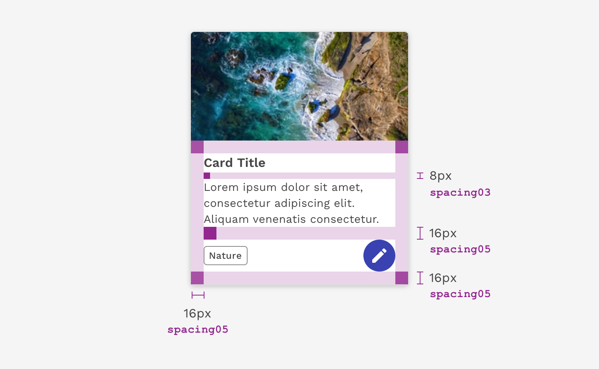

import {
  Table,
  TableHead,
  TableRow,
  TableHeaderCell,
  TableBody,
  TableCell,
} from 'react-magma-dom';
import { LeadParagraph } from '../../components/LeadParagraph';

<PageContent componentName="spacing" type="design_intro">

<LeadParagraph>
  Spacing is a powerful visual design tool for creating clearly organized and
  harmonious interfaces.
</LeadParagraph>

## Spacing Scale

The React Magma spacing scale is based on the 8px grid system with some more granular increments at the smaller end of the scale for more fine-tuned spacing. Spacing can be applied using margin or padding.

The spacing scale helps us determine how much space to put between or inside of everything you see. This includes large things like the gutters of our page layouts or the padding inside a card component, as well as the tiny space between a label and its corresponding input.

<Table>
  <TableHead>
    <TableRow>
      <TableHeaderCell>Property</TableHeaderCell>
      <TableHeaderCell>em</TableHeaderCell>
      <TableHeaderCell>px</TableHeaderCell>
      <TableHeaderCell width={200}>Example</TableHeaderCell>
    </TableRow>
  </TableHead>
  <TableBody>
    <TableRow>
      <TableCell>spacing01</TableCell>
      <TableCell>0.125</TableCell>
      <TableCell>2px</TableCell>
      <TableCell width={200}>
        
      </TableCell>
    </TableRow>
    <TableRow>
      <TableCell>spacing02</TableCell>
      <TableCell>0.25</TableCell>
      <TableCell>4px</TableCell>
      <TableCell width={200}>
        
      </TableCell>
    </TableRow>
    <TableRow>
      <TableCell>spacing03</TableCell>
      <TableCell>0.5</TableCell>
      <TableCell>8px</TableCell>
      <TableCell width={200}>
        
      </TableCell>
    </TableRow>
    <TableRow>
      <TableCell>spacing04</TableCell>
      <TableCell>0.75</TableCell>
      <TableCell>12px</TableCell>
      <TableCell width={200}>
        
      </TableCell>
    </TableRow>
    <TableRow>
      <TableCell>spacing05</TableCell>
      <TableCell>1</TableCell>
      <TableCell>16px</TableCell>
      <TableCell width={200}>
        
      </TableCell>
    </TableRow>
    <TableRow>
      <TableCell>spacing06</TableCell>
      <TableCell>1.5</TableCell>
      <TableCell>24px</TableCell>
      <TableCell width={200}>
        
      </TableCell>
    </TableRow>
    <TableRow>
      <TableCell>spacing07</TableCell>
      <TableCell>1.75</TableCell>
      <TableCell>28px</TableCell>
      <TableCell width={200}>
        
      </TableCell>
    </TableRow>
    <TableRow>
      <TableCell>spacing08</TableCell>
      <TableCell>2</TableCell>
      <TableCell>32px</TableCell>
      <TableCell width={200}>
        
      </TableCell>
    </TableRow>
    <TableRow>
      <TableCell>spacing09</TableCell>
      <TableCell>2.5</TableCell>
      <TableCell>40px</TableCell>
      <TableCell width={200}>
        
      </TableCell>
    </TableRow>
    <TableRow>
      <TableCell>spacing10</TableCell>
      <TableCell>3</TableCell>
      <TableCell>48px</TableCell>
      <TableCell width={200}>
        
      </TableCell>
    </TableRow>
    <TableRow>
      <TableCell>spacing11</TableCell>
      <TableCell>3.5</TableCell>
      <TableCell>56px</TableCell>
      <TableCell width={200}>
        
      </TableCell>
    </TableRow>
    <TableRow>
      <TableCell>spacing12</TableCell>
      <TableCell>4</TableCell>
      <TableCell>64px</TableCell>
      <TableCell width={200}>
        
      </TableCell>
    </TableRow>
    <TableRow>
      <TableCell>spacing13</TableCell>
      <TableCell>6</TableCell>
      <TableCell>96px</TableCell>
      <TableCell width={200}>
        
      </TableCell>
    </TableRow>
    <TableRow>
      <TableCell>spacing14</TableCell>
      <TableCell>10</TableCell>
      <TableCell>160px</TableCell>
      <TableCell width={200}>
        
      </TableCell>
    </TableRow>
  </TableBody>
</Table>

<figure>
  
  <figcaption>
    Example of using spacing properties to add padding inside a card, as well as
    the margins between the content within the card.
  </figcaption>
</figure>

<figure>
  
  <figcaption>
    Example of using spacing properties to create the space between cards in a
    grid.
  </figcaption>
</figure>

---

## Designing with Space

Every part of a UI should be intentional including the empty space between elements. The amount of space between items creates relationships and hierarchy.

### Creating Relationships

When elements in a design are close to each other, then they are seen as related. This relationship becomes weaker as the space between them increases.

Using space to arrange related elements into groups can help you create sections on a page without using lines as a divider.

### Creating Hierarchy

You can give more importance to elements by increasing the space around them. Elements that are close to each other often get grouped together or are viewed as being equally important to each other. Therefore, if you have an element or content of high importance on the page, consider giving it extra surrounding space to help it attract focus.

### White Space

Empty space — also known as white space — is important in design. It can be used to break up sections on a page or to help create focus on certain elements. White space helps with information processing; too much dense information can be disorienting or overwhelming for a user. Sections of a UI are allowed to be dense, but the whole page should not be crowded; there should be white space to let the user’s eye rest.

---

## FAQ

**Are spacing increments outside of the scale allowed?** 
There are always exceptions to the rule, but deviating from the spacing scale should be avoided whenever possible.

**Can I still use percentages for spacing?** 
Percentages like 50% (1/2) or 33% (1/3) are still acceptable ways to divide a page. Percentages can all still be used to control max and min widths. However, using percentages for padding or margin inside of a component or element should be avoided (ex. padding-right: 10%).

**Is the spacing scale responsive?** 
No, the spacing properties themselves do not change values based on the screen size. However, it is acceptable at page breakpoints to jump a step(s) on the spacing scale to fit spacing needs.

Example: At 1440px `padding-right: spacing05` but at breakpoint 768px `padding-right: spacing03`.

</PageContent>
