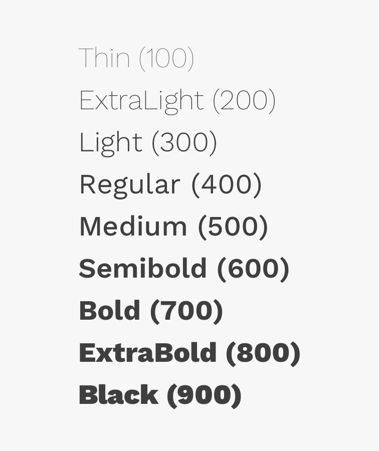
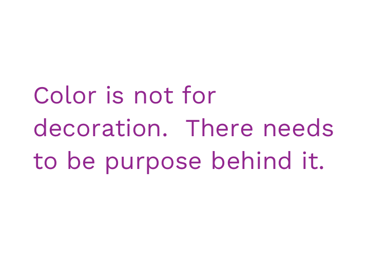

import { Link } from 'gatsby';
import '../design/design-guidelines-styles.css';
import { DocsHeading } from '../../components/DocsHeading';
import { Button, Paragraph, Heading } from 'react-magma-dom';

<PageContent componentName="typography" type="design_intro">

Cengage applications need clear and consistent headings, highly legible body paragraphs, and clear labels. Our typefaces are chosen for legibility and maximum support for mathematical characters.

By consistently tying typographic styles to appropriate functions in the interface, we create a clear visual pattern for students and faculty to follow while they’re interacting with our products.

---

## Magma Type Sets

Magma has three sets of ready-made typographic elements that you can choose from and should be adhered to when at all possible. Each one combines a font family with calibrated sizes and weights to work within applications or editorial content. The three sets are called **Productive**, **Expressive**, and **Narrative**.

_**IMPORTANT:** The Productive set is used by default in the components so you won't actually see it referred to in the code. You can easily change to Expressive or Narrative when appropriate by adding the necessary prop._

### Productive Type Set (Default)

Productive type is reserved for use in web-based product design, where the user needs to focus on tasks. The Productive styles are curated to create a series of clear user expectations about hierarchy. The difference between the Productive and Expressive styles is mainly evident in the Headings.

#### Productive Body Text Styles

  

    

      <Paragraph noMargins visualStyle="bodyLarge">
        This is a good size for higher emphasis text, as well as the subheadline
        of a page.
      </Paragraph>
    

    

      

        <strong>Body / Large</strong>
      

      
Typeface: Work Sans

      
Size: 20px / 1.25em

      
Line-height: 32px / 2em

      
Weight: Regular / 400

      
Letter-spacing: 0px

    

    

      

        <strong>Body / Large</strong>
      

      
Typeface: Work Sans

      
Size: 18px / 1.125em

      
Line-height: 24px / 1.5em

      
Weight: Regular / 400

      
Letter-spacing: 0px

    

  

  

    

      <Paragraph noMargins visualStyle="bodyMedium">
        This is commonly used in layouts for paragraphs. The line height and
        size make for comfortable, long-form reading, in mediums that allow for
        more space. This size type is the basis for how all other text is
        calculated.
      </Paragraph>
    

    

      

        <strong>Body / Medium</strong>
      

      
Typeface: Work Sans

      
Size: 16px / 1em

      
Line-height: 24px / 1.5em

      
Weight: Regular / 400

      
Letter-spacing: 0px

    

  

  

    

      <Paragraph noMargins visualStyle="bodySmall">
        This is commonly used for helper and error text on inputs, as well as
        other explanatory text.
      </Paragraph>
    

    

      

        <strong>Body / Small</strong>
      

      
Typeface: Work Sans

      
Size: 14px / .875em

      
Line-height: 20px / 1.25em

      
Weight: Regular / 400

      
Letter-spacing: .16px

    

  

  

    

      <Paragraph noMargins visualStyle="bodyXSmall">
        This is good to use for captions and other meta-data or explanatory
        text.
      </Paragraph>
    

    

      

        <strong>Body / X-Small</strong>
      

      
Typeface: Work Sans

      
Size: 12px / .75em

      
Line-height: 16px / 1em

      
Weight: Regular / 400

      
Letter-spacing: .32px

    

  

#### Productive Heading Text Styles

  

    

      <Paragraph noMargins visualStyle="headingXLarge">
        This is used for layout headings
      </Paragraph>
    

    

      

        <strong>Heading / X-Large</strong>
      

      
Typeface: Work Sans

      
Size: 36px / 2.25em

      
Line-height: 48px / 3em

      
Weight: Semibold / 600

      
Letter-spacing: 0px

    

    

      

        <strong>Heading / X-Large</strong>
      

      
Typeface: Work Sans

      
Size: 28px / 1.75em

      
Line-height: 40px / 2.5em

      
Weight: Semibold / 600

      
Letter-spacing: 0px

    

  

  

    

      <Paragraph noMargins visualStyle="headingLarge">
        This is used for layout headings
      </Paragraph>
    

    

      

        <strong>Heading / Large</strong>
      

      
Typeface: Work Sans

      
Size: 28px / 1.75em

      
Line-height: 40px / 2.5em

      
Weight: Semibold / 600

      
Letter-spacing: 0px

    

    

      

        <strong>Heading / Large</strong>
      

      
Typeface: Work Sans

      
Size: 24px / 1.5em

      
Line-height: 32px / 2em

      
Weight: Semibold / 600

      
Letter-spacing: 0px

    

  

  

    

      <Paragraph noMargins visualStyle="headingMedium">
        This is used for layout headings and component titles
      </Paragraph>
    

    

      

        <strong>Heading / Medium</strong>
      

      
Typeface: Work Sans

      
Size: 24px / 1.5em

      
Line-height: 32px / 2em

      
Weight: Semibold / 600

      
Letter-spacing: 0px

    

    

      

        <strong>Heading / Medium</strong>
      

      
Typeface: Work Sans

      
Size: 20px / 1.25em

      
Line-height: 32px / 2em

      
Weight: Semibold / 600

      
Letter-spacing: 0px

    

  

  

    

      <Paragraph noMargins visualStyle="headingSmall">
        This is used for layout headings and component titles
      </Paragraph>
    

    

      

        <strong>Heading / Small</strong>
      

      
Typeface: Work Sans

      
Size: 20px / 1.25em

      
Line-height: 32px / 2em

      
Weight: Semibold / 600

      
Letter-spacing: 0px

    

    

      

        <strong>Heading / Small</strong>
      

      
Typeface: Work Sans

      
Size: 18px / 1.125em

      
Line-height: 24px / 1.5em

      
Weight: Semibold / 600

      
Letter-spacing: 0px

    

  

  

    

      <Paragraph noMargins visualStyle="headingXSmall">
        This is used for layout headings and component titles
      </Paragraph>
    

    

      

        <strong>Heading / X-Small</strong>
      

      
Typeface: Work Sans

      
Size: 18px / 1.125em

      
Line-height: 24px / 1.5em

      
Weight: Semibold / 600

      
Letter-spacing: 0px

    

  

  

    

      <Paragraph noMargins visualStyle="heading2XSmall">
        This is used for layout headings and component titles
      </Paragraph>
    

    

      

        <strong>Heading / 2X-Small</strong>
      

      
Typeface: Work Sans

      
Size: 12px / .75em

      
Line-height: 16px / 1em

      
Weight: Bold / 700

      
Letter-spacing: .32px

    

  

### Expressive Type Set

Expressive type is reserved for use in editorial and digital marketing experiences which may require more dynamic typographic hierarchies and more variety in the Heading scale. The Expressive styles are curated to create a series of clear user expectations while still allowing for a more dramatic, graphic use of type.

#### Expressive Body Text Styles

  

    

      <Paragraph contextVariant="expressive" noMargins visualStyle="bodyLarge">
        This is a good size for higher emphasis text, as well as the subheadline
        of a page.
      </Paragraph>
    

    

      

        <strong>Body / Large</strong>
      

      
Typeface: Work Sans

      
Size: 24px / 1.5em

      
Line-height: 32px / 2em

      
Weight: Regular / 400

      
Letter-spacing: 0px

      
Color: primary600 / #292F7C

    

    

      

        <strong>Body / Large</strong>
      

      
Typeface: Work Sans

      
Size: 20px / 1.25em

      
Line-height: 32px / 2em

      
Weight: Regular / 400

      
Letter-spacing: 0px

      
Color: primary600 / #292F7C

    

  

#### Expressive Heading Text Styles

  

    

      <Paragraph
        contextVariant="expressive"
        noMargins
        visualStyle="heading2XLarge"
      >
        This is used for layout headings
      </Paragraph>
    

    

      

        <strong>Heading / 2X-Large</strong>
      

      
Typeface: Work Sans

      
Size: 72px / 4.5em

      
Line-height: 84px / 5.25em

      
Weight: Semibold / 600

      
Letter-spacing: 0px

    

    

      

        <strong>Heading / 2X-Large</strong>
      

      
Typeface: Work Sans

      
Size: 54px / 3.375em

      
Line-height: 64px / 4em

      
Weight: Semibold / 600

      
Letter-spacing: 0px

    

  

  

    

      <Paragraph
        contextVariant="expressive"
        noMargins
        visualStyle="headingXLarge"
      >
        This is used for layout headings
      </Paragraph>
    

    

      

        <strong>Heading / X-Large</strong>
      

      
Typeface: Work Sans

      
Size: 52px / 3.25em

      
Line-height: 68px / 4.25em

      
Weight: Regular / 400

      
Letter-spacing: 0px

    

    

      

        <strong>Heading / X-Large</strong>
      

      
Typeface: Work Sans

      
Size: 42px / 2.625em

      
Line-height: 48px / 3em

      
Weight: Regular / 400

      
Letter-spacing: 0px

    

  

  

    

      <Paragraph
        contextVariant="expressive"
        noMargins
        visualStyle="headingLarge"
      >
        This is used for layout headings
      </Paragraph>
    

    

      

        <strong>Heading / Large</strong>
      

      
Typeface: Work Sans

      
Size: 36px / 2.25em

      
Line-height: 48px / 3em

      
Weight: Light / 300

      
Letter-spacing: 0px

    

    

      

        <strong>Heading / Large</strong>
      

      
Typeface: Work Sans

      
Size: 28px / 1.75em

      
Line-height: 40px / 2.5em

      
Weight: Light / 300

      
Letter-spacing: 0px

    

  

  

    

      <Paragraph
        contextVariant="expressive"
        noMargins
        visualStyle="headingMedium"
      >
        This is used for layout headings and component titles
      </Paragraph>
    

    

      

        <strong>Heading / Medium</strong>
      

      
Typeface: Work Sans

      
Size: 28px / 1.75em

      
Line-height: 40px / 2.5em

      
Weight: Light / 300

      
Letter-spacing: 0px

    

    

      

        <strong>Heading / Medium</strong>
      

      
Typeface: Work Sans

      
Size: 24px / 1.5em

      
Line-height: 32px / 2em

      
Weight: Light / 300

      
Letter-spacing: 0px

    

  

  

    

      <Paragraph
        contextVariant="expressive"
        noMargins
        visualStyle="headingSmall"
      >
        This is used for layout headings and component titles
      </Paragraph>
    

    

      

        <strong>Heading / Small</strong>
      

      
Typeface: Work Sans

      
Size: 24px / 1.5em

      
Line-height: 32px / 2em

      
Weight: Light / 300

      
Letter-spacing: 0px

    

    

      

        <strong>Heading / Small</strong>
      

      
Typeface: Work Sans

      
Size: 20px / 1.5em

      
Line-height: 32px / 2em

      
Weight: Light / 300

      
Letter-spacing: 0px

    

  

  

    

      <Paragraph
        contextVariant="expressive"
        noMargins
        visualStyle="headingXSmall"
      >
        This is used for layout headings and component titles
      </Paragraph>
    

    

      

        <strong>Heading / X-Small</strong>
      

      
Typeface: Work Sans

      
Size: 20px / 1.25em

      
Line-height: 32px / 2em

      
Weight: Light / 300

      
Letter-spacing: 0px

    

    

      

        <strong>Heading / X-Small</strong>
      

      
Typeface: Work Sans

      
Size: 18px / 1.25em

      
Line-height: 24px / 1.5em

      
Weight: Light / 300

      
Letter-spacing: 0px

    

  

  

    

      <Paragraph
        contextVariant="expressive"
        noMargins
        visualStyle="heading2XSmall"
      >
        This is used for layout headings and component titles
      </Paragraph>
    

    

      

        <strong>Heading / 2X-Small</strong>
      

      
Typeface: Work Sans

      
Size: 16px / 1em

      
Line-height: 24px / 1.5em

      
Weight: Bold / 700

      
Letter-spacing: .32px

    

  

### Narrative Type Set

Narrative type uses Noto Serif but is otherwise styled the same as the default Productive variant. The Narrative styles are curated to create a series of clear user expectations about hierarchy, but in a font that is more pleasurable for reading long passages of text.

#### Narrative Body Text Styles

  

    

      <Paragraph contextVariant="narrative" noMargins visualStyle="bodyLarge">
        This is a good size for higher emphasis text, as well as the subheadline
        of a page.
      </Paragraph>
    

    

      

        <strong>Body / Large</strong>
      

      
Typeface: Noto Serif

      
Size: 20px / 1.25em

      
Line-height: 32px / 2em

      
Weight: Regular / 400

      
Letter-spacing: 0px

    

    

      

        <strong>Body / Large</strong>
      

      
Typeface: Noto Serif

      
Size: 18px / 1.125em

      
Line-height: 24px / 1.5em

      
Weight: Regular / 400

      
Letter-spacing: 0px

    

  

  

    

      <Paragraph contextVariant="narrative" noMargins visualStyle="bodyMedium">
        This is commonly used in layouts for paragraphs. The line height and
        size make for comfortable, long-form reading, in mediums that allow for
        more space. This size type is the basis for how all other text is
        calculated.
      </Paragraph>
    

    

      

        <strong>Body / Medium</strong>
      

      
Typeface: Noto Serif

      
Size: 16px / 1em

      
Line-height: 24px / 1.5em

      
Weight: Regular / 400

      
Letter-spacing: 0px

    

  

  

    

      <Paragraph contextVariant="narrative" noMargins visualStyle="bodySmall">
        This size is great for creating contrast between the main paragraph of
        the passage and secondary information.
      </Paragraph>
    

    

      

        <strong>Body / Small</strong>
      

      
Typeface: Noto Serif

      
Size: 14px / .875em

      
Line-height: 20px / 1.25em

      
Weight: Regular / 400

      
Letter-spacing: .16px

    

  

  

    

      <Paragraph contextVariant="narrative" noMargins visualStyle="bodyXSmall">
        This is good to use for captions and other meta-data or explanatory
        text.
      </Paragraph>
    

    

      

        <strong>Body / X-Small</strong>
      

      
Typeface: Noto Serif

      
Size: 12px / .75em

      
Line-height: 16px / 1em

      
Weight: Regular / 400

      
Letter-spacing: .32px

    

  

#### Narrative Heading Text Styles

  

    

      <Paragraph
        contextVariant="narrative"
        noMargins
        visualStyle="headingXLarge"
      >
        This is commonly used for H1 headings
      </Paragraph>
    

    

      

        <strong>Heading / X-Large</strong>
      

      
Typeface: Noto Serif

      
Size: 36px / 2.25em

      
Line-height: 48px / 3em

      
Weight: Bold / 700

      
Letter-spacing: 0px

    

    

      

        <strong>Heading / X-Large</strong>
      

      
Typeface: Noto Serif

      
Size: 28px / 1.75em

      
Line-height: 40px / 2.5em

      
Weight: Bold / 700

      
Letter-spacing: 0px

    

  

  

    

      <Paragraph
        contextVariant="narrative"
        noMargins
        visualStyle="headingLarge"
      >
        This is commonly used for H2 headings
      </Paragraph>
    

    

      

        <strong>Heading / Large</strong>
      

      
Typeface: Noto Serif

      
Size: 28px / 1.75em

      
Line-height: 40px / 2.5em

      
Weight: Bold / 700

      
Letter-spacing: 0px

    

    

      

        <strong>Heading / Large</strong>
      

      
Typeface: Noto Serif

      
Size: 24px / 1.5em

      
Line-height: 32px / 2em

      
Weight: Bold / 700

      
Letter-spacing: 0px

    

  

  

    

      <Paragraph
        contextVariant="narrative"
        noMargins
        visualStyle="headingMedium"
      >
        This is commonly used for H3 headings
      </Paragraph>
    

    

      

        <strong>Heading / Medium</strong>
      

      
Typeface: Noto Serif

      
Size: 24px / 1.5em

      
Line-height: 32px / 2em

      
Weight: Bold / 700

      
Letter-spacing: 0px

    

    

      

        <strong>Heading / Medium</strong>
      

      
Typeface: Noto Serif

      
Size: 20px / 1.25em

      
Line-height: 32px / 2em

      
Weight: Bold / 700

      
Letter-spacing: 0px

    

  

  

    

      <Paragraph
        contextVariant="narrative"
        noMargins
        visualStyle="headingSmall"
      >
        This is commonly used for H4 headings
      </Paragraph>
    

    

      

        <strong>Heading / Small</strong>
      

      
Typeface: Noto Serif

      
Size: 20px / 1.25em

      
Line-height: 32px / 2em

      
Weight: Bold / 700

      
Letter-spacing: 0px

    

    

      

        <strong>Heading / Small</strong>
      

      
Typeface: Noto Serif

      
Size: 18px / 1.125em

      
Line-height: 24px / 1.5em

      
Weight: Bold / 700

      
Letter-spacing: 0px

    

  

  

    

      <Paragraph
        contextVariant="narrative"
        noMargins
        visualStyle="headingXSmall"
      >
        This is commonly used for H5 headings
      </Paragraph>
    

    

      

        <strong>Heading / X-Small</strong>
      

      
Typeface: Noto Serif

      
Size: 18px / 1.125em

      
Line-height: 24px / 1.5em

      
Weight: Bold / 700

      
Letter-spacing: 0px

    

  

  

    

      <Paragraph
        contextVariant="narrative"
        noMargins
        visualStyle="heading2XSmall"
      >
        This is commonly used for H6 headings
      </Paragraph>
    

    

      

        <strong>Heading / 2X-Small</strong>
      

      
Typeface: Noto Serif

      
Size: 12px / .75em

      
Line-height: 16px / 1em

      
Weight: Bold / 700

      
Letter-spacing: .32px

    

  

### Changing Headings Styles

The headings presets above are assigned by default to H1 through H6 in the <Link to="/api/heading/">Headings component</Link>. But it's relatively common to need a specific heading type in the markup, but not want the default styling. For this reason we have made it very easy to change which styling preset you use in the headings component.

One example of this is in the <Link to="/api/modal/">Modal component</Link>. For optimal accessibility the title of the modal needs to be an H1, but we definitely don't want it to be styled with text that large. So we use an H1, but apply the Productive Heading Small style to it. This flexibility allows consumers of Magma to design using the styles that work best for the UI, but still have a clear informational hierarchy for assistive technologies.

<figure>
  
</figure>

#### Consistency is Key

Continuing from above, there isn't just one way an H1 or and H3 should be styled. We have chosen logical default styles, but it's easy to say you need an H3 to be styled using one of the larger or smaller presets. The key is to be consistent. If you style a page title using productive-heading-large, then you need to use the same styling on all of the pages. If you use "productive-heading-xsmall" to style the title of a section, then you should use the same styling on equivalent sections.

### Responsive Behavior

Another advantage to using the presets above is that Responsive behavior is already built into each style so you don't have to figure out and include it yourself. This means a number of the larger sizes will automatically reduce in size at 600px wide. This ensures we have appropriate text sizes on smaller devices. The breakpoint can be overridden if you want this change to happen earlier or later.

<figure>
  
</figure>

---

## Typefaces

### Work Sans

Our primary typface is Work Sans. It’s clear and approachable and is great for headlines, subheads, navigation and body copy.

<a href="https://fonts.google.com/specimen/Work+Sans" target="_blank">
  Download Work Sans
</a>

  

    

      <figure>
        
      </figure>
    

    

      Work Sans is a typeface family based loosely on early Grotesques, such as those by Stephenson Blake, Miller & Richard and Bauerschen Giesserei. The Regular weight and others in the middle of the family are optimised for on-screen text usage at medium-sizes (14px-48px) and can also be used in print design. The fonts closer to the extreme weights are designed more for display use both on the web and in print. Overall, features are simplified and optimised for screen resolutions; for example, diacritic marks are larger than how they would be in print. A version optimised for desktop applications is available from the Work Sans github project page.
    

  

### Noto Serif

Noto Serif is a beautiful serif font. It's easy to read, provides a nice contrast with Work Sans and has great support for special characters. At this point, Noto Serif should primarily be used for the reader applications that display our text books.

<a href="https://fonts.google.com/specimen/Noto+Serif" target="_blank">
  Download Noto Serif
</a>

  

    

      <figure>
        
      </figure>
    

    

      

        When text is rendered by a computer, sometimes there will be characters
        in the text that can not be displayed, because no font that supports
        them is available to the computer. When this occurs, small boxes are
        shown to represent the characters. We call those small boxes “tofu,” and
        we want to remove tofu from the Web. This is how the Noto font families
        got their name.
      

      

        Noto helps to make the web more beautiful across platforms for all
        languages. Currently, Noto covers over 30 scripts, and will cover all of
        Unicode in the future. This is the Serif Latin, Greek and Cyrillic
        family. It has Regular, Bold, Italic and Bold Italic styles and is
        hinted.
      

    

  

---

## Type Scale

The font sizes used in the sets above come from the full type scale. This type scale is based on the Major Second Type Scale (1.125) but is slightly modified to round to whole numbers and create a simple pattern in the difference between each size. Small font sizes differ by 2px, and then that difference increases by 4px and then 6px as the size gets larger.

Line-heights are also defined at this level to adhere to an 8px spacing system, and should not be changed unless absolutely necessary

If you have a need to use a font size outside of the pre-made sets above, you may only choose from this list.

<figure>
  
</figure>

---

## Styles

### Weight

Font weight is an important typographic variable that can add emphasis and differentiate content hierarchy. Font weight and size pairings must be carefully balanced. A bold weight will always have more emphasis than a lighter weight font of the same size. However, a lighter weight font can rank hierarchically higher than a bold font if the lighter weight type size is significantly larger than the bold one. The weights available in React Magma are `thin (100)`, `extra-light (200)`, `light (300)`, `regular (400)`, `medium (500)`, `semi-bold (600)`, `bold (700)`, `extra-bold (800)` and `black (900)`.

  

    

      <figure>
        
      </figure>
    

    

  

### Italic

Each weight has an italic style, which should only be used when you need to emphasize certain words in a sentence (titles of works, technical terms, names of devices, captions, etc.).

  

    

      <figure>
        
      </figure>
    

    

  

### Color

Type color should be carefully considered, with legibility and accessibility as your main concerns. Color can be helpful for reinforcing the meaning or context of a piece of text or action, but color should never be the only way this is communicated, or just for decoration. When text is generally kept neutral in color, then it can be much more powerful when you do need to use it to point out actions or a special important messages. The text itself is the clearest way to explain what the user needs to know, but icons can also help provide helpful clues.

  

    

      <figure>
        
        <figcaption>
          
Correct

          

            Text should generally be kept neutral in color until there's a
            reason to use a color.
          

        </figcaption>
      </figure>
    

    

      <figure>
        
        <figcaption>
          
Correct

          
On dark backgrounds, neutral text appears as white.

        </figcaption>
      </figure>
    

  

  

    

      <figure>
        
        <figcaption>
          
Incorrect

          
Don't use color as decoration.

        </figcaption>
      </figure>
    

    

      <figure>
        
        <figcaption>
          
Incorrect

          

            The contrast between text and its background needs to be 4.5:1, or
            3:1 for large (18px) text.
          

        </figcaption>
      </figure>
    

  

  

    

      <figure>
        
        <figcaption>
          
Correct

          

            Appropriate color usage can help reinforce the meaning of text, but
            is not a replacement for clear text and other helpful visual aids
            like icons.
          

        </figcaption>
      </figure>
    

    

      <figure>
        
        <figcaption>
          
Correct

          

            A message is successful if you can remove the color from it, and the
            meaning is still clear.
          

        </figcaption>
      </figure>
    

  

#### Subdued

It is common to lighten certain pieces of text in order to create more contrast. For example, making a subtitle more subdued than the title, or instructional text like the helper text on form inputs. This can be easily done by applying the "subdued" color to a piece of text. On a light background, this makes the color #707070. The inverse equivalent is a semi-transparent white.

  

    

      <figure>
        
      </figure>
    

    

      <figure>
        
      </figure>
    

  

---

## Margins

Headings and paragraphs have margins built into them by default. These margins provide the desired rhythm created by spacing when they are used together in a traditional narrative context. These margins can be easily modified using the spacing scale or completely removed when using headings or paragraphs in other contexts.

<figure>
  
</figure>

</PageContent>