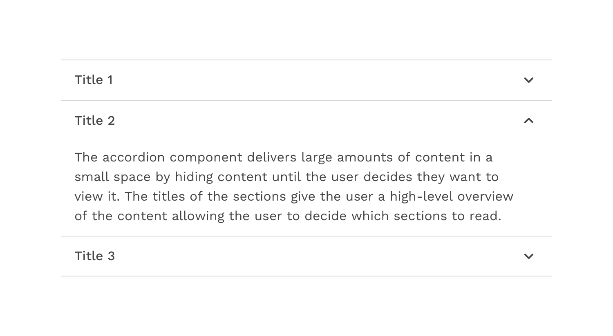
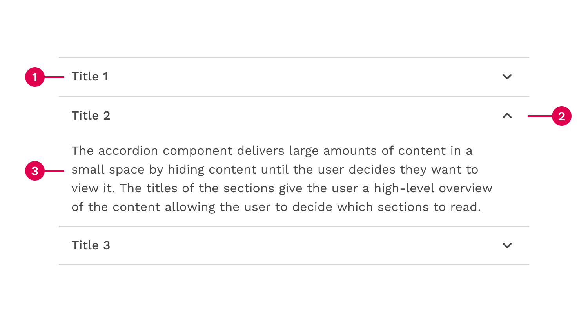
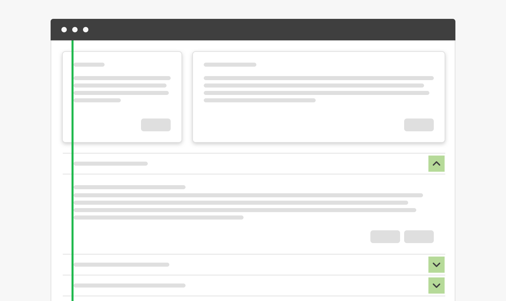
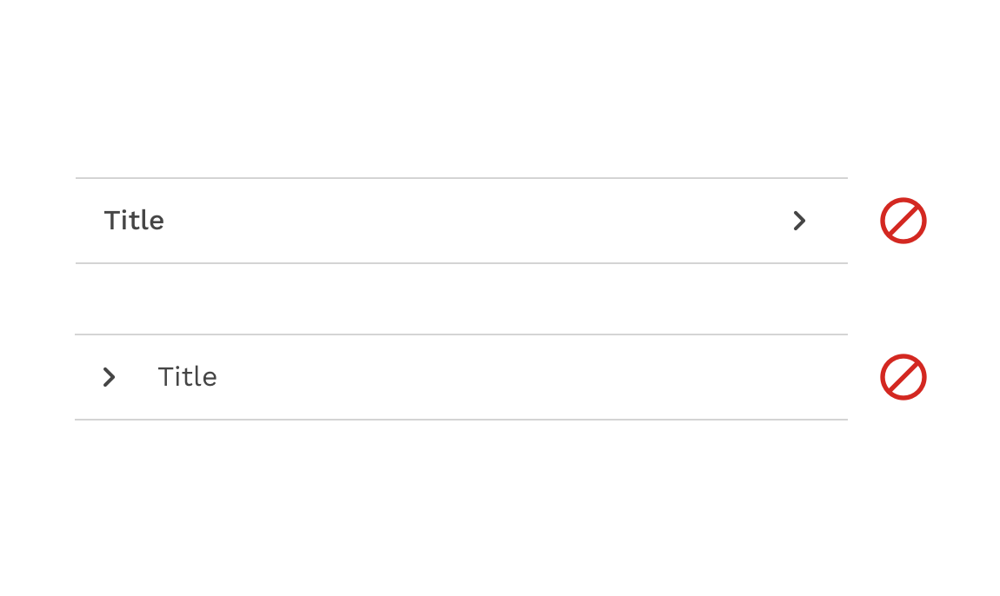
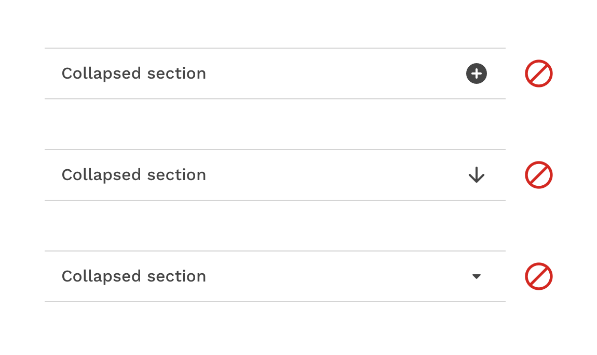
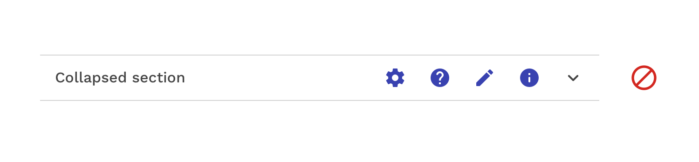
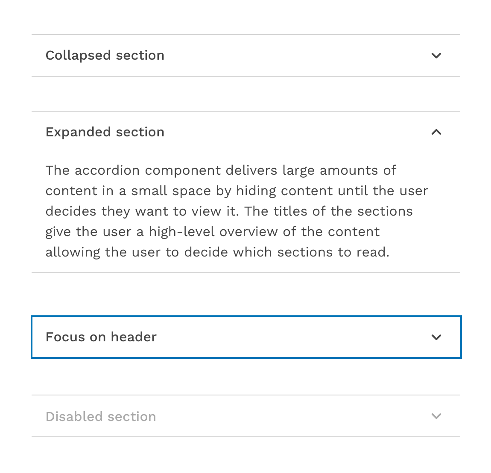
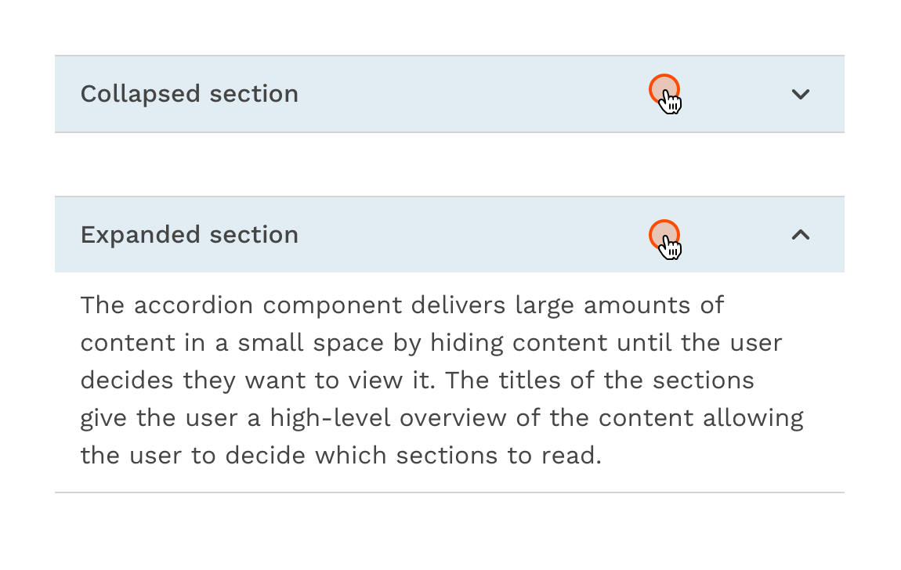

import './design-guidelines-styles.css';

<PageContent componentName="accordion" type="design">
<LeadParagraph>
  An accordion is a vertically stacked list of headers that reveal or hide associated sections of content.
</LeadParagraph>

## Usage

The accordion component delivers large amounts of content in a small space by hiding content until the user decides they want to view it. The titles of the sections give the user a high-level overview of the content allowing the user to decide which sections to read.

### When to use

- To organize related information.
- To shorten pages and reduce scrolling when content is not crucial to read in full.
- When space is at a premium and long content cannot be displayed all at once, like on a mobile interface or in a side panel.

---

## Formatting

### Anatomy

1. Header - contains the section title and controls the showing or hiding of the panel.
2. Icon - A down-facing or up-facing chevron indicates whether the section is currently expanded or collapsed.
3. Panel - Contains the content associated with the section header.

### Alignment

By default the chevron icon is placed on the right side of the header. This allows for the title on the left side to align with the content in the panel and other elements in the layout.

In some scenarios, the accordion can be modified to place the chevron icon in front of the title to function more like a tree. But this should be used with care because the content of the panel may not align with the title.

  <figure>
    
    <figcaption>
      
Correct

      

        Use the default icon alignment to make sure accordion text content
        properly aligns with other text content on the page.
      

    </figcaption>
  </figure>
  <figure>
    
    <figcaption>
      
Caution

      

        Be careful putting the icon on the left side of the accordion, because
        this could cause unintended alignment issues with other text content on
        the page.
      

    </figcaption>
  </figure>

If you place the chevron icon on the left side of the title, don’t be tempted to use a right-facing chevron. While it is common to have right-facing arrows on the left side of tree, placing it on the right side completely changes the meaning of the icon. So for the sake of consistency, we will only allow up and down chevrons for components that expand and collapse.

  <figure>
    
    <figcaption>
      
Incorrect

      

        Only use up and down chevrons to indicate whether an accordion section
        is expanded or collapsed, even if you move the icon to the left side.
      

    </figcaption>
  </figure>
  <figure>
    
    <figcaption>
      
Incorrect

      

        Don't change the chevron icon to something else like arrows or plus and
        minus icons.
      

    </figcaption>
  </figure>

<figure>
  
  <figcaption>
    
Incorrect

    

      Don't group additional icons with the chevron without providing some kind
      of separation to avoid missing the expanding functionality entirely.
    

  </figcaption>
</figure>

### Placement

Accordions can be placed within main page content or placed inside of a container such as a side panel or card.

  <figure>
    
  </figure>
  <figure>
    
  </figure>
  <figure>
    
  </figure>

---

## Content

### Main Elements

#### Title

The title should be as brief as possible while still being clear and descriptive.
Each title should be wrapped in a role heading (h1-h6) that is appropriate for the information architecture of the page.

#### Body Copy

The content inside of a panel can be essentially anything. It could be simple paragraphs or a more complex layout of elements.

### Scrolling Content

When the accordion content is longer than the viewport the whole accordion should vertically scroll. Content should not scroll inside of an individual panel. Content should never scroll horizontally in an accordion.

---

## Behaviors

### States

The accordion component has two main states: collapsed and expanded. The chevron icon at the end of the accordion indicates which state the accordion is in. The chevron points down to indicate collapsed and up to indicate expanded.

Any or all sections in an accordion may be open or closed in their starting state. Starting in a collapsed state gives the user a high-level overview of the available information.

A user can then independently expand each section of the accordion allowing for multiple sections to be open at once. The accordion may also be configured so that opening a section automatically closes another section so that only one is open at a time.

In addition to the collapsed and expanded states, accordions also have interactive states for focus, hover, and disabled.

---

## Interactions

### Mouse

Users can open or close a section by clicking on the chevron or clicking anywhere in the header area.

### Keyboard

Users can open or close a section by pressing Enter or Space while the header area has focus.

Users can navigate between accordion headers by pressing Tab or Shift-Tab.

---

## Design Customization

The basic accordion is designed to be used as-is but is also very flexible and the design can be customized to fit any use. To make sure the accordion is as visually appealing, but also as accessible as possible, play with text styles, colors, icon sizes, and spacing within the guidelines provided for those attributes.

</PageContent>
