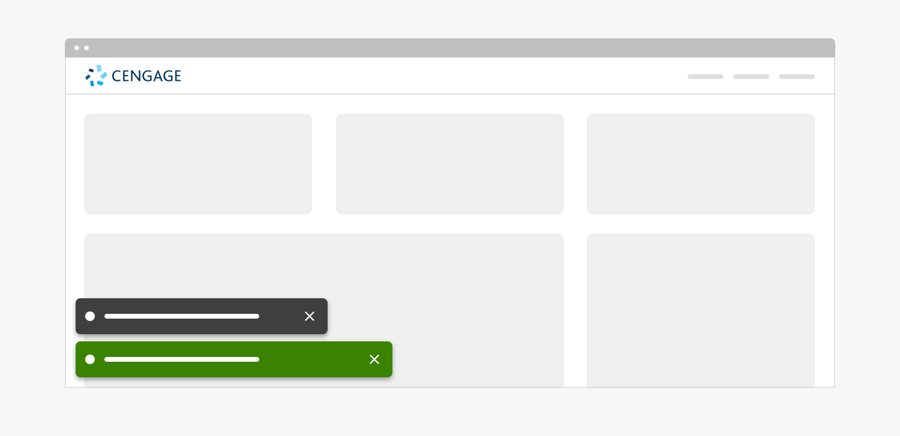
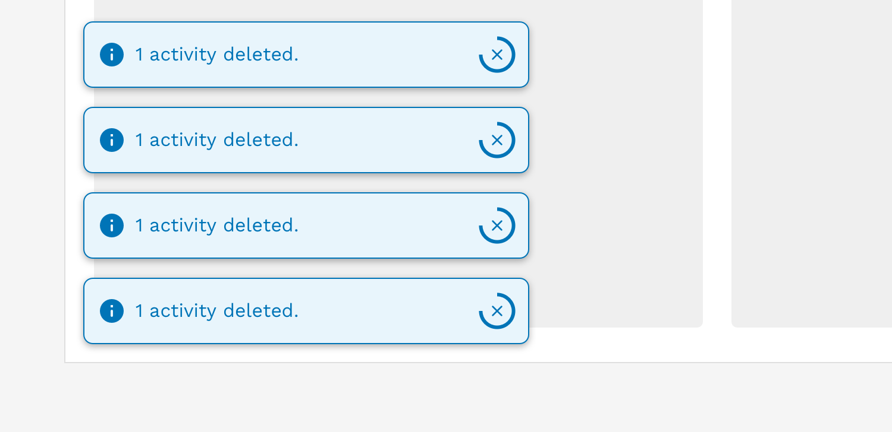
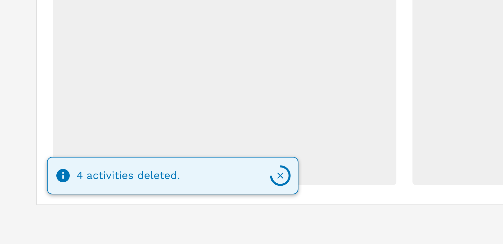
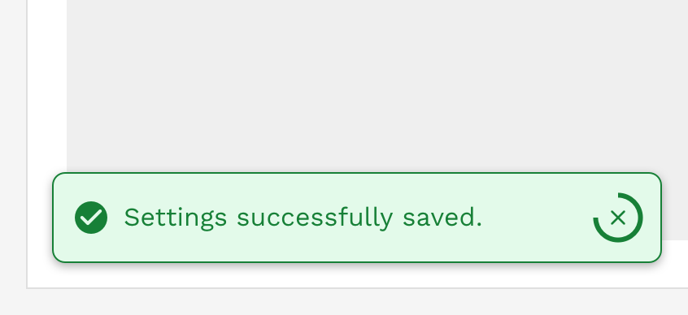
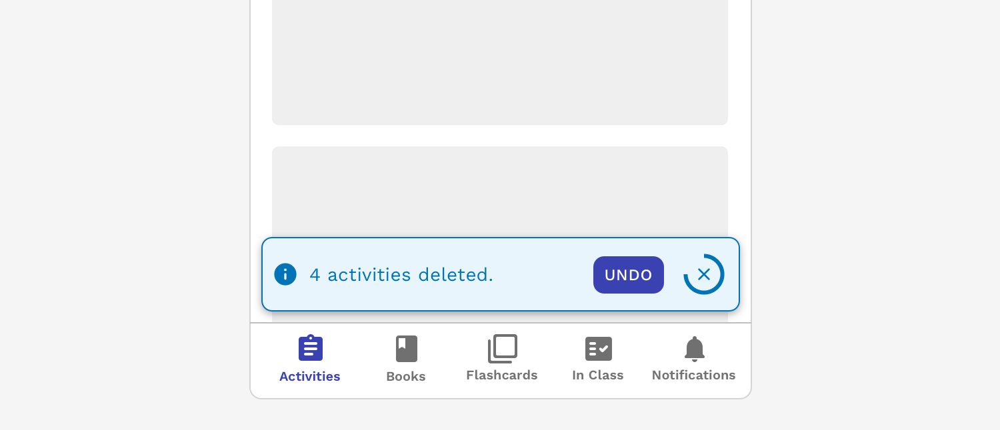

import { Link } from 'gatsby';
import './design-guidelines-styles.css';
import { LeadParagraph } from '../../components/LeadParagraph';
import { Alert } from 'react-magma-dom';

<PageContent componentName="alert" type="design">
<LeadParagraph>
  Alerts display a short, important message in a way that attracts a user's
  attention.
</LeadParagraph>

## Usage

Use alerts to inform users of updates, changes to system status, or as feedback to an action they have taken. Proactively communicating with users and providing immediate feedback is important for building trust and maintaining a constant awareness of the system status. While alerts are an effective method of communicating with users, they have the potential to be disruptive and should be used with care.

<figure>
  
</figure>

---

## Principles

### Helpful

Alerts are used to clearly communicate relevant and important information to the user and help them understand what is happening or has happened, and if they need to take action on something.

### Simple

Alerts should use simple language and as few words as possible. Avoid using error codes, technical language, or other jargon that fails to help the user know what to do next.

### Appropriately Interruptive

Alerts are interruptive, but their level of interruption should match the information they contain and the context in which they appear.

---

## Anatomy

The basic anatomy of the alert is the same across all three types (banner, inline, toast).

<figure>
  
</figure>

1. Container
1. Message
1. Icon (automatically changes depending on the alert variant)
1. Close button (optional)
1. Dismissal timer (only available on toasts)

---

## Colors

Alerts come in four colors depending on the severity or meaning of the message.

It's important to remember that not all users will see these colors in the same way, and meaning should never be conveyed by color alone, and therefore the colors and accompanying icons are simply meant to enhance the meaning of the message at a glance for some users. The message within the alert is the most important part for all users and great care should be taken to make the message clear and understandable without the iconography or color.

### Info

Provides non-urgent information related to a performed action, or used within a page to communicate completely neutral information.

<Alert>
  I'm just here to tell you something totally not worth stressing over.
</Alert>

### Success

Indicates that a system process completed successfully.

<Alert variant="success">Yay! You did it! Great job!</Alert>

### Warning

Indicates that something isn't quite right, but there wasn't an error.

<Alert variant="warning">Umm, something's not quite right here.</Alert>

### Error

Indicates that a system process has encountered an error.

<Alert variant="danger">Oh no, it's all gone horribly wrong!</Alert>

---

## Inverse Colors

Alerts have an inverse option where we have defined colors that are optimized for use on dark backgrounds. Do not mix default colors and inverse colors in your application. These are meant specifically for if you set up a "dark mode" theme for your application.

---

## Alert Types

Alerts come in three different types – Banner, inline, and toast. The choice of which one to use depends on the context of what you're trying to communicate.

### Banner Alert

Banner alerts appear at the very top of the browser viewport and extend all the way across. Banner alerts can be an effective way of telling the user about something that impacts the entire application such as a planned maintenance notification or an important world event that impacts all users. Banner alerts are by their nature the most disruptive type of alert so you may decide whether you want the alert to persist or allow the user to dismiss the alert themselves.

View the <Link to="/api/banner/">component API</Link> for banner alerts.

<figure>
  
</figure>

#### Responsive Behavior

When the viewport is 600px wide and smaller, we automatically hide the icon and reduce the font size to optimize the amount of space given to the message and optional links or buttons in the alert.

<figure>
  
</figure>

### Inline Alert

Inline alerts are embedded within the content of a page. They can provide the user with helpful information regarding a specific process or part of the interface. They can also be triggered by an action the user took, like submitting a form before filling out all the required fields.

View the <Link to="/api/alert/">component API</Link> for inline alerts.

<figure>
  
</figure>

If an inline alert is being used to communicate some general information to the user, then you can choose to allow them to dismiss the alert to get it out of their way. However, error messages are typically not dismissable by the user and persist until the issue is fixed either by the user or the system.

<figure>
  
</figure>

#### Responsive Behavior

When the viewport is 600px wide and smaller, we automatically hide the icon and reduce the font size to optimize the amount of space given to the message and optional links or buttons in the alert.

<figure>
  
</figure>

### Toast Alert

Toast alerts are the least intrusive of the three types and are used primarily for communicating non-critical information to the user. Toasts appear in the lower-left corner of the viewport. They are always triggered by the action of a user, such as when they add or delete something, and shouldn't require additional actions from the user.

View the <Link to="/api/toast/">component API</Link> for toast alerts.

<figure>
  
</figure>

If multiple toasts are triggered, they will automatically stack vertically. When at all possible, try to group batch-like actions into a single toast instead of triggering multiple alerts.

<figure>
  
  <figcaption>
    
Incorrect

    

      Do not trigger multiple toasts when a single action processes multiple
      identical results
    

  </figcaption>
</figure>
<figure>
  
  <figcaption>
    
Correct

    
Combine the results from a single action into a single toast alert.

  </figcaption>
</figure>

#### Auto-Dismiss

Because toasts are intended to be the least disruptive type of alert, you can generally allow them to dismiss themselves automatically. A timer will be displayed showing the user how long they have unless they dismiss it manually before the timer runs out. The default duration of a toast is 5 seconds (5000 milliseconds), but this may be easily extended for longer or more complex messages.

Avoid displaying errors or warnings with toasts, but if you have to, then these should not auto-dismiss. Errors and warnings are generally considered critical, and you don't want the user to miss the notification. The user has to manually dismiss these messages when they are ready, or when the issue is resolved.

  

    

      <figure>
        
        <figcaption>
          
Correct

          

            Toasts displaying error messages or warnings should only be manually
            dismissable.
          

        </figcaption>
      </figure>
    

    

      <figure>
        
        <figcaption>
          
Correct

          

            Toasts displaying general information or success messages may be set
            to auto-dismiss.
          

        </figcaption>
      </figure>
    

  

#### Content Considerations

Unlike the other alert types, toasts will not grow vertically to accommodate long messages. They are set at a specific height, and the message is allowed to wrap to a second line without issue. The text will continue to wrap beyond 2 lines, but you will start seeing the text spill out of the toast and that is expected.

Take the following guidelines into consideration when crafting your message:

- Limit your message to approximately 80 characters or less to ensure your message fits when the toast is at its smallest on mobile devices.
- The character limit may need to be less than 80 characters if you also include a link or action button.
- If you require a longer message, then consider using a different alert type.

#### Responsive Behavior

When the viewport is 600px wide and smaller, we automatically hide the icon and reduce the font size to optimize the amount of space given to the message and optional links or buttons in the alert. The toast will also automatically stretch to 100% of the viewport width with spacing around it.

<figure>
  
</figure>

---

## Accessibility

Alerts have a number of measures built into them to improve accessibility. Starting with the colors, we make sure that text always has at least a 4.5:1 contrast ratio with the background color. All of the alerts can be navigated with a keyboard or screen reader.

The auto-dismissing toasts have some additional features for accessibility including:

- Hovering over or moving focus to the toast pauses the timer to give the user ample time to read and understand the message.
- There is a white border around the toast to ensure the boundaries of the toast are visible no matter what is displayed in the background.

</PageContent>
