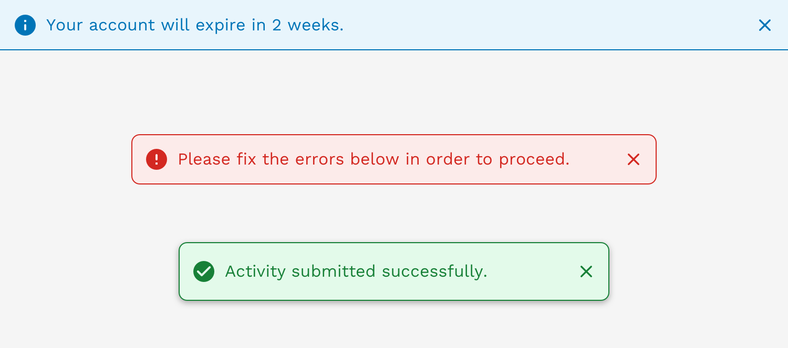
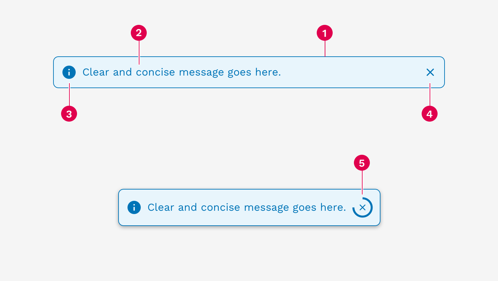
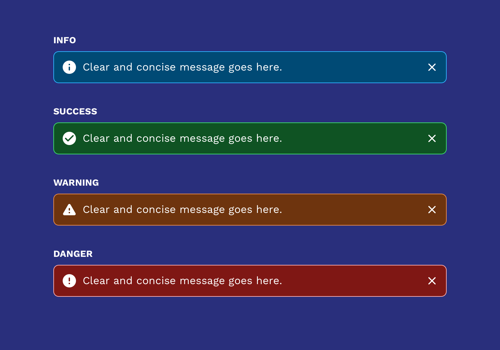
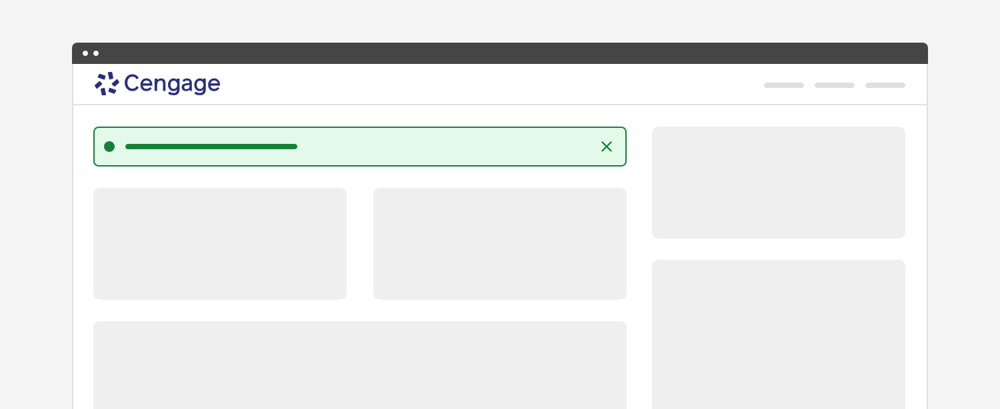
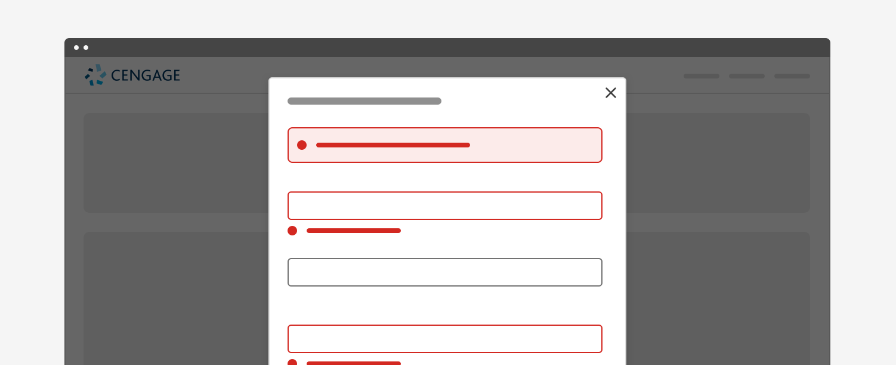
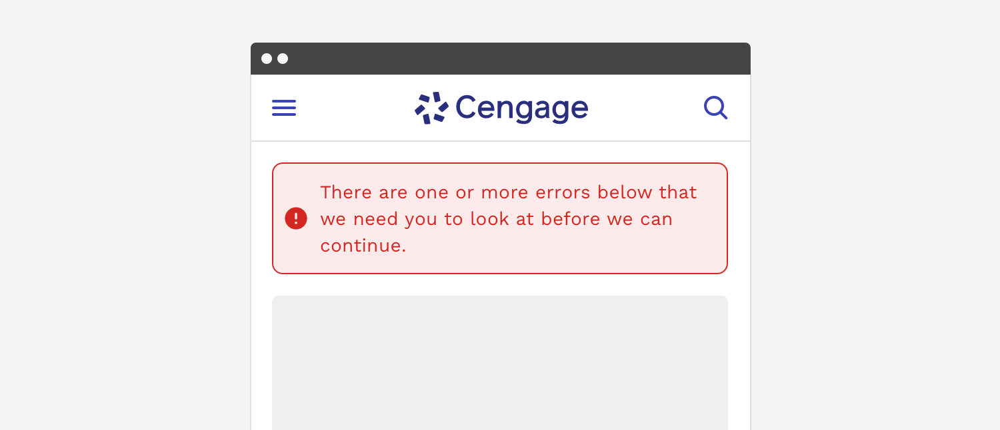

import { Link } from 'gatsby';
import './design-guidelines-styles.css';
import { Alert } from 'react-magma-dom';

<PageContent componentName="alert" type="design">
<LeadParagraph>
  Alerts display a short, important message in a way that attracts a user's attention.
</LeadParagraph>

This page focuses primarily on the commonalities between the different alert types and more detail about the basic inline alert. You can also get more information about <Link to="/design/banner/">banner</Link> and <Link to="/design/toast/">toast</Link> alerts.

## Usage

Use alerts to inform users of updates, changes to system status, or as feedback to an action they have taken. Proactively communicating with users and providing immediate feedback is important for building trust and maintaining a constant awareness of the system status. While alerts are an effective method of communicating with users, they have the potential to be disruptive and should be used with care.

<figure>
  
</figure>

---

## Principles

### Helpful

Alerts are used to clearly communicate relevant and important information to the user and help them understand what is happening or has happened, and if they need to take action on something.

### Simple

Alerts should use simple language and as few words as possible. Avoid using error codes, technical language, or other jargon that fails to help the user know what to do next.

### Appropriately Interruptive

Alerts are interruptive, but their level of interruption should match the information they contain and the context in which they appear.

---

## Anatomy

The basic anatomy of the alert is the same across all three types (banner, inline, toast).

<figure>
  
</figure>

1. Container
1. Message
1. Icon (automatically changes depending on the alert variant)
1. Close button (optional)
1. Dismissal timer (only available on toasts)

---

## Colors

Alerts come in four colors depending on the severity or meaning of the message.

Using color to add meaning only provides a visual indication, which will not be conveyed to users of assistive technologies such as screen readers. Ensure that information denoted by the color is either obvious from the content itself (for example the visible text), or is included through alternative means, such as additional hidden text.

### Info

Provides non-urgent messages and information.

<Alert>I'm just here to tell you something totally not worth stressing over.</Alert>

### Success

Indicates that a system process completed successfully.

<Alert variant="success">Yay! You did it! Great job!</Alert>

### Warning

Indicates that something is not quite right, but there wasn't an error.

<Alert variant="warning">Umm, something's not quite right here.</Alert>

### Error

Indicates that a system process has encountered an error.

<Alert variant="danger">Oh no, it's all gone horribly wrong!</Alert>

### Inverse Colors

Alerts have an inverse option where we have defined colors that are optimized for use on dark backgrounds.

---

### Basic Inline Alert

Inline alerts are embedded within the content of a page. They can provide the user with helpful information regarding a specific process or part of the interface. They can also be triggered by an action the user took, like submitting a form before filling out all the required fields.

<figure>
  
</figure>

If an inline alert is being used to communicate some general information to the user, then you can choose to allow them to dismiss the alert to get it out of their way. However, error messages are typically not dismissible by the user and persist until the issue is fixed either by the user or the system.

<figure>
  
</figure>

---

## Responsive Behavior

When the viewport is 600px wide and smaller, we automatically reduce the icon and font size to optimize the amount of space given to the message and optional links or buttons in the alert.

<figure>
  
</figure>

---

## Accessibility

(WAI-ARIA: <a href="https://www.w3.org/WAI/ARIA/apg/patterns/alert/">https://www.w3.org/WAI/ARIA/apg/patterns/alert/</a>)

Alerts have a number of measures built into them to improve accessibility. Starting with the colors, we make sure that text always has at least a 4.5:1 contrast ratio with the background color. All of the alerts can be navigated with a keyboard or screen reader.

</PageContent>
