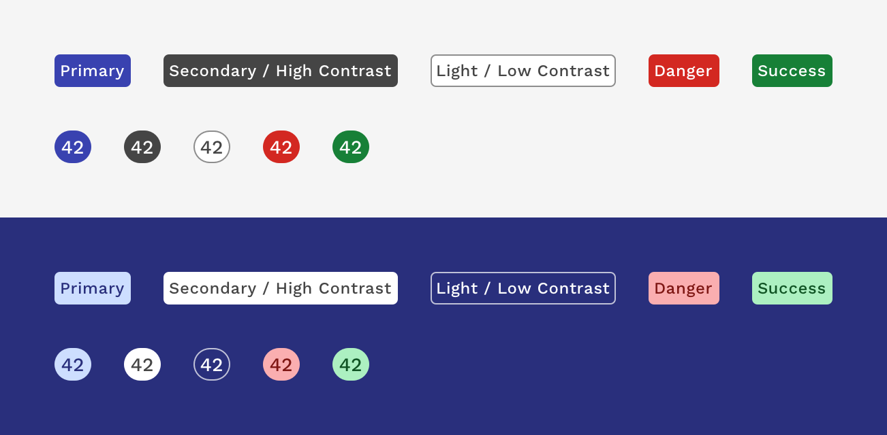
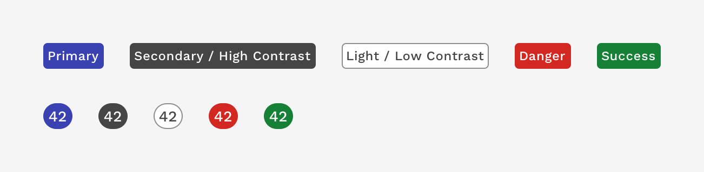

import { Link } from 'gatsby';
import './design-guidelines-styles.css';
import { LeadParagraph } from '../../components/LeadParagraph';

<PageContent componentName="badge" type="design">

<LeadParagraph>
  Badges are a small labeling component, used to highlight key pieces of
  information.
</LeadParagraph>

## Usage

Badges are used as a form of inline feedback and labeling. They are typically used to provide additional context to components already on the page.

<figure>
  
</figure>

---

## Text Badges

<figure>
  
</figure>

Text badges provide a way to provide feedback or label pieces of data.

Note that badges may be confusing for users of screen readers and similar assistive technologies. While the styling and placement of badges provide a visual cue as to their purpose, these users will simply be presented with the content of the badge. These badges may seem like random additional words or numbers at the end of a sentence, link, or button.

Unless the context is clear, consider including additional context with a visually hidden piece of additional text.

---

## Counters

<figure>
  
</figure>

Counters can be used as part of links or buttons, or simply in a context that conveys the count of something to the user. When space is limited, and if the exact count isn't important, you may consider limiting the count to "99+".

---

## Color

<figure>
  
</figure>

There are multiple colors available for badges, but they should be used with purpose. The colors that should be used most commonly are primary, secondary/high contrast, and light/low contrast. The best color to use will most likely be determined by which one gives the appropriate level of emphasis with the surrounding content.

The success and danger colors can be used to enhance the meaning you're trying to convey. Using color to add meaning only provides a visual indication, which will not be conveyed to users of assistive technologies or with vision differences. You must ensure that the meaning denoted by the color is either obvious from the content itself (e.g. the visible text), or is included through alternative means.

</PageContent>
