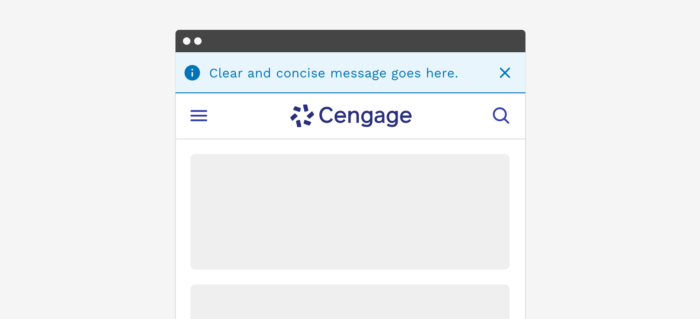

import './design-guidelines-styles.css';

<PageContent componentName="banner" type="design">

<LeadParagraph>
  Banners are typically used for system or application level alerts.
</LeadParagraph>

<figure>
  
</figure>

## Usage

Banner alerts typically appear at the very top of the browser viewport and extend all the way across. Banner alerts can be an effective way of telling the user about something that impacts the entire application such as a planned maintenance notification or an important world event that impacts all users. Banner alerts are by their nature the most disruptive type of alert so you may decide whether you want the alert to persist or allow the user to dismiss the alert themselves.

---

## Responsive Behavior

When the viewport is 600px wide and smaller, we automatically reduce the icon and font size to optimize the amount of space given to the message and optional links or buttons in the alert.

<figure>
  
</figure>

---

## Accessibility

(WAI-ARIA: <a href="https://www.w3.org/WAI/ARIA/apg/patterns/alert/">https://www.w3.org/WAI/ARIA/apg/patterns/alert/</a>)

Alerts have a number of measures built into them to improve accessibility. Starting with the colors, we make sure that text always has at least a 4.5:1 contrast ratio with the background color. All of the alerts can be navigated with a keyboard or screen reader.

</PageContent>
