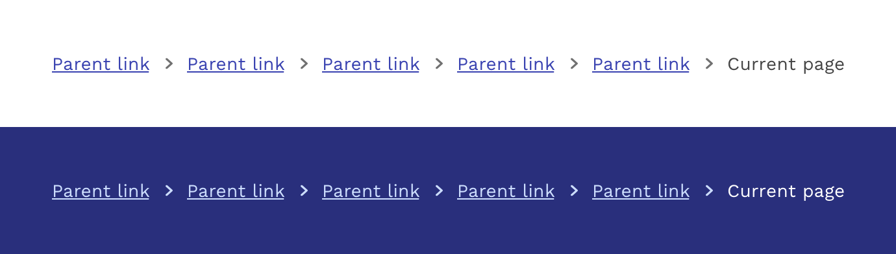

import './design-guidelines-styles.css';

<PageContent componentName="breadcrumb" type="design">

<LeadParagraph>
  Indicate the current page's location within a navigational hierarchy that
  automatically adds separators.
</LeadParagraph>

## Usage

The default breadcrumb component is styled for use on backgrounds **neutral100** or **neutral200**. For dark backgrounds you can use the inverse version.

<figure>
  
</figure>

---

## Responsive Behavior

As the viewport gets smaller, the breadcrumb component will simply wrap to as many lines as necessary. Mobile apps do not typically use breadcrumbs, and the same goes for when our Responsive applications are rendered on smaller screens. Therefore it is appropriate to suppress the breadcrumbs at a specified breakpoint, and provide an alternative way of navigating if necessary. A common breakpoint for hiding breadcrumbs is 600px, which covers the majority of small tablets and phones.

  

    

      <figure>
        
      </figure>
    

    

  

</PageContent>
