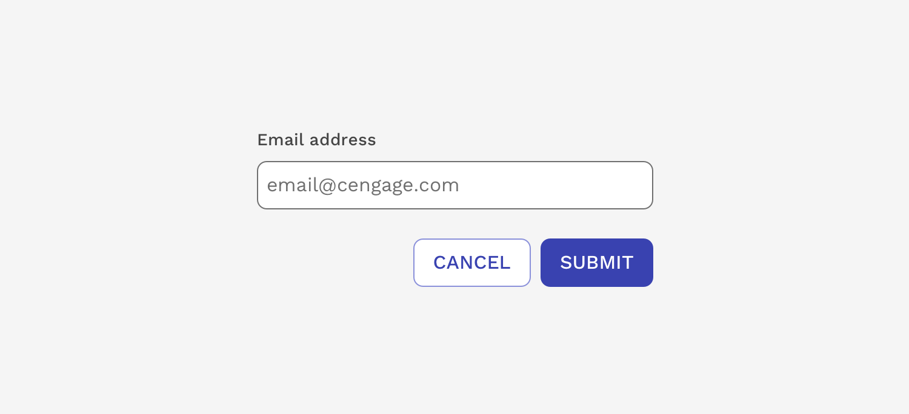
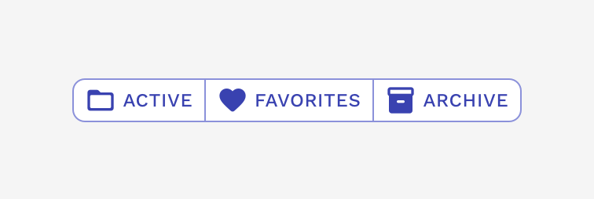

import { Link } from 'gatsby';
import './design-guidelines-styles.css';
import { DocsHeading } from '../../components/DocsHeading';
import { LeadParagraph } from '../../components/LeadParagraph';

<PageContent componentName="buttongroup" type="design">

<LeadParagraph>
  The ButtonGroup component can be used to group related buttons.
</LeadParagraph>

---

## Options

### Orientation

ButtonGroup can be either horizontal or vertical in its orientation. By default, ButtonGroup is horizontal. Use the vertical option when horizontal space is limited.

  

    

      <figure>
        
      </figure>
    

    

    

  

### Size

ButtonGroup comes in three different sizes: small, medium, and large. The medium size is the default and most frequently used option. Use the other sizes sparingly; they should be used to create a hierarchy of importance within the page.

  

    

      <figure>
        
      </figure>
    

    

    

  

### No Space

You can easily remove the space between buttons to create a single unit. When you join buttons like this together, there typically isn't a hierarchy within their relationship, so it is acceptable to use the same button style. This property is not intended for vertical ButtonGroups.

  

    

      <figure>
        
      </figure>
    

    

    

  

---

## Usage Guidelines

### Use the recommended option for subsequent actions

The most critical action within a ButtonGroup should be a primary, marketing, or danger button (fill or outline). The other actions should always be a secondary outline button. If all of the buttons are of equal importance, the buttons can all use the same variant.

  

    

      <figure>
        
      </figure>
    

    

      <figure>
        
      </figure>
    

  

### Align ButtonGroups based on content

ButtonGroups are aligned contextually. In general, ButtonGroups are left-aligned to follow content such as a block of text. They can be center-aligned if that block of text is also center-aligned. And, they should be right-aligned inside container components such as modals, or cards.

  

    

      <figure>
        
      </figure>
    

    

    

  

### Respect button order within a group

The order of button priority should match the alignment of surrounding text. When text is left-aligned, buttons should be arranged so that the leftmost button is the most critical. When text is right- or center- aligned, the most critical action should be the furthest right.

  

    

      <figure>
        
      </figure>
    

    

      <figure>
        
      </figure>
    

  

### Use icons only for the most critical actions

Not all buttons in a group require an icon, but buttons with icons should always be of a higher priority than ones without icons. If the most critical action in a group doesn’t have an icon, don’t use icons in the remaining lower-level actions.

  

    

      <figure>
        
      </figure>
    

    

      <figure>
        
      </figure>
    

  

### Use ButtonGroup to show additional actions

Use ButtonGroup to show any additional actions related to the most critical action.

  

    

      <figure>
        
      </figure>
    

    

    

  

</PageContent>