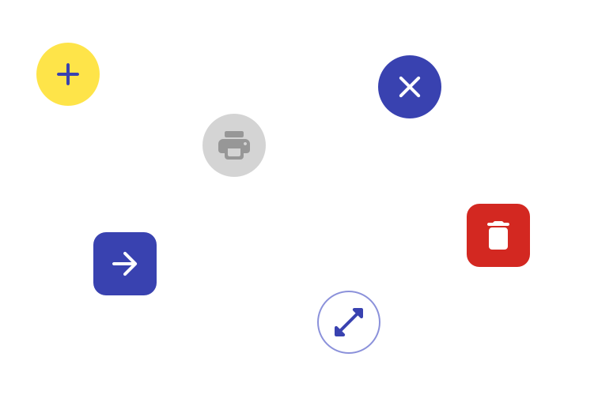
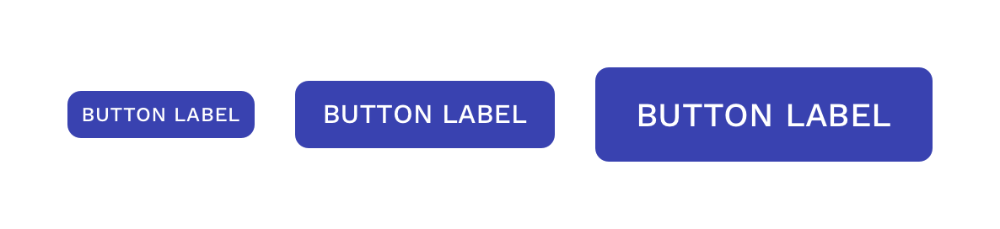
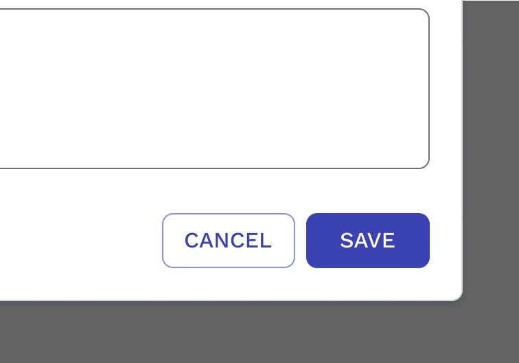
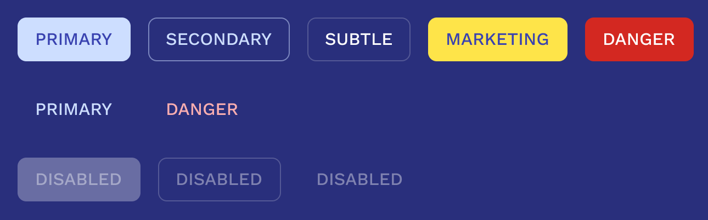
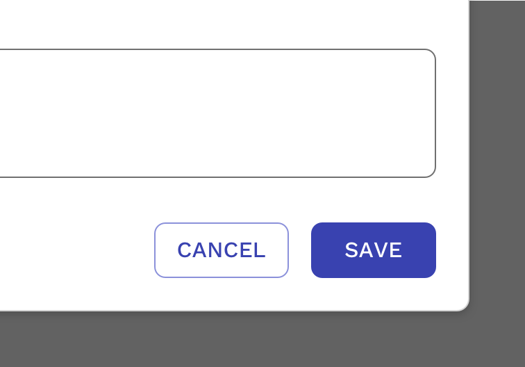

import { Link } from 'gatsby';
import './design-guidelines-styles.css';
import { DocsHeading } from '../../components/DocsHeading';
import { LeadParagraph } from '../../components/LeadParagraph';
import { Button } from 'react-magma-dom';

<DocsHeading to="/api/button/" type="design">
  Button
</DocsHeading>
<LeadParagraph>
  Buttons are clickable items used to perform an action.
</LeadParagraph>

## Usage

Buttons communicate actions that users can take.

- Submit a form.
- Begin a new task.
- Trigger a new UI element to appear on the page.
- Specify a new or next step in a process.

---

## Types

### Text Button (low emphasis)

Text buttons are typically used for less important actions.

<Button color="primary" variant="link">
  Text Button
</Button>

### Outlined Button (medium emphasis)

Outlined buttons are used for more emphasis than text buttons due to the stroke.

<Button color="secondary" variant="solid">
  Outlined Button
</Button>

### Solid Button (high emphasis)

Solid buttons have more emphasis, as they use use a color fill.

<Button>Solid Button</Button>

---

## Anatomy

### Text Label

Almost all buttons use text labels, which describe the action that will occur if a user taps a button.

#### All Caps or Title Case?

**By default Magma uses all caps text labels.** This is to provide a greater contrast between buttons and surrounding text, therefore making buttons easier to find. This is especially helpful for buttons that don't have a visible container.

Text labels should always be short and have clear purpose. If a button requires a text label with three or more words, try really hard to shorten it. If you can’t, you may use title case to help reduce the size of the button’s footprint. We recommend buttons using title case also have an outline or solid container, to help differentiate the button from the text around it.

  

    

      <figure>
        
        <figcaption>
          
Correct

          
Keep labels short

        </figcaption>
      </figure>
    

    

      <figure>
        
        <figcaption>
          
Incorrect

          

            Don’t wrap text. For maximum legibility and recognition as a button,
            a text label should never wrap to multiple lines.
          

        </figcaption>
      </figure>
    

  

  

    

      <figure>
        
        <figcaption>
          
Correct

          

            Text labels can be written in title case if all efforts to make the
            label less than three words have been exhausted, or if the button
            simply won't fit in the space without making it smaller.
          

        </figcaption>
      </figure>
    

    

  

  

    

      <figure>
        
        <figcaption>
          
Correct

          

            Text buttons don’t typically need a container when in all caps,
            because the label is differentiated from the text around it.
          

        </figcaption>
      </figure>
    

    

      <figure>
        
        <figcaption>
          
Caution

          

            Text labels need to be distinct from other elements. Without a
            container, the button above could be hard to distinguish from the
            content above it.
          

        </figcaption>
      </figure>
    

  

### Icon

You can place icons next to text labels to both clarify an action and call attention to a button. If a text label is not used, make sure the icon is intuitive and clear through testing. Also, consider using a tooltip so its exact meaning can be easily seen on hover.

  

    

      <figure>
        
        <figcaption>
          
Correct

          
Use icons that clearly communicate their meaning.

        </figcaption>
      </figure>
    

    

      <figure>
        
        <figcaption>
          
Correct

          

            You can use icons without a text label if testing proves that the
            intended action of the button is clear to the users.
          

        </figcaption>
      </figure>
    

  

  

    

      <figure>
        
        <figcaption>
          
Incorrect

          

            Don’t vertically align an icon and text in the center of a contained
            button.
          

        </figcaption>
      </figure>
    

    

      <figure>
        
        <figcaption>
          
Incorrect

          
Don’t use two icons in the same button.

        </figcaption>
      </figure>
    

  

---

## Sizes

Other than the standard sized buttons, there are two other sizes – Large and small.

_Large_ buttons can be used in scenarios where space allows and you desire a much more prominent call to action.

_Small_ buttons can be used in scenarios where you want less emphasis on some actions because there are other more prominent actions on the UI. They can also be used when space is limited for the number of buttons you need.

**Minimum Width -** Buttons with extremely short labels like “OK” or “Save” are in danger of being very small, even though they may be the primary action. To avoid this, all text buttons have a minimum of width of 5.625em (90px). This does not apply to icon only buttons.

---

## Button Colors

Color can help reinforce the type of action that a button will perform if tapped. The default colors of the buttons are carefully chosen to both fit Cengage branding guidelines, as well as meet the accessibility requirement for color contrast ratio. If deviations to these colors are required, then you assume responsibility to meet accessibility requirements.

The **primary** button should be used by default for important actions.  From there you can use **secondary** or buttons without a container for other actions, but they draw less attention than primary buttons.

For actions that delete things, you can emphasize this action with the **danger** buttons.

  

    

      <figure>
        
        <figcaption>
          
Correct

          

            Use the <strong>Primary</strong> button for the primary
            action unless there is a specific reason to use something else.
          

        </figcaption>
      </figure>
    

    

      <figure>
        
        <figcaption>
          
Correct

          

            Consider using the <strong>Danger</strong> variation for buttons
            that will remove or destroy something to help emphasize the danger
            that comes with clicking that button.
          

        </figcaption>
      </figure>
    

  

If your button is going on a dark background, all of the buttons have an inverse appearance for optimal accessibility. They are carefully designed for use within entirely dark themes for Dark Mode.

  

    

      <figure>
        
      </figure>
    

  

---

## Button States

Buttons have clear states to provide feedback to the user.

  

    

      <figure>
        
      </figure>
    

  

### Hover and Active

The background color of the Hover and Active button states are automatically calculated based on the base color. This frees designers from having to choose multiple colors to represent the various states of a button. Additionally, if the colors of the buttons ever need to change, due to a rebranding event or the creation of a new theme, this automatic calculation will make this task much easier to complete and will reinforce consistency in what colors should be used.

Here's how it works in more detail. If you have a solid button with a white text label, the background is darkened by 10% on hover, and then 20% on the active or pressed state. If you have a solid button with dark label, the background is lightened by 10% on hover, and then 20% on the active or pressed state. This ensures the button's background and text label will always have the necessary 4.5:1 contrast ratio for accessibility.

Outline and link buttons are a little different since they don't have a background color or fill in their default state. On hover, the text label and/or border are darkened by 10%, and then 20% on the active or pressed state. For the background color on hover, we take the original color value of the text label and lighten it by 90%. On the active or pressed state, we change the value to 70% darkened.

### Focus

It’s important for users to clearly see when the browser’s focus is on a button. This is especially important for users who can’t use a mouse, but instead have to rely on a keyboard or other means for navigating through the elements on the page. The default focus presentation built into the browsers are not consistent, and have varying success in visibility depending on what’s behind the button. For this reason, we are putting our own custom focus effect on Magma components.

The solid outline is 2px thick with at least a 2px offset, and the color is info-500. These properties ensure the outline is visible on a light background. The color changes to semi-transparent-white for optimal visibility on dark backgrounds.

  

    

      <figure>
        
      </figure>
    

  

---

## Hierarchy and Placement

### Hierarchy

#### Single Prominent Button

A layout should contain a single prominent button that makes it clear that other buttons have less visual importance in the hierarchy. This high-emphasis button commands the most attention.

#### Other Buttons

An app can show more than one button in a layout at a time, so a high-emphasis button can be accompanied by medium- and low-emphasis buttons that perform less important actions. When using multiple buttons, ensure the available state of one button doesn’t look like the disabled state of another.

### Placement

Multiple button types can be used to express different emphasis levels. When using buttons that are contextually connected to left-to-right content, the buttons should also be left aligned, with the most important action coming first. When the buttons are positioned as actions for a larger context, like an entire modal or page, then the buttons will typically be right aligned, with the most important action on the far right.

  

    

      <figure>
        
        <figcaption>
          
Correct

          

            When using multiple buttons, you can place a text button next to a
            solid button to show emphasis.
          

        </figcaption>
      </figure>
    

    

      <figure>
        
        <figcaption>
          
Correct

          

            When using multiple buttons in the bottom bar of a modal, the
            buttons align to the right with the most important button on the far
            right.
          

        </figcaption>
      </figure>
    

  

  

    

      <figure>
        
        <figcaption>
          
Correct

          

            You can place a text button (low emphasis) next to an outlined
            button (medium emphasis).
          

        </figcaption>
      </figure>
    

    

    

  

---

## Responsive Behavior

Button sizes and placements will sometimes need to change because of the size of the user’s screen. CSS breakpoints should be determined based on need, instead of limited to a set of standard breakpoints.

  

    

      <figure>
        
        <figcaption>
          
Correct

          

            You may allow the buttons to go block level if it benefits the
            design or if there isn’t enough room for them to remain
            side-by-side.
          

        </figcaption>
      </figure>
    

    

      <figure>
        
        <figcaption>
          
Correct

          

            No need to force buttons to be block level if they fit in the
            container without problem.
          

        </figcaption>
      </figure>
    

  

