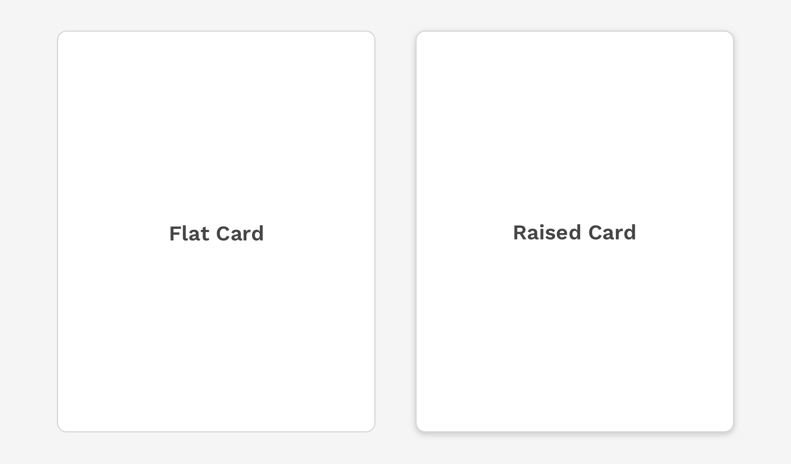

import './design-guidelines-styles.css';

<PageContent componentName="card" type="design">

<LeadParagraph>
  Cards provide a flexible container with multiple variants and options.
</LeadParagraph>

## Usage

Cards are one of the core building blocks in React Magma. They can be used to create the overall layout of a page, contain relatively large amounts of content focusing on a single topic, or contain small related pieces of content such as a carousel.

  

    

      <figure>
        
      </figure>
    

    

      <figure>
        
      </figure>
    

  

## Anatomy

The only part of a card that is required is the container itself. All other content is optional and completely depends on the purpose of the card.

<figure>
  
</figure>

1. Container
2. Header text
3. Subhead
4. Media
5. Body text
6. Buttons
7. Icons

### Dividers

Inset dividers do not extend to the edges of the card. Inset dividers are used to divide related pieces of content.

Use full-width dividers that extend to the edges of a card to separate more distinct pieces of content or isolate actions that have more to do with the card than any specific piece of content within it.

<figure>
  
</figure>

---

## Depth

Displaying a card as flat or raised can have a strong impact on the user's perception of that card and what it can do.

### Flat

The card component is by default displayed as flat. This implies the card itself is set into the same plane as the rest of the content, and the border of the card provides the separation needed from other content on the page.

### Raised

If a card can move, such as in a carousel or a drag and drop scenario, you should use the property that adds a dropshadow to the container to help communicate the dynamic nature of that component.

<figure>
  
</figure>

---

## Scrolling

A card will grow vertically to display as much content as you choose to put inside it. If you decide to limit the height of a card or collection of cards, it is NOT recommended to allow the content within the card to scroll unless it's only on Desktop. This will result in multiple scrollbars on a UI, and usually ends up as a very poor experience for users on small devices.

To avoid these issues, you should instead provide links within the card to view more information somewhere else, or allow the cards to expand and show more details. You may also switch from one method to the other based on a logical breakpoint.

  

    

      <figure>
        
        <figcaption>
          
Correct

          

            If the maximum height of the card isn't enough to display all of the
            content, then allow the card to expand and collapse on small
            screens.
          

        </figcaption>
      </figure>
    

    

      <figure>
        
        <figcaption>
          
Incorrect

          

            On small devices, do not allow scrolling within a card or you could
            create a trap for the user on small devices preventing them from
            scrolling past the card.
          

        </figcaption>
      </figure>
    

  

---

## Actions

Depending how the card is being used, the card could contain any number of action buttons. Like with everything else, make sure the primary action is clear compared to any secondary actions. For small cards, avoid cluttering the card with too many actions by creating an overflow menu within a dropdown.

<figure>
  
</figure>

### UI Controls

Cards can contain many kinds of UI controls, including buttons, tabs, toggle switches, etc. These allow the user to interact with the content of the card.

<figure>
  
</figure>

---

## Colors

Various colors from the global color palette may be used as the background of a card as long as you make sure the content of the card meets the minimum contrast ratio required for proper accessibility.

**Important:** Conveying meaning with color does not translate to assistive technologies. If the communication of this meaning is important, make sure it is also obvious in the content that is visible, or is possibly delivered through alternative methods such as visibly hidden text that is read by screen readers.

<figure>
  
</figure>

---

## Callout Cards

Callout cards add a band of color to the left edge of the container. This can be especially helpful when trying to draw attention to a specific card with important information.

**Important:** Conveying meaning with color does not translate to assistive technologies. If the communication of this meaning is important, make sure it is also obvious in the content that is visible, or is possibly delivered through alternative methods such as visibly hidden text that is read by screen readers.

<figure>
  
</figure>

---

## Card Groups

When cards are grouped together, it's because they are working together for a common overall purpose. How they are organized can have a major impact on whether that purpose is achieved or not. Here are some general rules to follow.

### General Layout

In general, cards change size depending on the amount of content within them. But you can emphasize certain cards creating a layout that implies a hierarchy on the page with different sized columns. Just be mindful the card is large enough to support the content of the card, and that the content responds appropriately on smaller screens.

<figure>
  
</figure>

### Scannable

If you want a group of cards to be easy to scan, use a clean and consistent pattern for the layout.

<figure>
  
</figure>

</PageContent>
