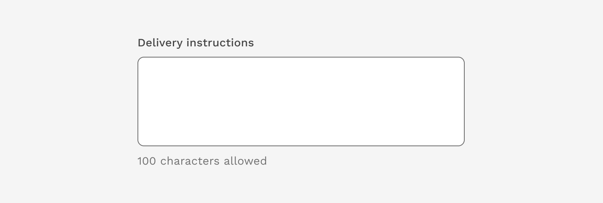
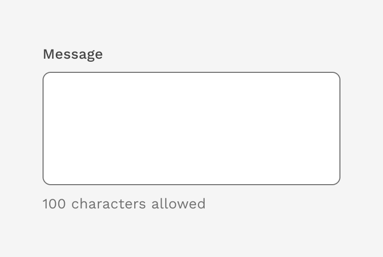
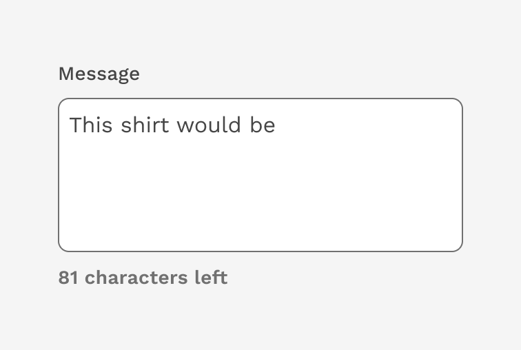
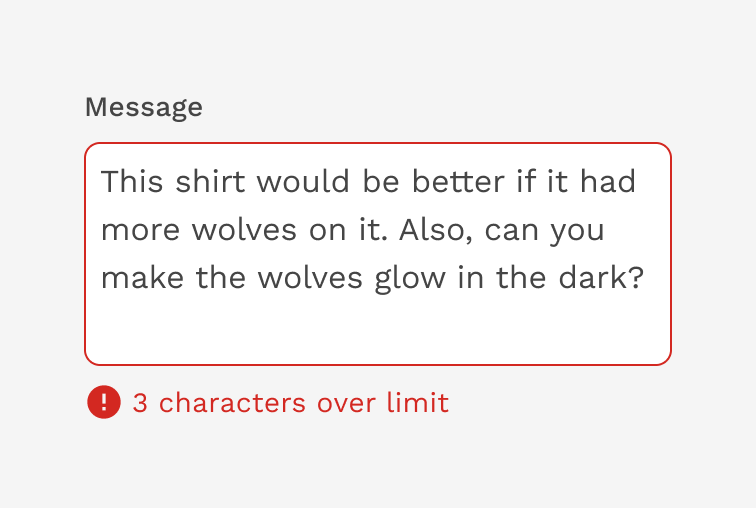

import './design-guidelines-styles.css';

<PageContent componentName="character_counter" type="design">

<LeadParagraph>
  Character counter helps users know how much text they can enter when there is
  a limit on the number of characters.
</LeadParagraph>

## Usage

### When to use the character counter

**Keeping it short** - When users are likely to provide more detail than is needed, and you want to force them to use fewer words. Note: this will likely increase the amount of time it takes users to submit the form because editing requires thinking.

**Legal requirement** - When there is a legal reason where an entry must be under a certain number of characters.

### When to consider a different solution

**Backend limitations** - If your users keep hitting the character limit imposed by the backend of your service then try to increase the limit rather than use a character count.

**Already implied** - If the character length is apparent or implied by the data type (i.e. phone number or zip code).

**Exceeding the character limit is highly unlikely** - If the vast majority of users are very unlikely to run into backend validation, such as an address field that has a database field limit of 250 characters.

---

## Component Behavior

The character counter initially tells the user the maximum number of characters they are allowed to enter.

  

    

      <figure>
        
      </figure>
    

    

  

As the user types, the character counter updates in real-time and informs the user how many characters they have left.

  

    

      <figure>
        
      </figure>
    

    

  

When the user exceeds the maximum number of characters allowed, the character counter alerts them with an error and tells the user how many characters over the limit they are.

  

    

      <figure>
        
      </figure>
    

    

  

---

## Accessibility

The following measures have been taken to ensure the Character Counter component is accessible.

1. The character count message is associated with the input. We use `aria-describedby` on the input to allow the message to be announced to those using screen readers.
2. We use the aria-live attribute on the character count message. We use `aria-live="polite"` so that updates to the character count message are also announced when using a screen reader.

</PageContent>
