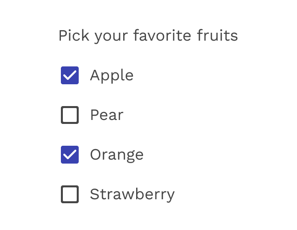
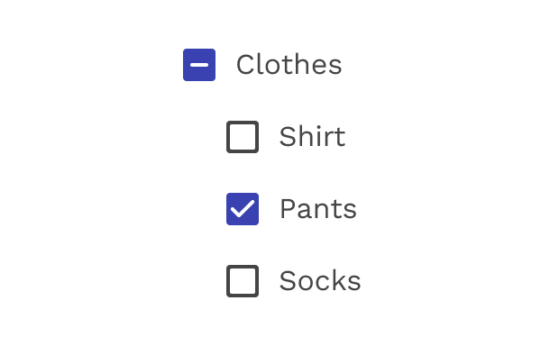
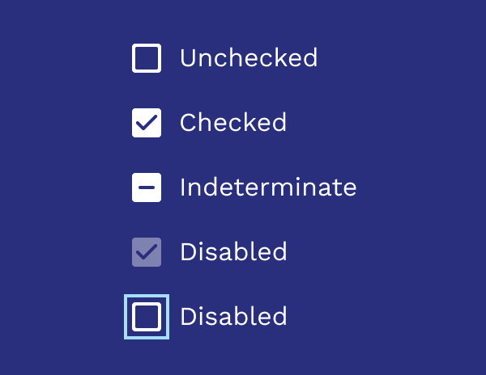

import './design-guidelines-styles.css';

<PageContent componentName="checkbox" type="design">

<LeadParagraph>
  A checkbox is an input control that allows a user to select one or more
  options from a number of choices.
</LeadParagraph>

## Usage

Use checkboxes to:

- Select one or multiple items from a list
- Present a list containing sub-selections
- Turn an option/setting on or off

<figure>
  

    
  

  <figcaption>
    
Checkboxes

  </figcaption>
</figure>

## Parent and Child Checkboxes

Checkboxes can have a parent-child relationship with other checkboxes.

- When the parent checkbox is checked, all child checkboxes are checked
- If a parent checkbox is unchecked, all child checkboxes are unchecked
- If some, but not all, child checkboxes are checked, the parent checkbox becomes an indeterminate checkbox

<figure>
  

    
  

  <figcaption>
    
Parent-child relationship for checkboxes

  </figcaption>
</figure>

## States

Checkboxes can be selected, unselected, or indeterminate. Checkboxes have enabled, disabled, focused and pressed states.

<figure>
  

    
  

  <figcaption>
    
Checkbox states

  </figcaption>
</figure>

## Colors

The default color used for checked checkboxes is primary-500 from the Magma palette, but sometimes a special scenario or specific UI can benefit from using one of the other colors from the palette. Colors like Info Blue (info-500), Success Green (success-500), or Danger Red (danger-500) can help add context when used responsibly and consistently.

<figure>
  

    
  

  <figcaption>
    
Alternate colors

  </figcaption>
</figure>

  

    

      <figure>
        
        <figcaption>
          
Incorrect

          

            Do not use multiple colors in the same UI. Pick one and stick with
            it.
          

        </figcaption>
      </figure>
    

    

      <figure>
        
        <figcaption>
          
Incorrect

          

            If you are going to change the color, don't use a neutral color.
            This could be confused with a checkbox that is checked and disabled.
          

        </figcaption>
      </figure>
    

  

## Inverse

Use the inverse version when using the checkboxes on a dark background.

<figure>
  

    
  

  <figcaption>
    
Inverse colors

  </figcaption>
</figure>

</PageContent>
