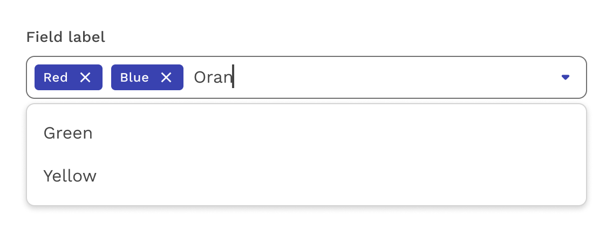

import './design-guidelines-styles.css';
import { LeadParagraph } from '../../components/LeadParagraph';

<PageContent componentName="combobox" type="design">

<LeadParagraph>
  A combobox is the combination of a text input and a list.
</LeadParagraph>

## Usage

The list is designed to help the user arrive at a value, but the value does not necessarily have to come from that list. Don't think of it like a Select, but more of a text input with some suggestions.

## Multi Combobox

The multi combobox allows the user to select more than one option from the list and add their own.

</PageContent>
