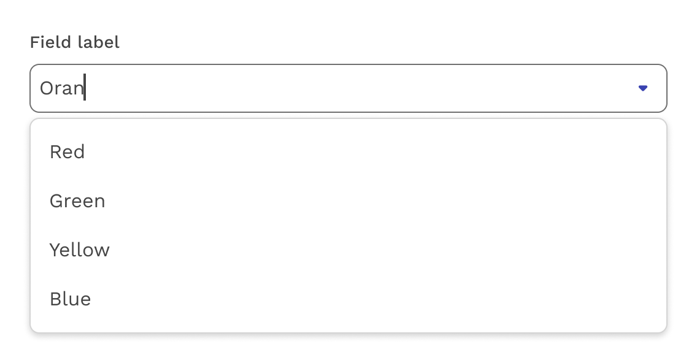

import './design-guidelines-styles.css';
import { LeadParagraph } from '../../components/LeadParagraph';

<PageContent componentName="combobox" type="design">

<LeadParagraph>
  A Combobox is similar to a Select component, in that it is used for collecting user provided information from a list of options. However, a combobox also allows users to type in the field, either to create their own option or to see typeahead suggestions. This can also be combined with the Multiselect functionality.
</LeadParagraph>

</PageContent>
