import './design-guidelines-styles.css';

<PageContent componentName="dropdown" type="design">

<LeadParagraph>
  Dropdowns (also referred to as Dropdown Menus) display a list of options that
  a user can select from within a contextual overlay.
</LeadParagraph>

## Usage

<figure>
  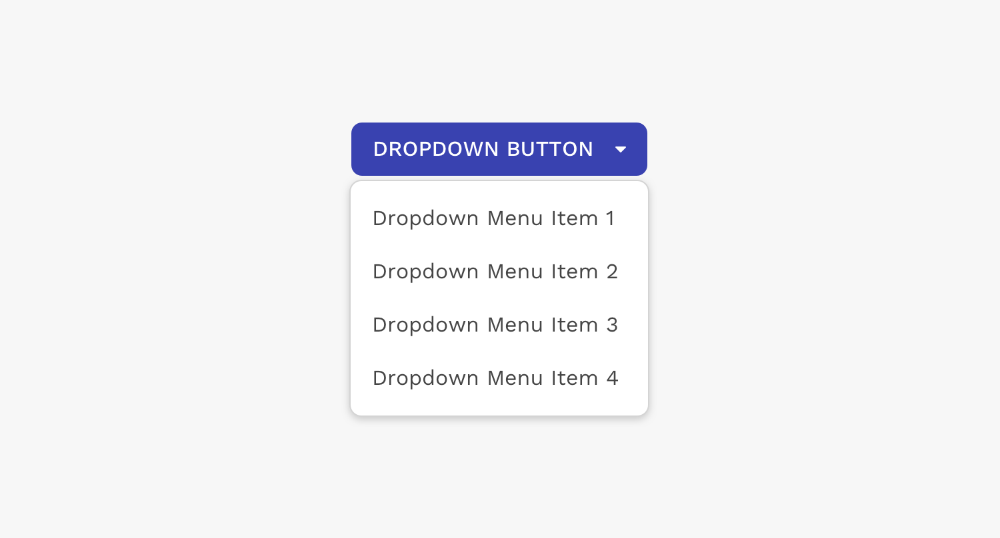
</figure>

---

## Anatomy

### Text List

Dropdown menus typically contain a list of text-only menu items.

  

    

      <figure>
        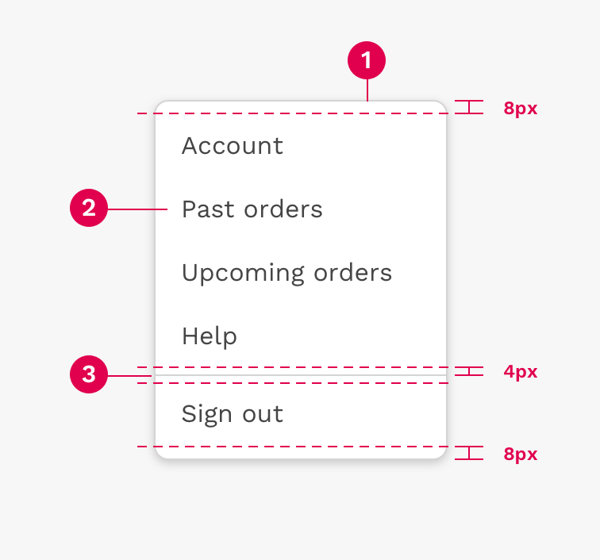
        <figcaption>
          

            There is 8px of space above the first item in the dropdown, and
            below the last item. There is also 4px of space above and below the
            divider.
          

        </figcaption>
      </figure>
    

    

      <ol>
        <li>Container</li>
        <li>Text Label</li>
        <li>Divider</li>
      </ol>
    

  

### Text and Icon List

Dropdown menu items may also use an icon on the left side to help clarify the meaning of the menu choice.

  

    

      <figure>
        
      </figure>
    

    

      <ol>
        <li>Container</li>
        <li>Icon</li>
        <li>Text label</li>
        <li>Divider</li>
      </ol>
    

  

### Selection State List

Dropdown menus may use a selection state by placing a checkmark next to the currently active choice.

  

    

      <figure>
        
      </figure>
    

    

      <ol>
        <li>Container</li>
        <li>Selected item indicator</li>
        <li>Text label</li>
      </ol>
    

  

### Grouping

Some dropdowns benefit from organizing the choices or options into groups, and then labelling those groups.

  

    

      <figure>
        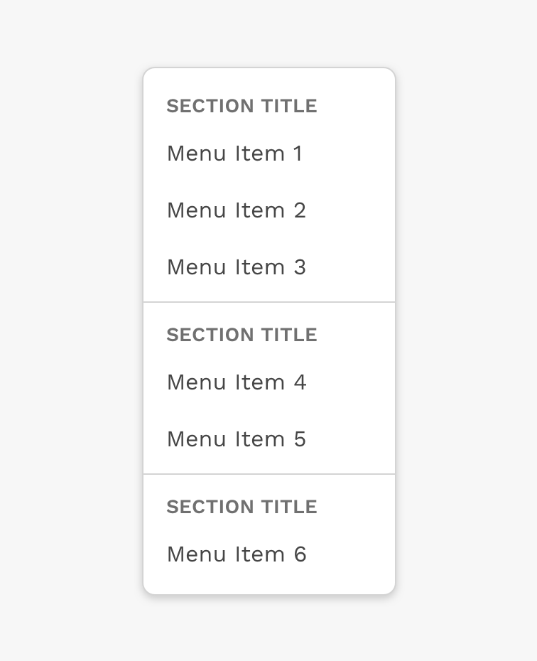
      </figure>
    

    

  

### Width

A dropdown will stretch horizontally by default to fit the longest item in the list. If you know the content of that dropdown is going to cause it to stretch beyond the boundaries of the browser window, you may set a width on that dropdown.

**Note:** For Responsive applications, dropdowns should have a width no greater than 320px.

  

    

      <figure>
        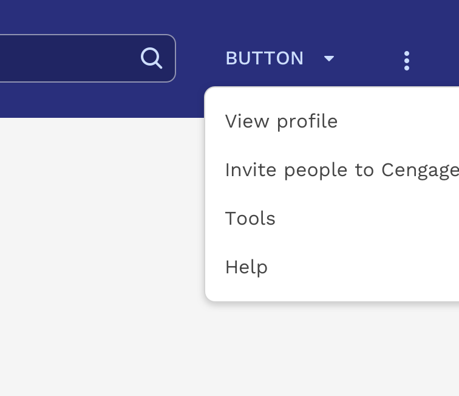
        <figcaption>
          
Incorrect

          

            Don't let menus extend beyond the boundaries of the browser window
            because of long menu labels or other wide content.
          

        </figcaption>
      </figure>
    

    

      <figure>
        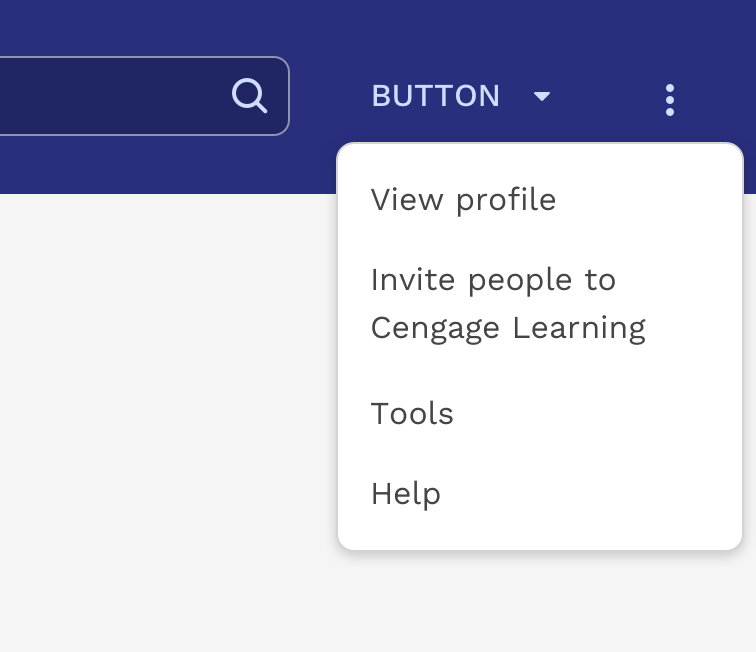
        <figcaption>
          
Correct

          

            Set the width of the dropdown to an appropriate value for where it's
            placed in the UI.
          

        </figcaption>
      </figure>
    

  

  

    

      <figure>
        
        <figcaption>
          
Correct

          

            You can change how the menu aligns with the button to ensure it
            doesn't spill outside the browser viewport.
          

        </figcaption>
      </figure>
    

    

  

### Height

Dropdowns have a default max-height of 250px and will scroll if necessary. This helps prevent extremely long lists of choices from stretching beyond the top and bottom boundaries of the browser window. 250px is enough to show an average of 6 single line menu choices at once. The max-height can be easily changed if a different value would improve the experience.

  

    

      <figure>
        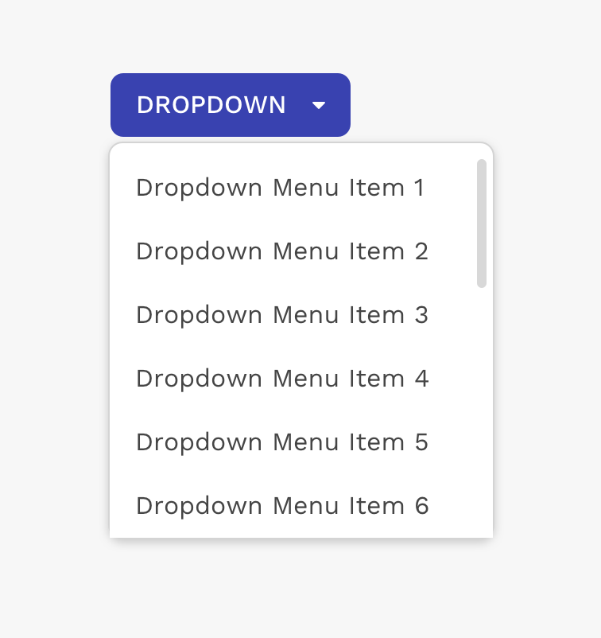
        <figcaption>
          
Correct

          

            If the dropdown isn't tall enough to show all content, it will
            automatically scroll.
          

        </figcaption>
      </figure>
    

    

      <figure>
        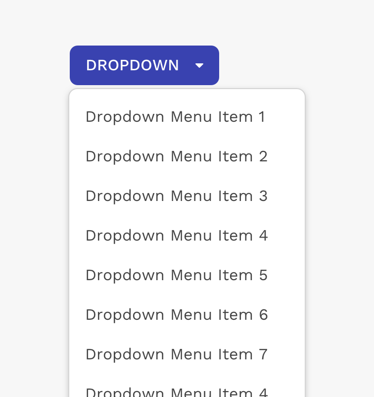
        <figcaption>
          
Caution

          

            Allowing a dropdown to get really tall could make it difficult to
            use.
          

        </figcaption>
      </figure>
    

  

---

## Button Types

### Standard Dropdown Button

The standard dropdown button is the most common element used to trigger a dropdown container.

  

    

      <figure>
        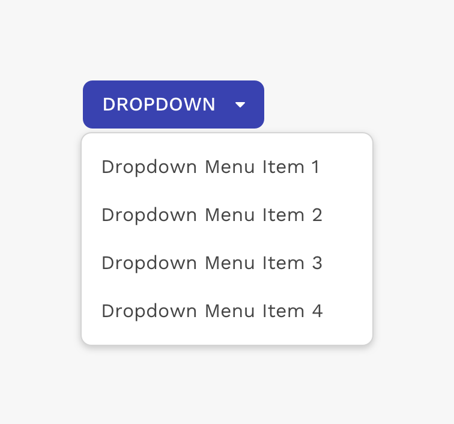
        <figcaption>
          
Example of single dropdown button.

        </figcaption>
      </figure>
    

    

  

### Split Dropdown Button

Split buttons combine a single action button with a menu of related choices into a single component.

  

    

      <figure>
        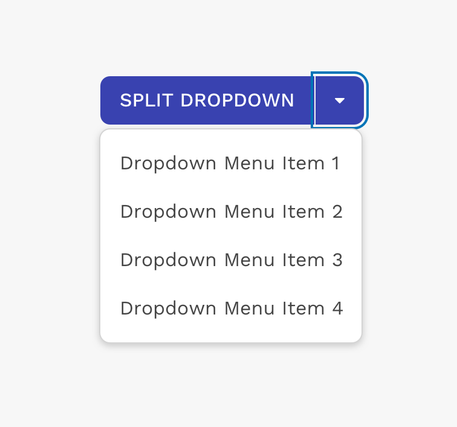
        <figcaption>
          
Example of split-dropdown button.

        </figcaption>
      </figure>
    

    

  

### Custom Button

Other button variants may be used as a trigger for a dropdown menu. Caution should be used because depending on the label or icon within the button, or where it's used, showing a dropdown menu could be confusing.

  

    

      <figure>
        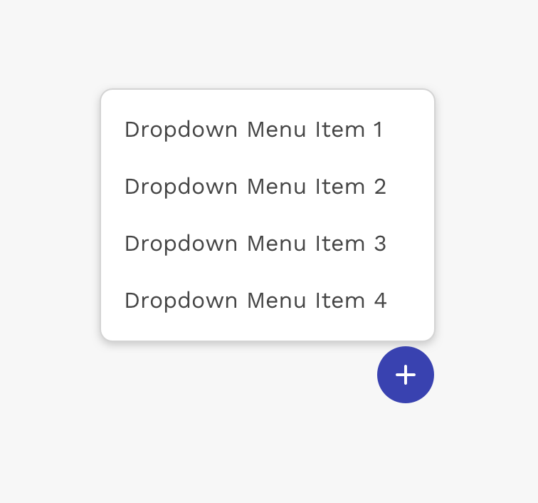
        <figcaption>
          

            Example of an icon button used for a series of options related to
            creating or adding something.
          

        </figcaption>
      </figure>
    

    

      <figure>
        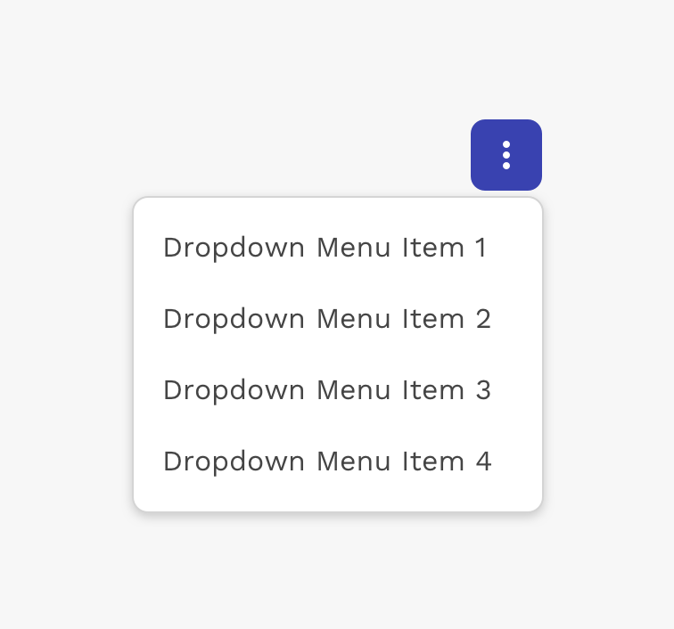
        <figcaption>
          
Example of a "more options" dropdown menu.

        </figcaption>
      </figure>
    

  

---

## Positioning & Alignment

Dropdowns are positioned relative to the trigger element that is clicked on to open it.

A dropdown is typically displayed below the trigger element, and the left edge of the dropdown is aligned with the left edge of the trigger element. To make sure dropdowns don’t become obscured by running off the edge of the browser, you may position the dropdown to the left, right, or above the trigger element. You may also change the alignment to the right, top, or bottom edges.

<figure>
  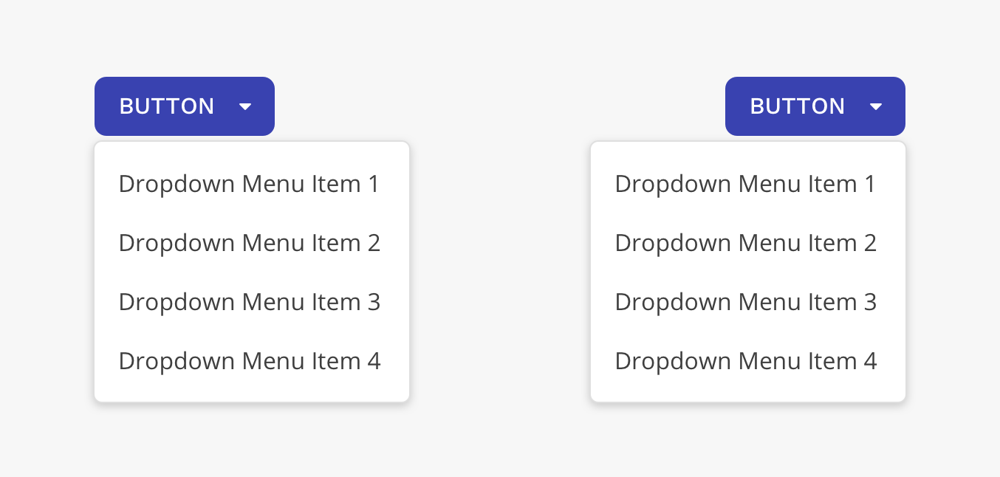
  <figcaption>
    
Dropdowns can be left or right aligned.

  </figcaption>
</figure>

<figure>
  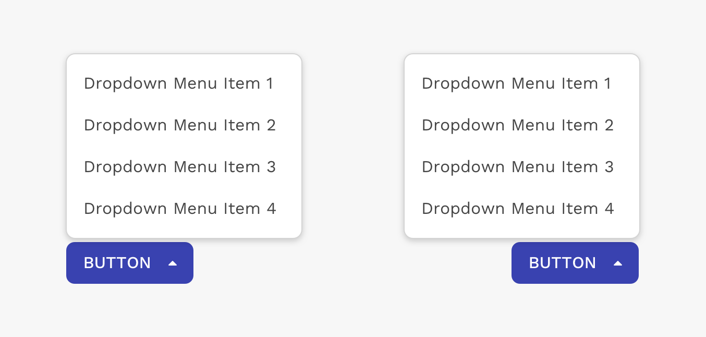
  <figcaption>
    

      Dropdowns can be positioned above the trigger element. If using a button,
      you should use the dropup button style.
    

  </figcaption>
</figure>

<figure>
  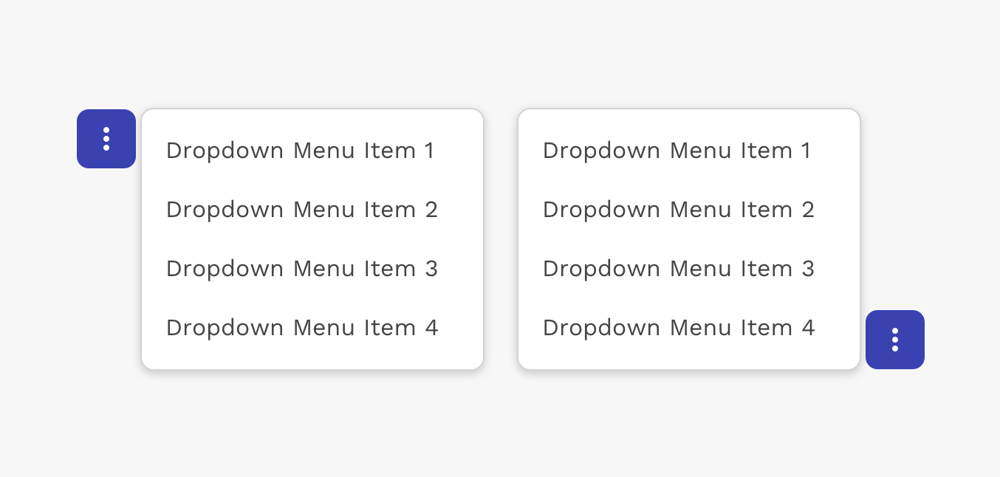
  <figcaption>
    

      Dropdowns can be positioned to the left or right of the trigger element.
    

  </figcaption>
</figure>

</PageContent>
