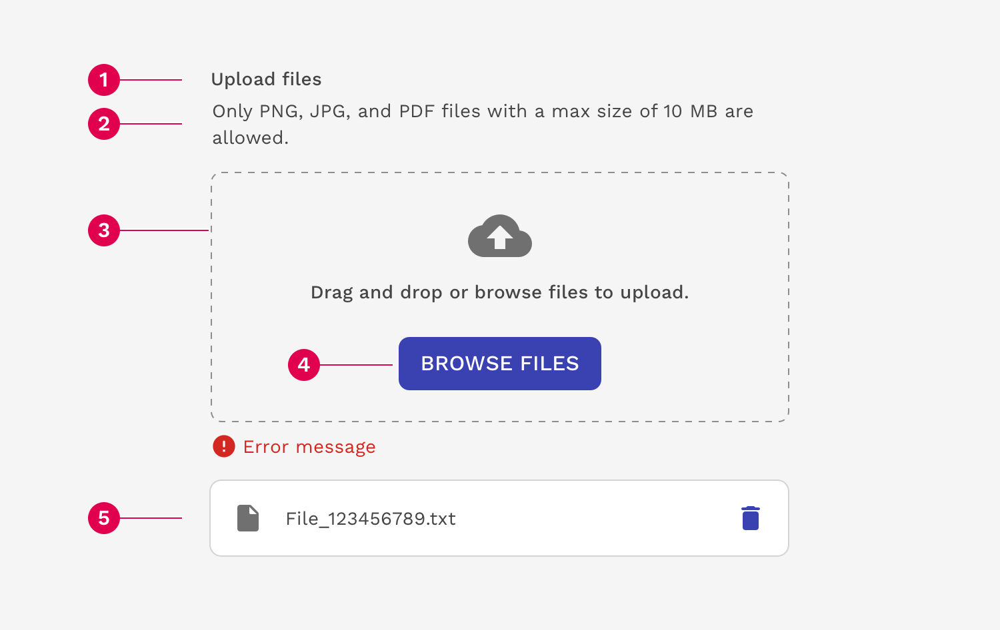
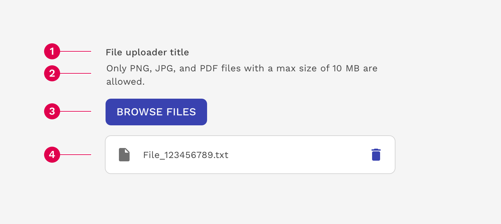
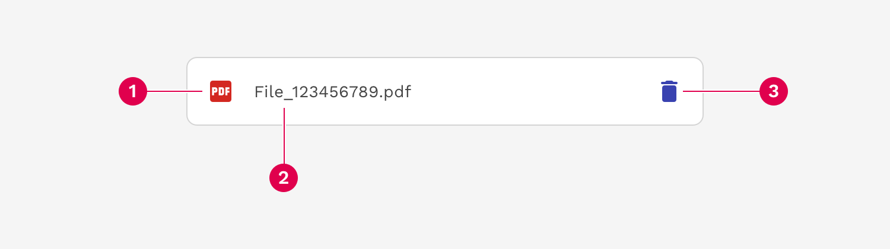
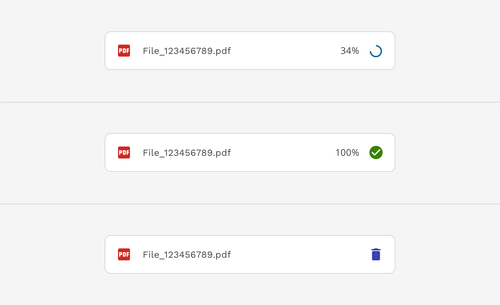
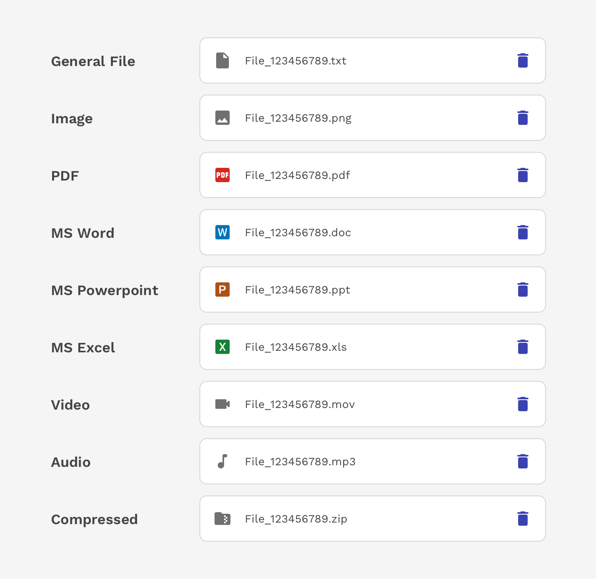
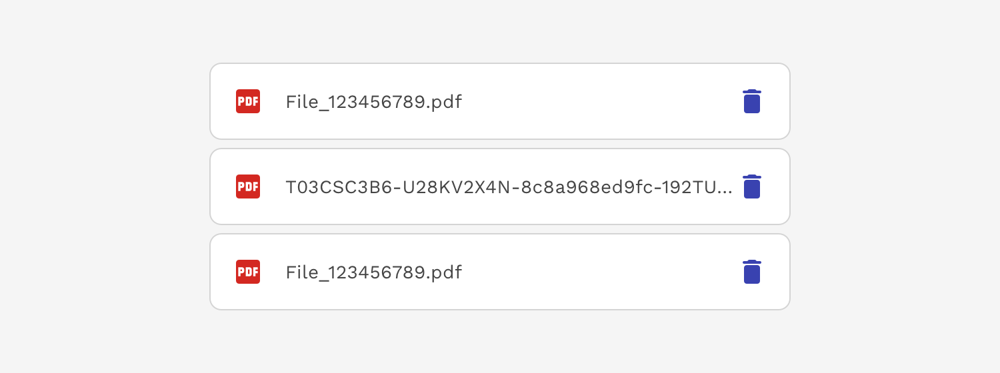
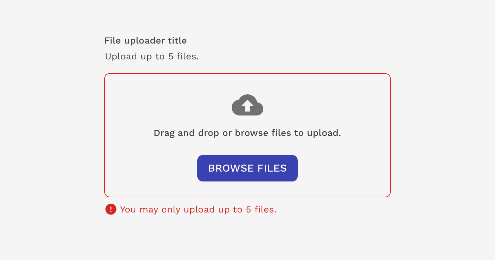

import { Link } from 'gatsby';
import './design-guidelines-styles.css';
import { DocsHeading } from '../../components/DocsHeading';
import { LeadParagraph } from '../../components/LeadParagraph';

<PageContent componentName="dropzone" type="design">

<LeadParagraph>
  Dropzones allow users to upload their own content. They are commonly used
  within forms but may also exist on their own.
</LeadParagraph>

## Usage

Use the React Magma dropzone when you want...

- ...users to upload one or more files at a time.
- ...users to be able to drag and drop files.
- ...users to see the progress and status of their uploads.

---

## Anatomy

### Full Component

1. **Label:** Informs the user what action needs to be taken.
1. **Description:** Helps the user understand the requirements of what may be uploaded.
1. **Drop zone:** Area where a file can be dropped to initiate the upload process.
1. **Button:** Allows the user to browse their computer’s file system to find the file(s) they wish to upload.
1. **Uploaded file:** A file that has been successfully uploaded.

### Component Without Dropzone

1. **Label:** Informs the user what action needs to be taken.
1. **Description:** Helps the user understand the requirements of what may be uploaded.
1. **Button:** Allows the user to browse their computer’s file system to find the file(s) they wish to upload.
1. **Uploaded file:** A file that has been successfully uploaded.

---

## Uploaded Files

### Anatomy

1. **File type icon:** Helps quickly identify the type of file that was uploaded.
1. **File name:** Helps the user confirm they uploaded the correct file.
1. **Delete button:** Allows the user to delete the uploaded file.

### Loading States

A file being uploaded has three different states – loading, success, and uploaded.

### File Types

We use icons on the uploaded file planks to help quickly identify certain commonly used file types – PDF, MS Word, MS Excel, MS Powerpoint, zipped files, etc. For file types we don’t have a specific icon for, we use a general file icon.

### Overflow

If the name of the file is too long for the space allowed within the container, it will be truncated with an ellipsis (...)

---

## Validation

When there’s an error uploading a specific file, that file will show an error state with a message. The component comes with basic validation messaging already built into it so you don't have to configure that every time. But if a custom validation message is necessary, make sure the message describes how the user can fix the issue. If the file upload is part of a larger form, you may also include an inline alert at the top of the form.

If the error is with the uploader itself and not a specific file, then a validation error message will display below the drop zone or upload button.

</PageContent>