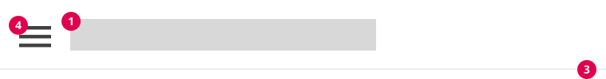
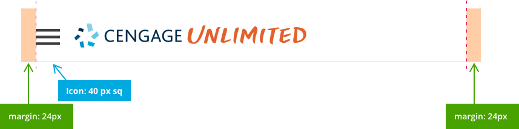
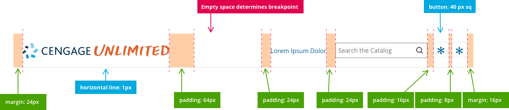
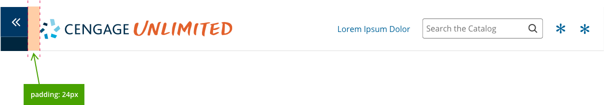
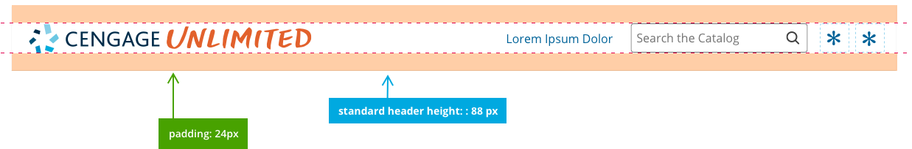

import { Link } from 'gatsby';
import './design-guidelines-styles.css';
import { LeadParagraph } from '../../components/LeadParagraph';

<PageContent componentName="header" type="design">

<LeadParagraph>
  The platform header component is intended to showcase the platform/product
  logo and can include icons, text links, inputs, and other features that are
  persistent throughout the experience.
</LeadParagraph>

## Usage

The header can be implemented with or without the Cengage Unlimited sidebar and is available in two vertical sizes (standard and compact) and both light and dark (inverse) styles.

## Anatomy

The header component is designed to be extremely flexible allowing designers to incorporate the features they need while maintaining consistency across platforms.

1. Platform/corporate logo
1. Icons, text links, primary navigation, inputs, etc.
1. Bottom border
1. Hamburger menu for responsive design

<figure>
  

    
  

  <figcaption>Header on small/mobile screen</figcaption>
</figure>

<figure class="with-background">
  
  <figcaption>Header on large/desktop screen</figcaption>
</figure>

## Horizontal Specifications

Horizontal specifications are consistent across all “flavors” of the header (standard, compact, and responsive.)

<figure>
  
  <figcaption>Header on small/mobile screen</figcaption>
</figure>

<figure>
  
  <figcaption>Header on large/desktop screen</figcaption>
</figure>

<figure>
  
  <figcaption>Header with sidebar menu icon</figcaption>
</figure>

## Left Justification

In certain circumstances, designers may need to left-justify header features. The component allows for this and uses the same basic rules of horizontal and vertical spacing.

<figure>
  
  <figcaption>Header with left justification</figcaption>
</figure>

## Span Width

The header should span the full width of the screen. On extra wide displays, the content may include expanded margins on each side, but the header logo should remain left-justfied to the edge of the screen, and (in most cases) the icons, features and inputs should remain right-justfied to the edge of the screen.

<figure>
  
</figure>

## Vertical Specifications

Vertical specifications vary between the standard and compact views.

<figure>
  
  <figcaption>Compact header</figcaption>
</figure>

<figure>
  
  <figcaption>Standard header</figcaption>
</figure>

## Icons, Inputs, and Features

Be careful not to use icons in the header that would be better-served elsewhere in the experience. Right-justified icons should only be used to highlight important, but ancillary features to the primary UX. Designers, ask yourself the following questions:

1. Is this feature highly important, but secondary to the user’s needs?
2. Is the feature “global” to the platform? (Does the user need access from every screen?)
3. Is the feature better-suited for the sidebar?
4. Would the feature be better-served as a navigation item in the sidebar or inline with the content?
5. Do the right-aligned header features provide balance to the visual experience?

## Order Of Operations for Icons

**(Recommended but not required)**

In order to maintain consistency across platforms, icons and features should be implemented as needed in the following order (from right to left):

- Profile or Username
- Help and Support
- Notifications
- Settings
- Misc. Icon Features
- Search
- Text link (Call to Action)

## Considerations

Here are several examples of strategies that designers should avoid:

### Don't use too many icons

<figure>
  
  <figcaption>
    
Incorrect

    
Incorrect: Too many icons create inbalance and clutter

  </figcaption>
</figure>

### Don't duplicate items

Don't duplicate items that already exist in the sidebar or elsewhere on the UI.

<figure>
  
  <figcaption>
    
Incorrect

    
These already exist in the sidebar or are better suited there

  </figcaption>
</figure>

### Don't use a collapsed sidebar and hamburger menu

<figure>
  
  <figcaption>
    
Incorrect

    
Sidebar controls should never co-exist with the hamburger menu

  </figcaption>
</figure>

</PageContent>
