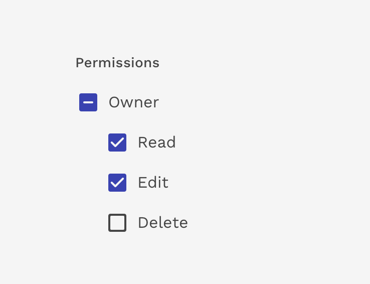

import './design-guidelines-styles.css';

<PageContent componentName="indeterminate_checkbox" type="design">

<LeadParagraph>
  Commonly used in hierarchical checkboxes to indicate that only some of the
  checkbox's descendants are checked.
</LeadParagraph>

## Usage

Use the indeterminate state when the checkbox contains a sub list of selections, some of which are selected, and some unselected.

View the <Link to="/design/checkboxes/">documentation for checkboxes</Link> for more details.

<figure>
  

    
  

  <figcaption>
    
Parent-child relationship for checkboxes

  </figcaption>
</figure>

</PageContent>
