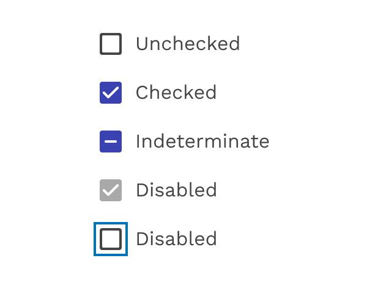
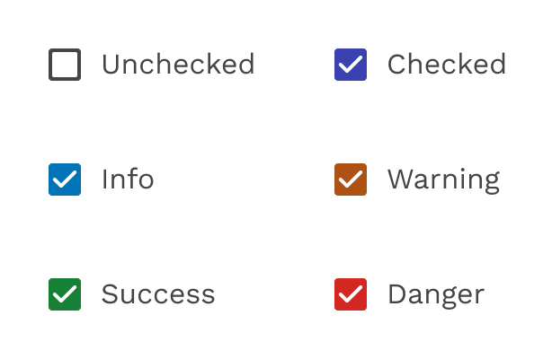
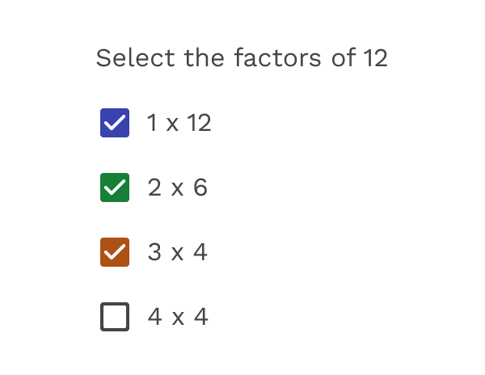

import './design-guidelines-styles.css';
import { LeadParagraph } from '../../components/LeadParagraph';

<PageContent componentName="indeterminate_checkbox" type="design">

<LeadParagraph>
  Selection controls allow the user to select options.
</LeadParagraph>

## Usage

Selection controls allow users to complete tasks that involve making choices such as selecting options, or switching settings on or off. Selection controls are found on screens that ask users to make decisions or declare preferences such as settings or dialogs.

<figure>
  

    
  

  <figcaption>
    
Selection controls

  </figcaption>
</figure>

---

## Principles

### Familiar

Selection controls have been in user interfaces for a long time and should be used as expected.

### Scannable

It should be visible at a glance if a selection control has been selected, and selected items should be more visually prominent than unselected items.

### Efficient

Selection controls make it easy to compare available options.

---

## Checkboxes

### When to Use Checkboxes

Use checkboxes to:

- Select one or multiple items from a list
- Present a list containing sub-selections
- Turn an option/setting on or off

<figure>
  

    
  

  <figcaption>
    
Checkboxes

  </figcaption>
</figure>

### Parent and Child Checkboxes

Checkboxes can have a parent-child relationship with other checkboxes.

- When the parent checkbox is checked, all child checkboxes are checked
- If a parent checkbox is unchecked, all child checkboxes are unchecked
- If some, but not all, child checkboxes are checked, the parent checkbox becomes an indeterminate checkbox

<figure>
  

    
  

  <figcaption>
    
Parent-child relationship for checkboxes

  </figcaption>
</figure>

### States

Checkboxes can be selected, unselected, or indeterminate. Checkboxes have enabled, disabled, focused and pressed states.

<figure>
  

    
  

  <figcaption>
    
Checkbox states

  </figcaption>
</figure>

### Colors

The default color used for checked checkboxes is the "primary" color in the Magma palette, but sometimes a special scenario or specific UI can benefit from using one of the other colors from the palette. Colors like Success Green, Danger Red, or just one of the "Pop" colors, when used responsibly and consistently, can help add context to your checkbox or just add some visual interest.

<figure>
  

    
  

  <figcaption>
    
Alternate colors

  </figcaption>
</figure>

### Inverse Checkboxes

Sometimes you have to put those checkboxes on a dark background, and that's when you'll want to use the inverse version. You can also still use alternate colors like Success Green and Danger Red if you wish.

<figure>
  

    
  

  <figcaption>
    
Inverse colors

  </figcaption>
</figure>

  

    

      <figure>
        
        <figcaption>
          
Incorrect

          

            Don't use multiple colors in the same UI. Pick one and stick with
            it.
          

        </figcaption>
      </figure>
    

    

      <figure>
        
        <figcaption>
          
Incorrect

          

            If you're going to change the color, don't use a neutral color. This
            could be confused with a checkbox that is checked and disabled.
          

        </figcaption>
      </figure>
    

  

</PageContent>
