import { DocsHeading } from '../../components/DocsHeading';
import { LeadParagraph } from '../../components/LeadParagraph';
import { Input, PasswordInput, Textarea } from 'react-magma-dom';
import { Link } from 'gatsby';

<PageContent componentName="input" type="design">

<LeadParagraph>
  Inputs enable the user to interact with and input content and data.
</LeadParagraph>

## Usage

Inputs can be used alone or they can be combined with other types of inputs to create more robust forms. In addition to text fields, other types of inputs include text area, password, search, number, and more.

<figure>
  

    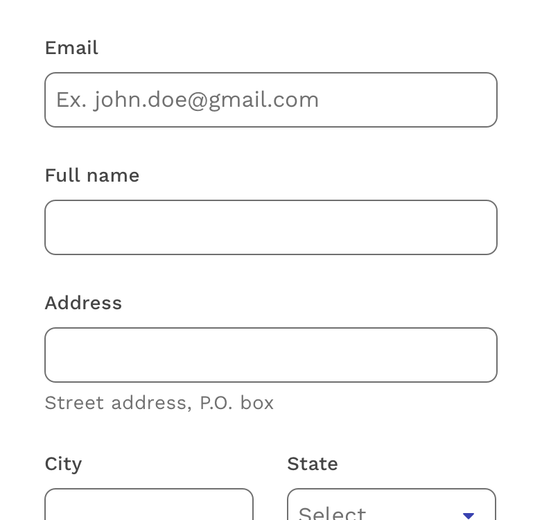
  

</figure>

---

## Principles

### Discoverable

Inputs should stand out and indicate that users can input information.

### Clear

Input states should be clearly differentiated from one another.

### Efficient

Inputs should make it easy to understand the requested information and clearly describe any errors.

---

## Types

Inputs come in many different types depending on what kind of information you want the user to enter.

### Text Field

Use this input when the expected user input is a single line of text, as opposed to a paragraph.

View <Link to="/api/input/">component API</Link> for text fields.

<figure>
  

    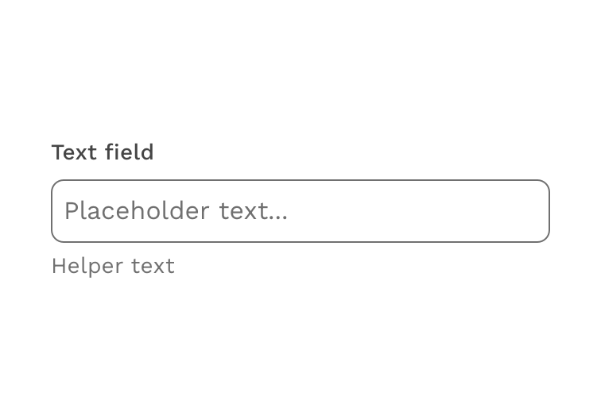
  

</figure>

### Text Area

Use this input when the expected user input is more than one sentence.

View <Link to="/api/textarea/">component API</Link> for text areas.

<figure>
  

    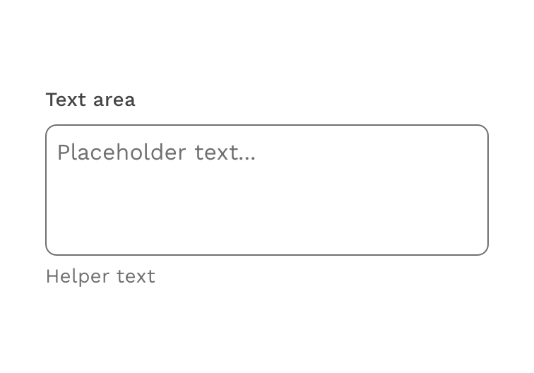
  

</figure>

### Password

Use this input when you want keep the user's password masked for security.

View <Link to="/api/password-input/">component API</Link> for password inputs.

<figure>
  

    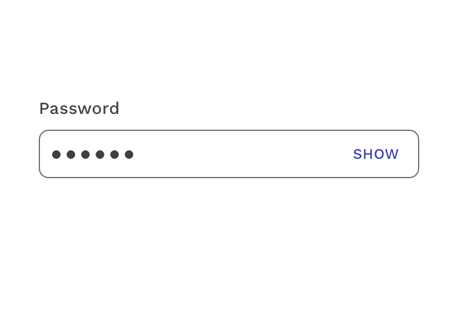
  

</figure>

### Number Input

Use this input when you want to limit the user's input to numerical characters.

View <Link to="/api/input/">component API</Link> for number inputs.

<figure>
  

    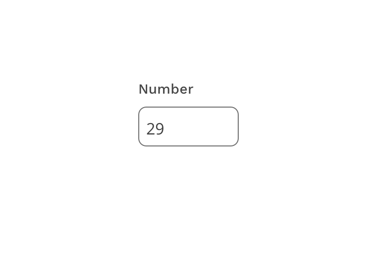
  

</figure>

### Search

Use the search input when the desired functionality is to submit a search query.

View <Link to="/api/search/">component API</Link> or <Link to="/design/search/">design guidelines</Link> for search inputs.

<figure>
  

    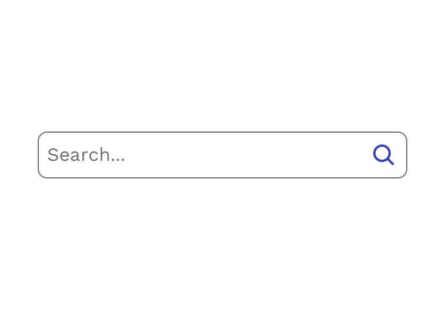
  

</figure>

### Date

Use the date input when you want the user to input a date in the format you choose. A built-in calendar widget and keyboard controls improve the general usability and accessibility of the component.

View <Link to="/api/date-pickers/">component API</Link> for date inputs.

<figure>
  

    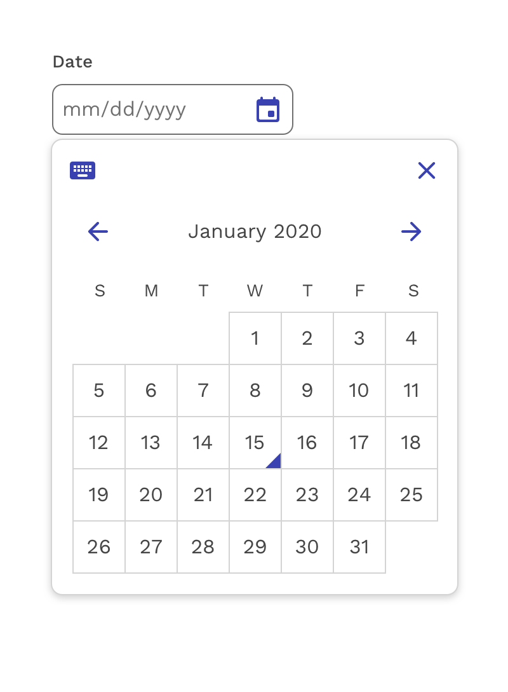
  

</figure>

### Time

Use the time input when you want the user to input a time in the format you choose. Enhanced keyboard navigation improves the general usability and accessibility of the component.

View <Link to="/api/time-picker/">component API</Link> for time inputs.

<figure>
  

    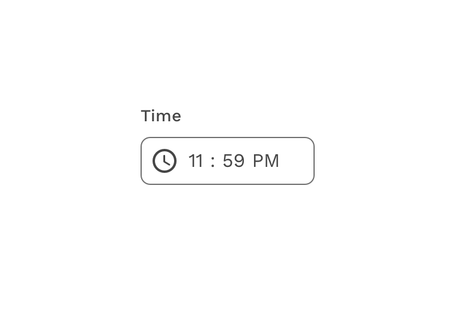
  

</figure>

---

## Anatomy

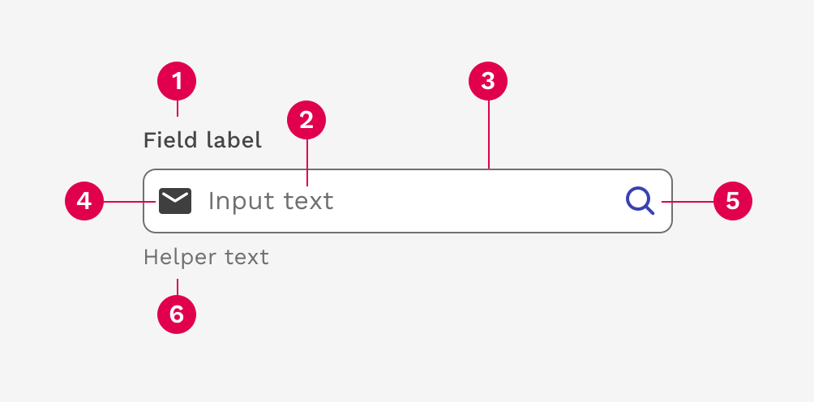

1. Field label
1. Input text
1. Container
1. Leading icon
1. Trailing icon
1. Helper text

### Field Label

The field label tells the user what information they need to input. Using placeholder text in lieu of a label is sometimes employed as a space-saving method. However, this should typically be limited to search inputs because it hides context and presents accessibility issues.

**Input labels should be written in sentence case.**  This means only the first word and proper nouns should be capitalized.

#### Accessibility best practices for labels

- Labels must be visible when an input gets focus.
- Labels must be announced to the screen reader on focus.
- Do not truncate text labels.
- Keep labels as short and clear as possible to avoid wrapping to multiple lines.

  

    

      <figure>
        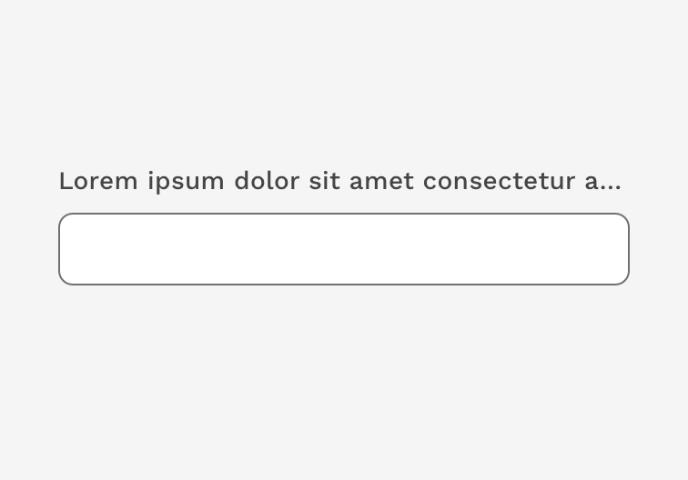
        <figcaption>
          
Incorrect

          
Do not truncate field labels.

        </figcaption>
      </figure>
    

    

      <figure>
        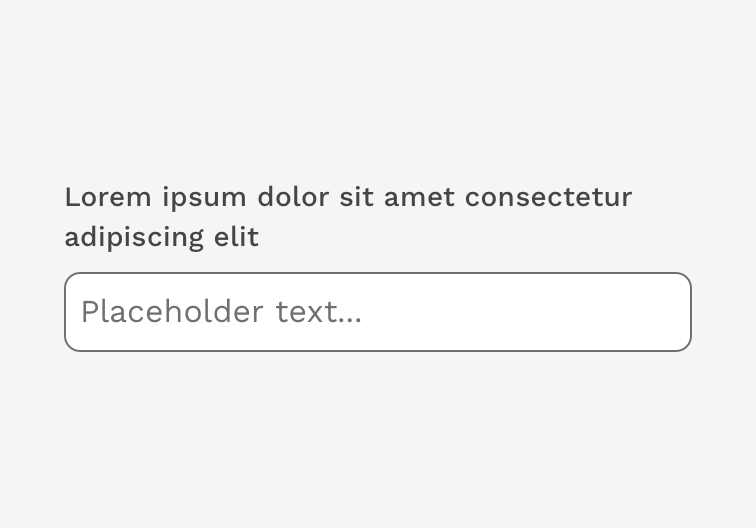
        <figcaption>
          
Caution

          

            Wrapping long field labels is acceptable, but try to avoid at all
            costs. Labels are best kept simple and short enough to fit on a
            single line.
          

        </figcaption>
      </figure>
    

  

### Placeholder Text

Placeholder text provides hints or examples of what to enter. Placeholder text disappears after the user begins entering data into the input and should not contain crucial information. Use sentence-style capitalization, and in most cases, write the text as a direct statement without punctuation.

  

    

      <figure>
        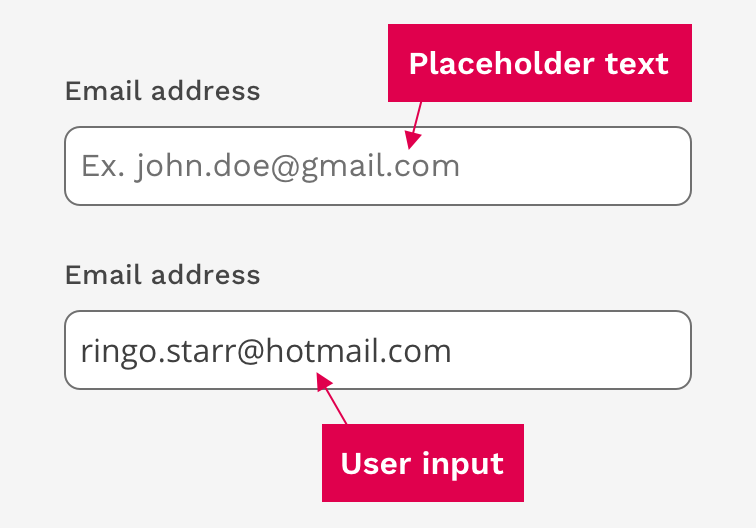
        <figcaption>
          

            This example shows how the placeholder text provides a hint to the
            user how to enter their email address.
          

        </figcaption>
      </figure>
    

    

  

### Helper Text

Helper text is pertinent information that assists the user in completing a field. Helper text appears underneath the container and remains visible unless there is a validation error on that field. Use sentence-style capitalization, and in most cases, write the text as full sentences with punctuation.

  

    

      <figure>
        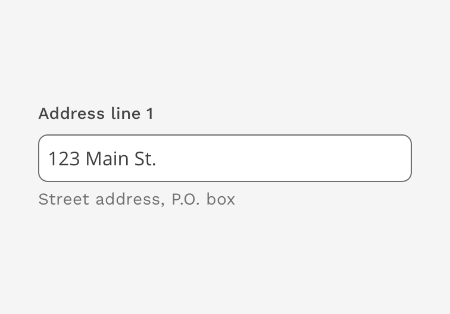
        <figcaption>
          
Example of input helper text

        </figcaption>
      </figure>
    

    

  

### Required Field Indicator

Required fields should be indicated by putting an asterisk (\*) at the end of the label. If there are very few required inputs in the form, you can use the helper text to inform the user what the asterisk means. If there are a relatively large number of required fields in the form, you can put a legend at the top of the form and just tell them once.

  

    

      <figure>
        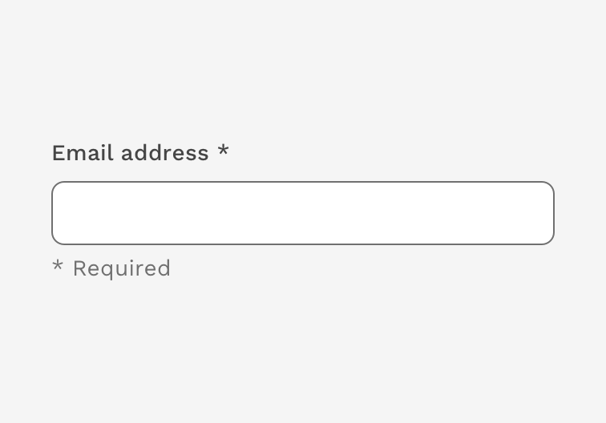
        <figcaption>
          
Correct

          

            A required field is indicated with an asterisk. If there aren't many
            required fields, you may use the Helper Text to tell the user what
            the asterisk means.
          

        </figcaption>
      </figure>
    

    

      <figure>
        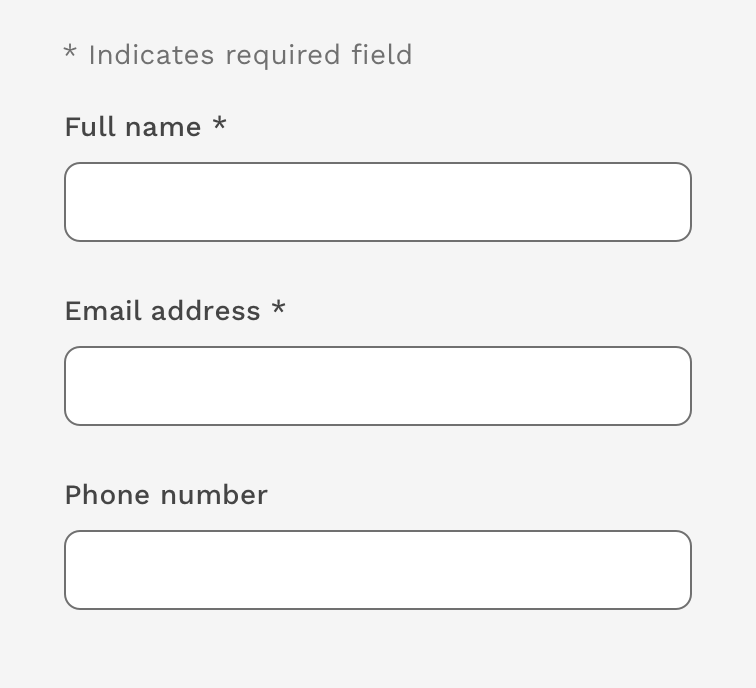
        <figcaption>
          
Correct

          

            If there are multiple required fields, you may explain the meaning
            of the asterisk one time above the form.
          

        </figcaption>
      </figure>
    

  

  

    

      <figure>
        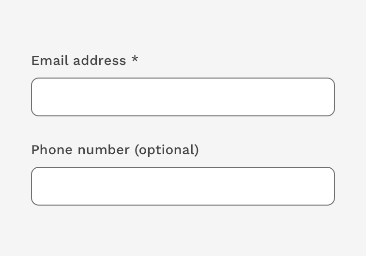
        <figcaption>
          
Incorrect

          

            Only required fields are called out as such. Do not mark optional
            fields.
          

        </figcaption>
      </figure>
    

    

  

### Input Container

The input container is designed to improve the discoverability of inputs by creating enough contrast between the input and the surrounding content.

#### Fill and Border

The input container is filled with white and has a 1px border. The color of the border on a white background neutral (#707070), while the color of the border on a white background is white.

#### Rounded Corners

Inputs have a 5px border radius to be consistent with buttons, which often accompany inputs.

  

    

      <figure>
        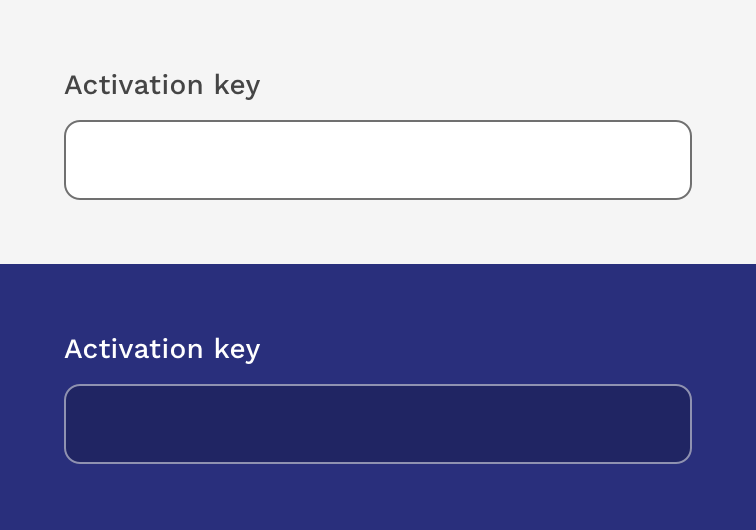
        <figcaption>
          
Examples of text fields on light and dark backgrounds.

        </figcaption>
      </figure>
    

    

  

### Assistive Elements

#### Icons

Icons can be used to help provide clarity or functionality. Leading icons are typically used to help clarify the type of input, such as email or phone. Trailing icons are typically also buttons that can be used to clear the input or trigger something else like a calendar component.

  

    

      <figure>
        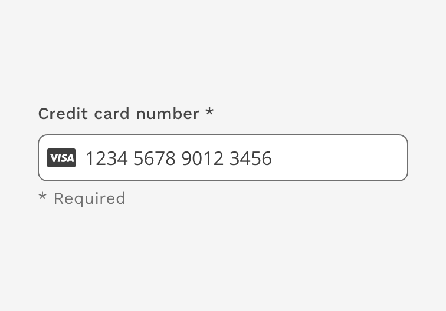
        <figcaption>
          

            Example of input with leading icon. The Visa icon helps identify the
            specific kind of credit card entered.
          

        </figcaption>
      </figure>
    

    

      <figure>
        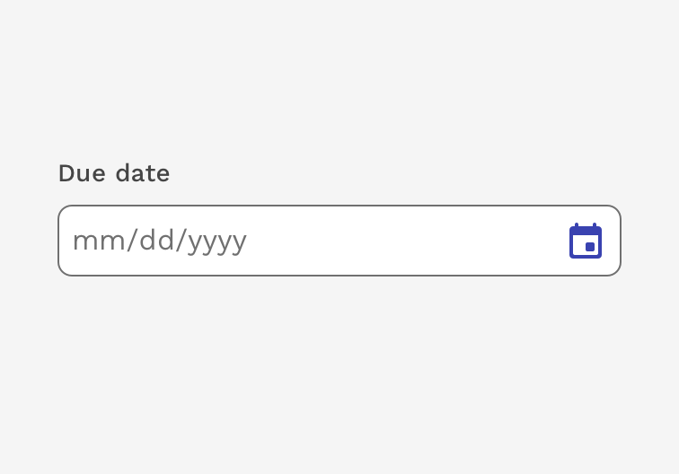
        <figcaption>
          

            Example of input with trailing icon. The calendar icon is a button
            that opens a calendar widget.
          

        </figcaption>
      </figure>
    

  

#### Help Link

The "Help Icon" can be added to inputs that might require more explanation or clarification to the user.  The difference between the "Help Icon" and the "Helper Text" below the input is that the "Help Icon" is used to explain things like why the user needs to fill out that input or how you're going to use that information.  The "Helper Text" is used to explain how to fill out the input by showing examples of expected information or restrictions.  

The icon can be configured to simply display a message within a tooltip or also trigger actions like opening a modal or navigating to another location for extreme cases.

  

    

      <figure>
        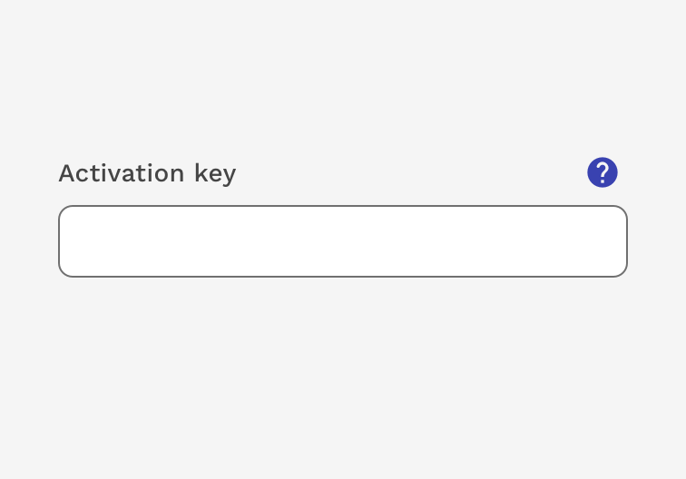
        <figcaption>
          
Example of input with Help icon

        </figcaption>
      </figure>
    

    

  

---

## Input States

  

    

      <figure>
        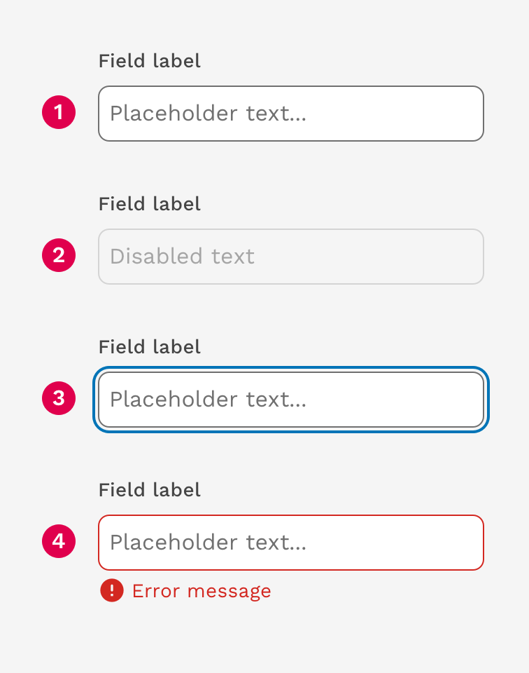
        <figcaption>
          

            Inputs can display the following states: active, disabled, focused,
            and error.
          

        </figcaption>
      </figure>
    

    

  

1. Active
1. Disabled
1. Focus
1. Error

### Error Messages

When the input provided is invalid, an error message should be used to provide instructions on how to fix the error. The error message will replace the helper text until it is fixed.

  

    

      <figure>
        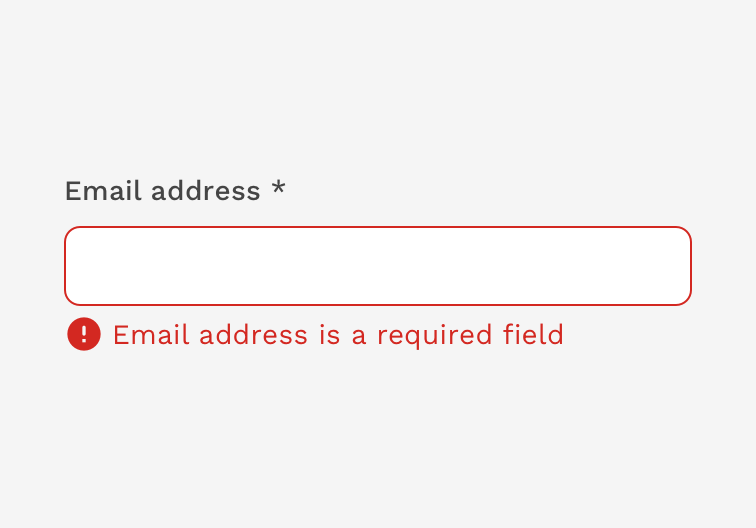
        <figcaption>
          
Example of input with error message

        </figcaption>
      </figure>
    

    

  

---

## Sizes

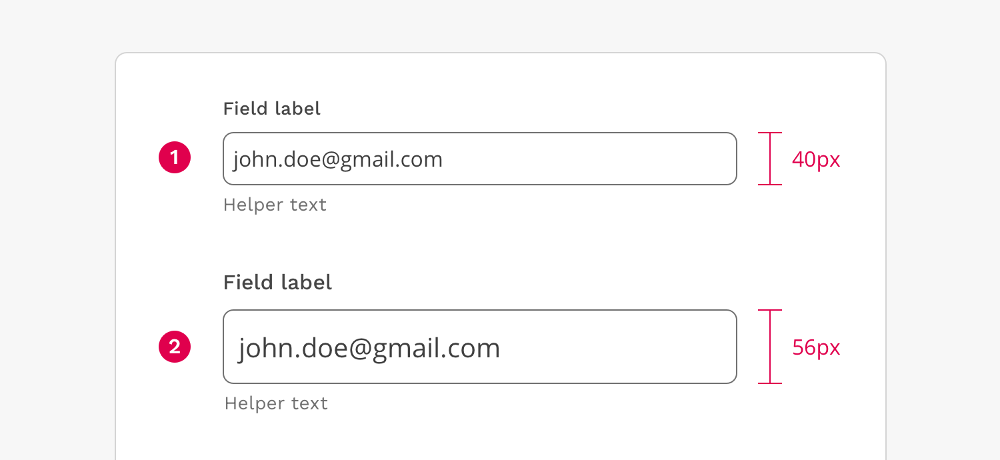

1. Regular
1. Large

The regular sized inputs should be used in all cases, unless you are creating an interface that justifies the use of the large input. One example could be a page focusing entirely on search. Inputs should not be customized outside of these two standards without review and approval by the UX Department.

</PageContent>