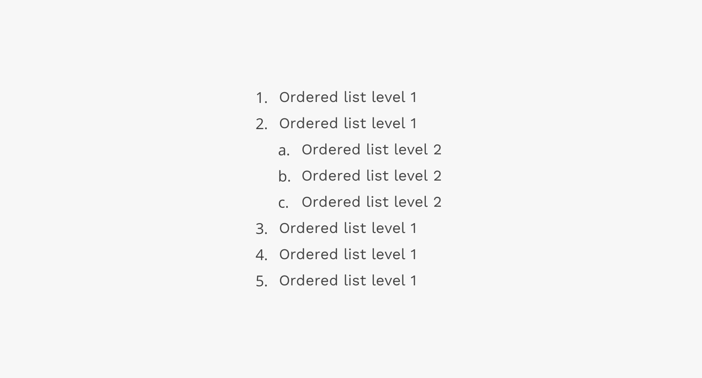
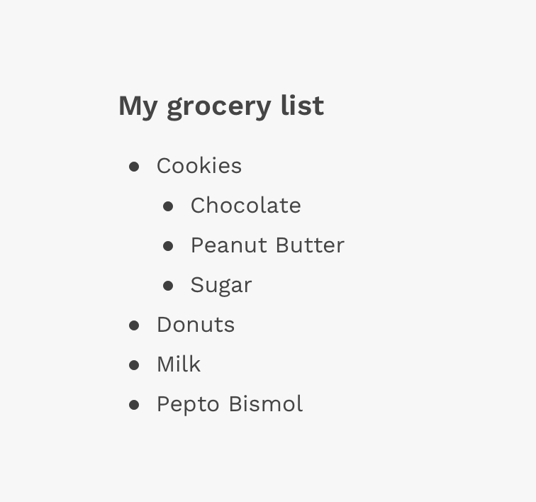
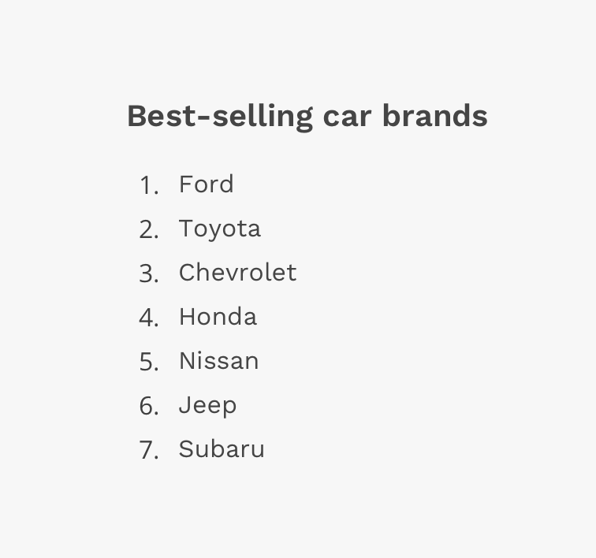
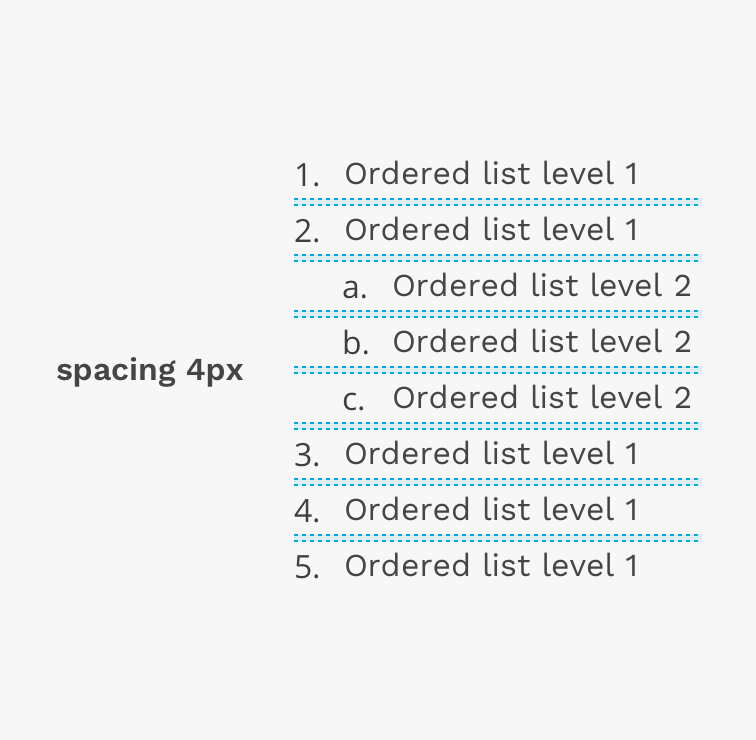
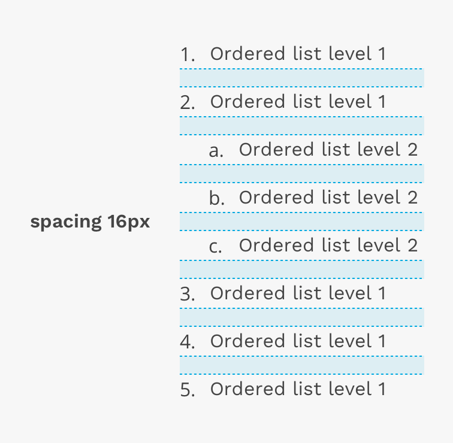
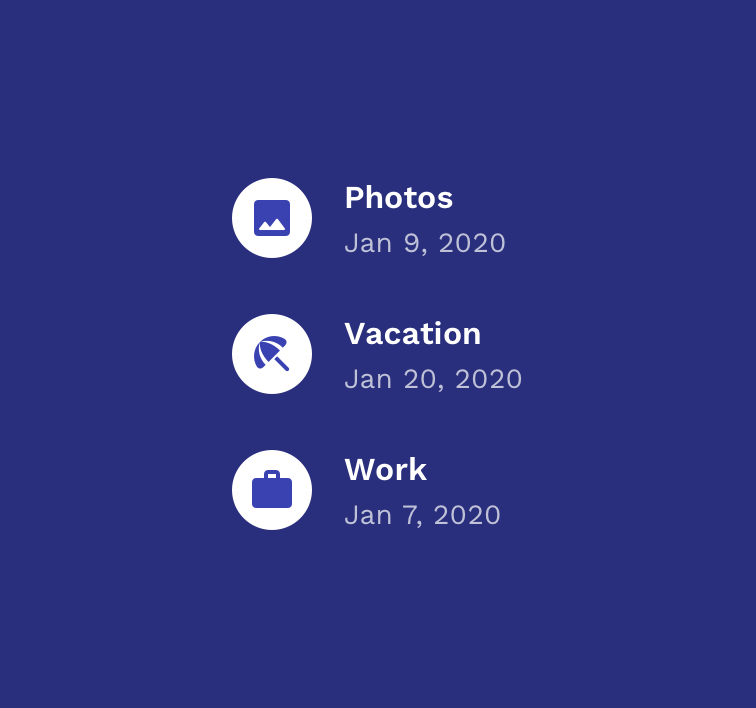
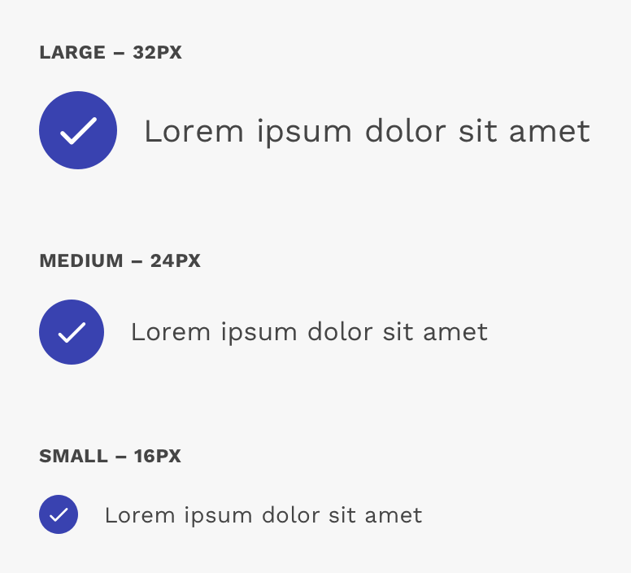
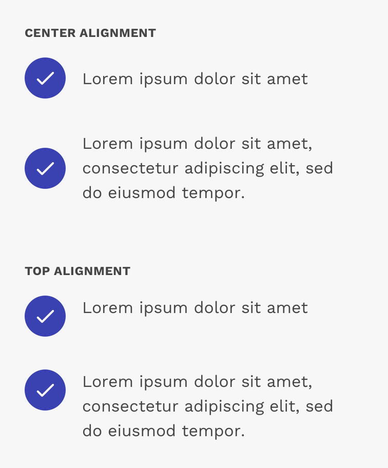

import './design-guidelines-styles.css';

<PageContent componentName="list" type="design">

<LeadParagraph>
  Lists are vertical groupings of related content. Lists come either ordered or
  unordered.
</LeadParagraph>

## Usage

The list component is intended for simple groupings of related information and styles are kept very minimal for seamless integrations into things like articles or the page of a book. Highly stylized lists like menus or lists of actionable items might share some of the same code, but should be handled as separate components.

Use unordered (bulleted) lists when you don’t need to convey a specific order for list items.

Use ordered (numbered) lists when you need to convey a sequence or hierarchy between list items.

  

    

      <figure>
        
        <figcaption>
          The list in this image shows a list of grocery items in no particular
          order.
        </figcaption>
      </figure>
    

    

      <figure>
        
        <figcaption>
          The list in this image shows a list of the top 7 best-selling car
          brands.
        </figcaption>
      </figure>
    

  

---

## Content

### Length

Generally, lists should be used to present simple pieces of information. For more complex sets of data, consider using a data table.

### Order

Arrange list items in a logical way. For example, if the list is about item sales, the default order might be the highest sold item to the lowest. Grouping items in categories into smaller, more specific lists might be more meaningful in some contexts. You can also organize lists in alphabetical or numeric order.

### Text

Use list items that are grammatically parallel. For example, try not to mix passive voice with active voice.

---

## Styling

The basic unordered and ordered lists have very minimal styling and instead rely mostly on the browser's default display. They can utilize the standard "list type" attribute so you can display numbers or letters on ordered lists, or discs and squares on unordered lists. You may use any typographic style appropriate for your design, and you can adjust the spacing between the line items. You can also create an unordered list that displays icons in front of each line item instead of bullets.

### Spacing

You can use the spacing tokens in React Magma to increase the vertical space between each item in the list.

  

    

      <figure>
        
      </figure>
    

    

      <figure>
        
      </figure>
    

  

### Icon List

The icon list is really just a variant of the Unordered List, but instead of bullets, you can put Material Design icons in front of each list item.

  

    

      <figure>
        
      </figure>
    

    

  

#### Icon Size

There are three icon size choices, including small, medium, and large. These sizes provide flexibility and allow you to find the right balance between the size of the icon and the content associated with it.

  

    

      <figure>
        
      </figure>
    

    

  

#### Icon Alignment

You can align the icon with the center or top of the associated content. This largely depends on the layout of the associated content. For example, top-aligning the icon with single lines of content creates a very undesirable appearance. Also center-aligning the icon with content consisting of several lines may also create an odd-looking result.

  

    

      <figure>
        
      </figure>
    

    

  

</PageContent>
