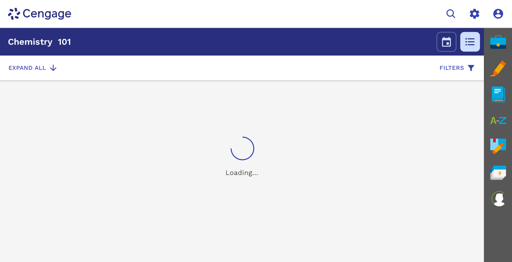

import './design-guidelines-styles.css';

<PageContent componentName="loading_indicator" type="design">

<LeadParagraph>
  Loading indicators communicate to the user that the action they requested is
  working, or the content they're going to see is not quite ready.
</LeadParagraph>

## Usage

React Magma loading indicators range from small circular spinners, to larger components designed for loading large amounts of data. These loading indicators allow us to communicate with the user when information or an action they requested is taking some time to complete.

---

## Types

### Indeterminate

Circular spinners are used when the amount of time needed to run a process or load some content is unknown. The circular spinner can be applied to any surface, and should be placed in a way that makes it clear what it is related to. This means the size of the spinner can vary depending on where it's used, but the size should be set in multiples of 10px.

  

    

      <figure>
        
      </figure>
    

    

  

### Determinate

Progress bars should be used when real progress data can be fed to it, and you also know it could take several seconds or longer to complete. This could include the uploading of files, loading pages, loading large areas of data, etc.

  

    

      <figure>
        
      </figure>
    

    

  

---

## Behavior

### Small Amounts of Data

Many actions happen quickly, such as saving updates, submitting a form, or loading small amounts of data. That being said, there's still typically a delay between the user clicking an action and the action itself completing.

If you know that it will take less than a second to complete an action, then no loading indicator is necessary. If you know the action is going to take 1 - 5 seconds to complete, you should use a circular spinner.

<figure>
  
  <figcaption>
    

      Replace the label in the button with the circular spinner after clicking
      on it.
    

  </figcaption>
</figure>

### Large Amounts of Data

If you are loading large amounts of data like an entire page or large areas of data, the amount of time it takes to load can vary greatly. We need to effectively communicate with the user what is happening, but that takes some informed decisions on our part.

<figure>
  
  <figcaption>
    

      In this example, we are using a loading indicator while the Learning Path
      in MindTap loads. You could also do this when switching from one view to
      the other.
    

  </figcaption>
</figure>

#### Spinner + Message

If there is no way of measuring how long it will take in real-time, but you know from testing that it typically takes 1 - 15 seconds, you should use the component that uses the circular spinner plus message. The component will automatically transition through three custom messages at the following intervals.

<figure>
  
  <figcaption>
    
Messaging should tell the user what is happening and what to expect.

  </figcaption>
</figure>

1. **1-5 seconds -** The first message is used to simply tell the user what is happening. This could be as simple as "Loading..." or slightly more descriptive if necessary.
1. **5-15 seconds -** The second message is used to tell the user that the data is still loading.
1. **Greater than 15 seconds -** The third message is used to either comfort the user because everything is still loading but OK, or to prepare the user for a possible problem.

#### Progress Bar + Message

If you know from testing that it typically takes more than 15 seconds to load, **AND** you can measure the progress in real-time, you should use the component that uses the progress bar plus message.

<figure>
  

    
  

  <figcaption>
    

      In this example, testing shows that it always takes at least 15 seconds to
      load, and we can track the progress, so we use the progress bar with
      message to let the user know what to expect.
    

  </figcaption>
</figure>

This component also allows for three messages, although at different intervals than the variant with the spinner above.

<figure>
  
  <figcaption>
    
Messaging should tell the user what is happening and what to expect.

  </figcaption>
</figure>

1. **1-15 seconds -** The first message is used to simply tell the user what is happening. This could be as simple as "Loading..." or slightly more descriptive if necessary.
1. **15-30 seconds -** The second message is used to tell the user that the data is still loading.
1. **Greater than 30 seconds -** The third message is used to either comfort the user because everything is still loading but OK, or to prepare the user for a possible problem.

</PageContent>
