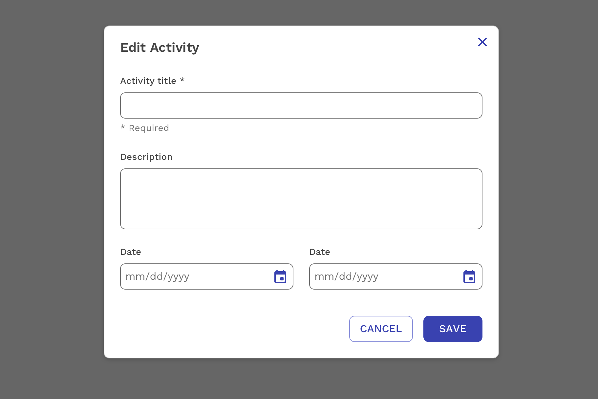

import './design-guidelines-styles.css';
import { DemoModal } from '../../components/DemoModal';

<PageContent componentName="modal" type="design">

<LeadParagraph>
  Modals inform users about a task and can contain critical information, require
  decisions, or involve multiple tasks.
</LeadParagraph>

---

## Usage

A modal is intentionally interruptive and blocks the user from interacting with the on-page content. Modals keep the user focused on the task or information until they either cancel or complete the task. Modals can be very useful when used effectively but should be used sparingly to avoid disrupting the user too much. Here are some guidelines for when to use a modal.

### Confirm a User Decision

Clearly describe the decision being made by the user, and explain any possible consequences it could cause. The primary button should also reinforce the action being taken. If the action being taken is irreversible, make that clear to the user as well. The user should also be able to cancel the action with a secondary button or closing the modal.

### Edit or Manage Tasks

It's very common to use a modal to quickly edit or manage one or more items on a page without going back and forth between multiple pages. The emphasis here is "quickly". If the settings or management of an item becomes relatively complex and requires many decisions or multiple steps, please consider using a separate page or something other than a modal. If a particular action is often done repeatedly, consider allowing the action to be done directly on the main page rather than in a modal.

---

## Sizes

Modals come in three responsive sizes: small, medium, and large.

### Small

The default width of the small modal is 300px. Works well for basic alerts and confirmations.

<DemoModal size="small" />

### Medium

The default width of the medium modal is 600px. Works well for standard single-column forms.

<DemoModal size="medium" />

### Large

The default width of the large modal is 900px. Works well for UI's requiring multi-column layouts. If you are considering the large modal, you should also be seriously considering using a new page instead.

<DemoModal size="large" />

### Modal Height

React Magma modals do not have a maximum height at this time. They are as tall as they need to be to fit the content, which means it's possible for the bottom of the modal to extend beyond the bottom of the viewport. You can still easily scroll the entire modal in order to access the content off-screen.

### Responsive Behavior

When the viewport of the device is 600px wide or below, the padding within the modal decreases from 24px to 16px. This matches the change in gutter widths on the overall page layout on smaller devices. The result allows the content of the modal to maximize the available space.

---

## Behaviors

### Trigger

Modals are typically triggered by a user's action rather than generated by the system. Common components used to trigger a modal include buttons, links, and icons. A modal can also be opened using a keyboard by pressing `Enter` or `Space`.

### Closing

Modals should always contain a way to close them, and there are typically multiple ways for any modal. The most obvious is the Close button in the upper-right corner. Less obvious, but always present, is the ability to press `Escape` on the keyboard or simply click outside the modal. Additionally, there is often a primary action button that triggers a process and then closes the modal when it's completed or a Cancel button that closes the modal without taking any further action.

### Focus

When a modal is opened, the focus is automatically put on the title of the modal rather than the first actionable element. We intentionally do this to provide an optimal experience for both people using assistive technologies and those who don't.

### Validation

Always validate a user's input entries before a modal is closed. If there are any errors, an inline error alert should be displayed above the form, as well as error messages on any specific inputs that failed validation. The error messages should provide clear instructions on how to resolve the errors and complete the action.

</PageContent>
