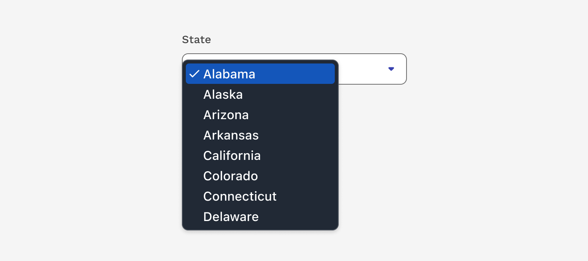

import './design-guidelines-styles.css';

<PageContent componentName="native_select" type="design">

<LeadParagraph>
  The Select component allows users to choose one or more options from a list.
</LeadParagraph>

## Usage

The Native Select functionally works the same as the standard Select. The difference is that the Native Select lets the browser determine how the list of options is presented. This makes it the preferred component when the list of options is longer than 10 items. This will ensure the list is navigable and optimized for any size screen.

</PageContent>
