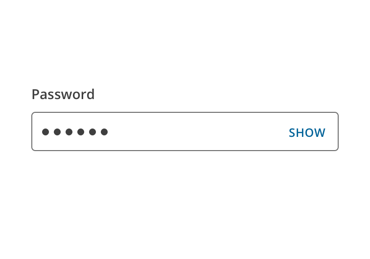
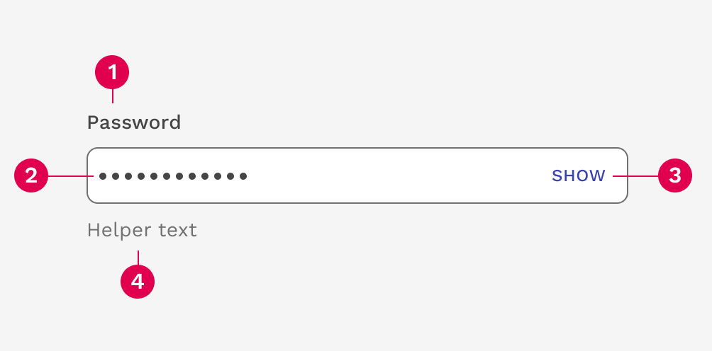

import { LeadParagraph } from '../../components/LeadParagraph';
import { Link } from 'gatsby';

<PageContent componentName="password_input" type="design">

<LeadParagraph>
  Use the password input when you want to keep the user's password masked for security.
</LeadParagraph>

<figure>
  

    
  

</figure>

---

## Anatomy

1. Field label
1. Masked password
1. Reveal password
1. Helper text

</PageContent>
