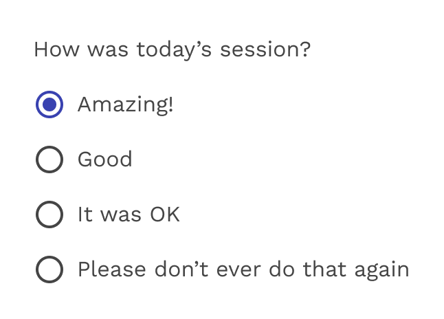
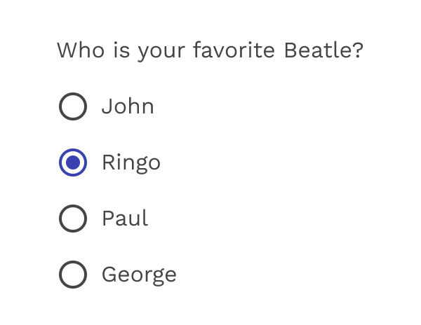

import './design-guidelines-styles.css';
import { LeadParagraph } from '../../components/LeadParagraph';

<PageContent componentName="radio_button" type="design">

<LeadParagraph>Radio buttons allow the user to select options.</LeadParagraph>

## Usage

Use radio buttons to select a single option from a list. Radio buttons should be used instead of checkboxes if only one item can be selected from a list.

<figure>
  

    
  

  <figcaption>
    
Radio buttons

  </figcaption>
</figure>

  

    

      <figure>
        
        <figcaption>
          
Correct

          

            Use radio buttons when only one item can be selected from a list.
          

        </figcaption>
      </figure>
    

    

      <figure>
        
        <figcaption>
          
Incorrect

          

            Don’t use checkboxes when only one item can be selected from a list.
            Use radio buttons instead.
          

        </figcaption>
      </figure>
    

  

<figure>
  

    
  

  <figcaption>
    
Radio buttons - only one option can be selected at a time.

  </figcaption>
</figure>

## States

Radio buttons can be off or on. Radio buttons have enabled, focused and pressed states.

<figure>
  

    
  

  <figcaption>
    
Radio states

  </figcaption>
</figure>

## Colors

The default color used for radio buttons is the "primary" color in the Magma palette, but sometimes a special scenario or specific UI can benefit from using one of the other colors from the palette. Colors like Success Green, Danger Red, or just one of the "Pop" colors, when used responsibly and consistently, can help add context to your radio button or just add some visual interest.

<figure>
  

    
  

  <figcaption>
    
Alternate colors

  </figcaption>
</figure>

## Inverse Radio Buttons

Sometimes you have to put those radio buttons on a dark background, and that's when you'll want to use the inverse version. You can also still use alternate colors like Success Green and Danger Red if you wish.

<figure>
  

    
  

  <figcaption>
    
Inverse colors

  </figcaption>
</figure>

</PageContent>
