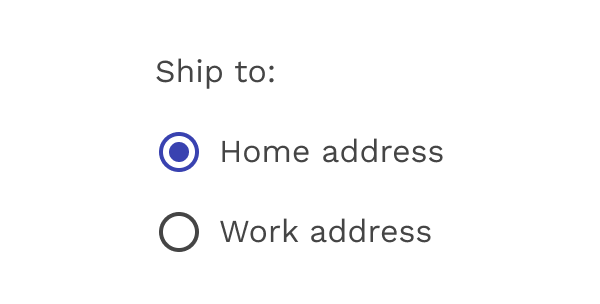
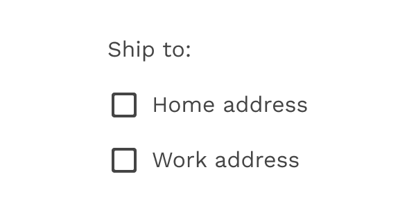
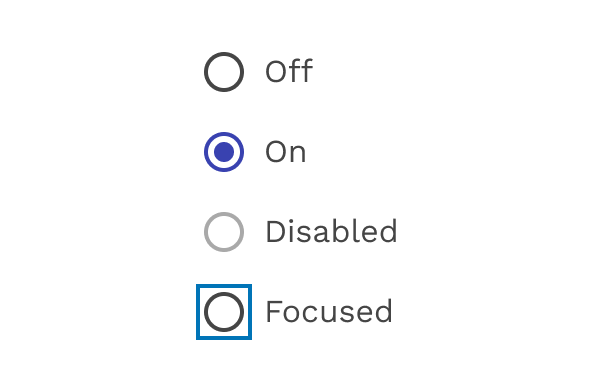

import './design-guidelines-styles.css';

<PageContent componentName="radio_button" type="design">

<LeadParagraph>
  The Radio button allows the user to select one option from a set.
</LeadParagraph>

## Usage

Use radio buttons when the user needs to see all available options. If available options can be collapsed, consider using a Select component because it uses less space.

Radio buttons should have the most commonly used option selected by default.

<figure>
  

    
  

  <figcaption>
    
Radio buttons

  </figcaption>
</figure>

  

    

      <figure>
        
        <figcaption>
          
Correct

          

            Use radio buttons when only one item can be selected from a list.
          

        </figcaption>
      </figure>
    

    

      <figure>
        
        <figcaption>
          
Incorrect

          

            Don’t use checkboxes when only one item can be selected from a list.
            Use radio buttons instead.
          

        </figcaption>
      </figure>
    

  

<figure>
  

    
  

  <figcaption>
    
Radio buttons - only one option can be selected at a time.

  </figcaption>
</figure>

## States

Radio buttons can be off or on. Radio buttons have enabled, focused and pressed states.

<figure>
  

    
  

  <figcaption>
    
Radio states

  </figcaption>
</figure>

## Inverse

Use the inverse version when using the radio buttons on a dark background.

<figure>
  

    
  

  <figcaption>
    
Inverse colors

  </figcaption>
</figure>

</PageContent>
