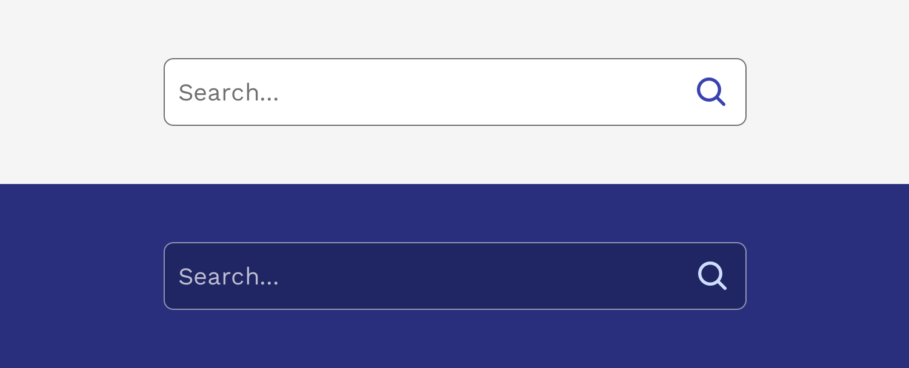
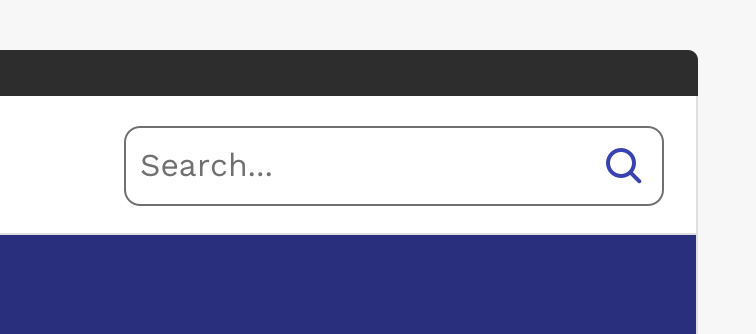
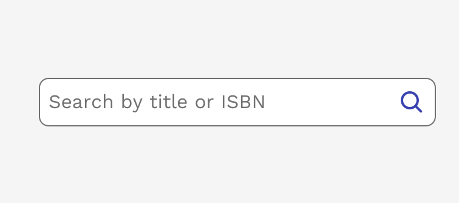

import { DocsHeading } from '../../components/DocsHeading';
import { Input, PasswordInput, Textarea } from 'react-magma-dom';
import { Link } from 'gatsby';
import { LeadParagraph } from '../../components/LeadParagraph';

<DocsHeading to="/api/search/" type="design">
  Search
</DocsHeading>
<LeadParagraph>
  Search enables users to specify a word or a phrase to find relevant pieces of
  content without the use of navigation.
</LeadParagraph>

## Usage

Search offers users a way to explore a website or application using keywords. Search can be used as the primary means of discovering content, or as a filter to aid the user in finding content.

---

## Behavior

Set the user’s context for the search with helpful placeholder text within the search field (search documents), that pertains to the page or section the search box is in. Search in the global header should just say search.

  

    

      <figure>
        
      </figure>
    

    

      <figure>
        
      </figure>
    

  

**Accessibility note:** If the search component’s label and placeholder text differ, VoiceOver on macOS will read both.

### Search results

- Clearly show which results are being displayed with labels or headers (i.e. Results for X).
- Categorize the search results if they come from different areas (eg. docs, services, apps, tutorials, blogs).
- Give the user control over their viewing options and ability to sort results (eg. relevancy, popularity, ratings, date).
- Have a clear, “no results”, message and offer suggestions if possible.
- Have smart algorithms that can search for similar terms or can search even with misspelled words.
- Include enough of a description in the results for users to make a judgement as to whether that particular result is relevant.
- Highlight the search term in the results, where appropriate.

