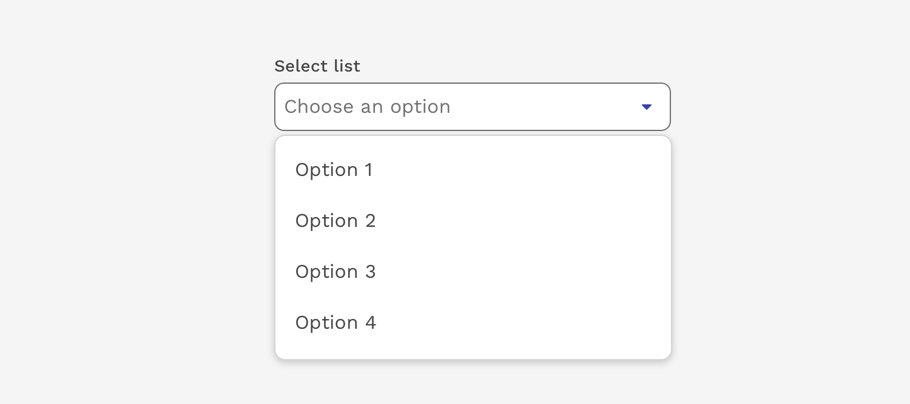
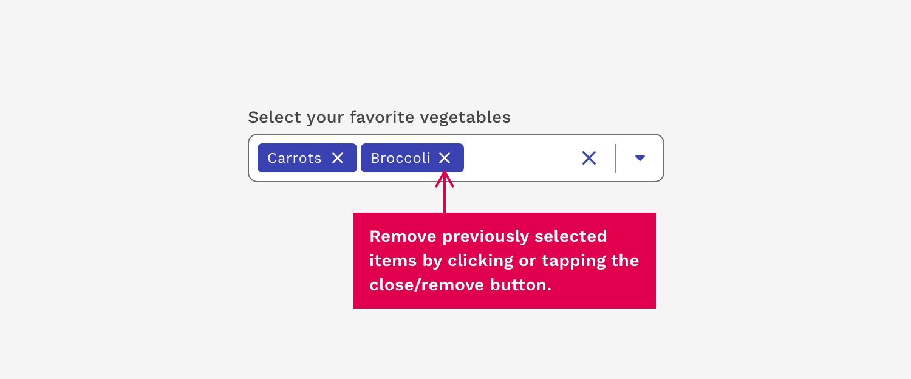

import { Link } from 'gatsby';
import './design-guidelines-styles.css';
import { LeadParagraph } from '../../components/LeadParagraph';

<PageContent componentName="select" type="design">

<LeadParagraph>
  The Select component allows users to choose one or more options from a list.
  It is used in forms for users to submit data.
</LeadParagraph>

---

## Select vs. Dropdown

While the Select and Dropdown components can look similar, they have different functions.

- Use the Select component inside a form where users are selecting from a list of options and submitting data.
- Use the Dropdown component to display a list of menu options.

---

## Multiselect

Multiselects are exactly what the name implies – A Select input that allows the user to choose multiple values to be submitted at the same time. Previously selected options may be removed with the associated close/remove button.

</PageContent>
