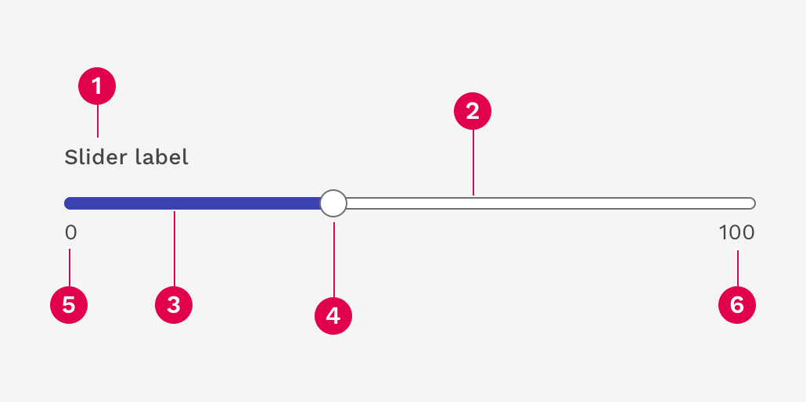
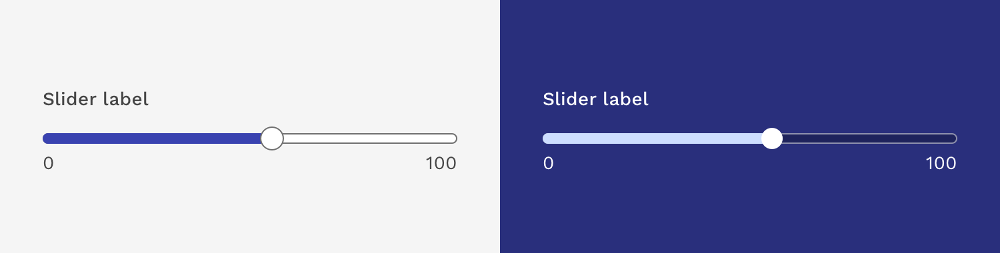
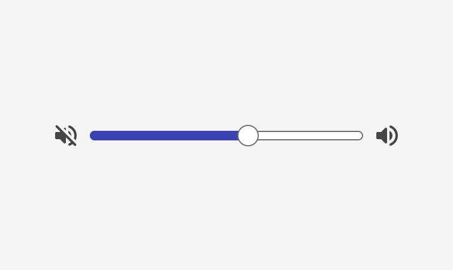
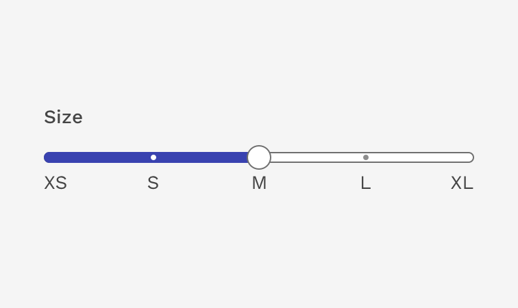
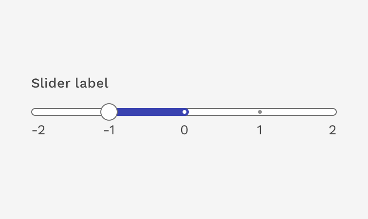
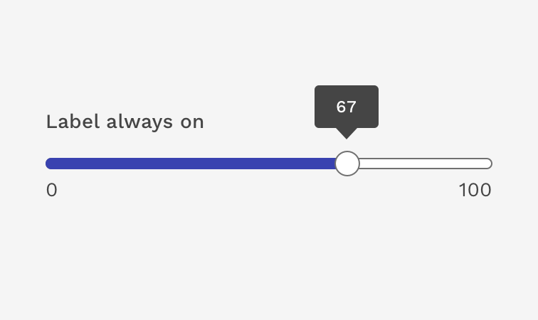
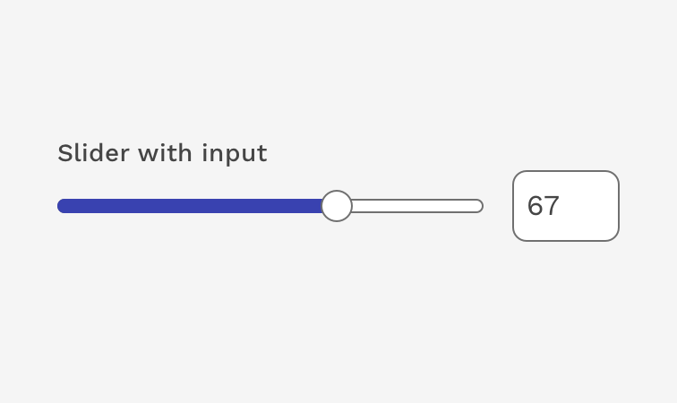
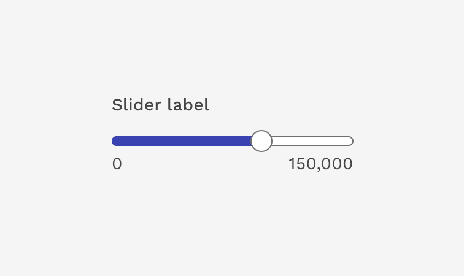
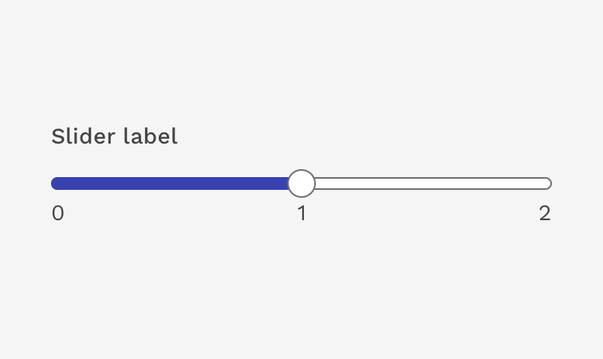

import './design-guidelines-styles.css';
import { DocsHeading } from '../../components/DocsHeading';
import { LeadParagraph } from '../../components/LeadParagraph';

<DocsHeading to="/api/slider/" type="design">
  Slider
</DocsHeading>
<LeadParagraph>
  Sliders allow users to easily adjust a value by sliding a handle along a horizontal track.
</LeadParagraph>

## Overview

A basic slider should be accompanied by a label identifying what value is being adjusted.

The basic slider doesn’t use discrete values, but instead the user increases or decreases the value across a scale of 0 to 100.  It’s not important for the user to know exactly what value they have chosen.  For example, sliding the handle up and down to increase or decrease the volume.

More complex sliders should be used for selecting a specific value within a given range.

---

## Anatomy

1. Label
1. Track
1. Fill
1. Handle
1. Min value (optional)
1. Max value (optional)

---

## Design

The design of the slider starts with the progress bar component as its base, and then adds the necessary functionality on top of that.  The overall goal of the design is to be simple, clear, and accessible.

### Colors

The slider has essentially two options when it comes to color – Light background and dark background.  On light backgrounds, we use the **primary-500** color for the fill, and on dark backgrounds we use **tertiary-500**.  We are intentionally keeping the color options on this component simple and avoiding the use of color to represent any positive or negative emotions.

The colors and borders on the track, handle, and mark labels are optimized for both scenarios for the required color contrast ratios on dark and light backgrounds.

---

## Variations and Options

### Continuous Sliders

Continuous sliders allow users to select a value within a subjective range.  Picture a volume slider where you don't need to know the exact value of the slider, but instead it's more about where the slider is on the track in relation to the bottom and top of the range.

### Discrete Sliders

Discrete sliders use a defined set of steps along the track, which represent values the user may choose.  These can be represented as numerical values or something more descriptive like a range of sizes or difficulty levels. 

You can generate a visible mark for each step so the available options are very clear to the user.

### Default Value

You may set the default selected value of the slider when the page loads.

  

    

      <figure>
        
      </figure>
    

    

      <figure>
        
      </figure>
    

  

### Label Always Visible

You can force the tooltip that appears above the slider handle to always be visible if you don't use visible marks but still want the user to see what value is selected without hovering over or placing focus on the handle.

### Range Sliders

You can select a range within the slider with two handles.

### Sliders with Input Field

You can pair the slider with a text input on the right as a clearer way to display the current value, and it provides an additional method for adjusting the value for better accessibility and ease of use.

---

## Best Practices
- The slider label should indicate what value the slider is changing.
- Avoid using for ranges that are extremely large i.e. 1-1000.
- Do not use for ranges that are too small i.e. 1-3.

  

    

      <figure>
        
        <figcaption>
          
Incorrect

          

            If the range of possible values is too large, it could be difficult for a user to select the exact value they desire.
          

        </figcaption>
      </figure>
    

    

      <figure>
        
        <figcaption>
          
Incorrect

          

            If you only have 2 or 3 possible values to select from, you're probably better off using a different component like a set of radio buttons or a select list.
          

        </figcaption>
      </figure>
    

  

---

## Interactions
Users can choose a numerical value by:
- Dragging the handle the exact desired value
- Entering the exact value into the text field if using.
- Moving the slider handle with their mouse, which automatically updates the value in the text input if using.
- Using the ← → arrow keys moves the slider handle along the track and updates the value in the input if using.
- Using the ↑ ↓ arrow keys in the text input automatically moves the slider handle along the track.
- The step size increment is how many increments the inputted value and slider handle will jump when using the arrow keys. Make sure to set the step size increments to reasonable values.

---

## Accessibility

W3C Accessibility guidelines for the slider component can be found at the following URL: [https://www.w3.org/TR/wai-aria-practices/#slider](https://www.w3.org/TR/wai-aria-practices/#slider)

The component handles most of the work necessary to make it accessible. However, you need to make sure that:

- Each mark has a user-friendly label (aria-label, aria-labelledby or getAriaLabel prop).
- Each thumb has a user-friendly text for its current value. This is not required if the value matches the semantics of the label. You can change the name with the getAriaValueText or aria-valuetext prop.

