import './design-guidelines-styles.css';
import { LeadParagraph } from '../../components/LeadParagraph';

<PageContent componentName="stepper" type="design">

<LeadParagraph>
  A stepper keeps users updated on their progression through a series of steps.
</LeadParagraph>

## Overview

Steppers aid in guiding a user's expectations while navigating through a multistep process. They indicate the current step, the total number of steps, and the overall progress towards task completion.

<figure>
  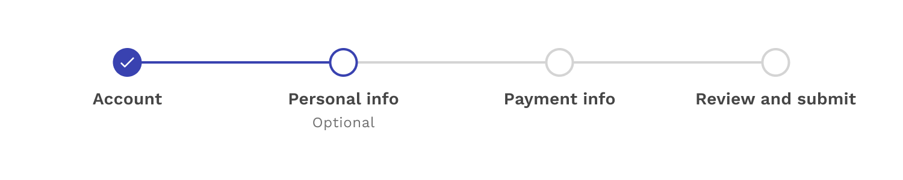
</figure>

### When to use

- When the user is working through a linear process that can be organized into three or more steps. 
- When the user could benefit from understanding their progress on long forms such as eCommerce checkouts, or course creation. 
- When user inputs need to be validated before moving on to the next step. 

### When not to use

- When a process or form has fewer than three steps. 
- When the process can be completed in any sequence. 
- When the quantity of steps can vary depending on conditional logic. 

---

## Formatting

### Anatomy

  

    

      <figure>
        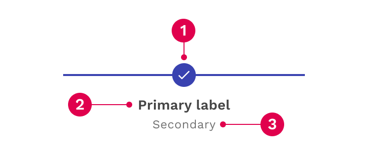
      </figure>
    

    

    

  

 

1. **Status indicator:** Communicates if a step is completed, current, not started, disabled or has an error.

1. **Primary label:** Communicates what the user will accomplish in each step. Numbering each step also makes the progression more obvious.

1. **Secondary label (optional):** Provides space for additional important details or helper text.

### Label Layouts

#### Standard Labels

The default placement of the labels is under each status indicator on the line. This layout benefits from short labels, especially as the number of steps increases.

<figure>
  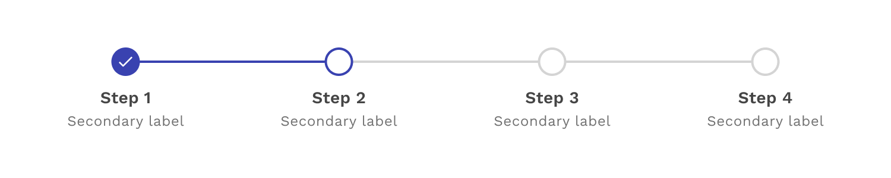
</figure>

#### No Labels

If the nature of the labels would simply be too much text to reasonably fit, then it is acceptable to hide the labels on the stepper component. However, this means having clear titles within the content of the step itself is extremely important. It can be helpful to change to this layout on small screens.

<figure>
  
</figure>

#### Summary View

The step summary layout shows the primary and secondary labels, but only for the step you are currently on. It also tells you what number step you are on, and how many steps there are in total. This layout can be a nice middle-point between showing all labels and not showing labels at all, and you can use it on large or small screens.

<figure>
  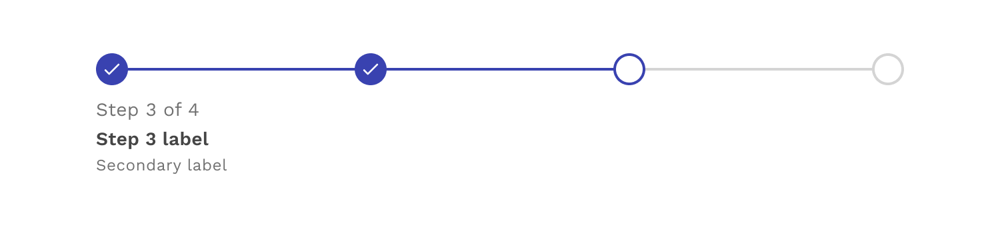
</figure>

### Placement

The stepper component can be placed on a full page, in a modal, or in a side panel.

<figure>
  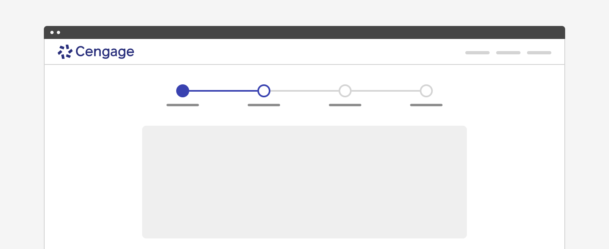
</figure>

<figure>
  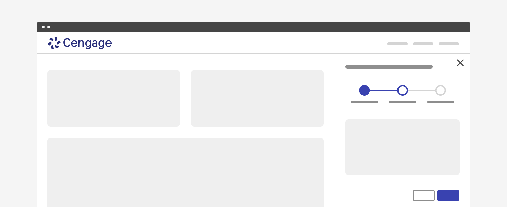
</figure>

<figure>
  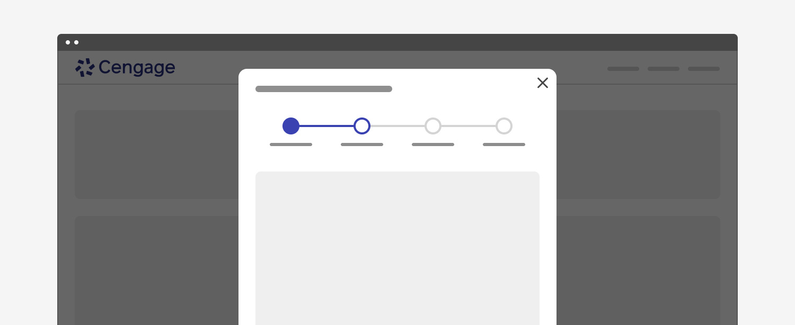
</figure>

---

## Content

### Main Elements 

#### Label

The label should succinctly convey the user's objectives for each step in one or two words. One option is to clearly indicate the action of the step by using the "verb" + "noun" content formula. For example, “Choose date” or “Configure settings.” A label may use one word if it is universally understood, such as “Cart,” “Shipping,” or “Payment.” Avoid vague terms like “Processing.” You may also number each step to make the progression more obvious.

  

    

      <figure>
        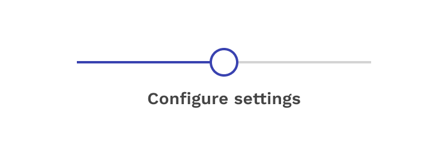
      </figure>
    

    

    

  

#### Secondary Label

Secondary labels are optional and should be used if some additional description or helper text is beneficial.

  

    

      <figure>
        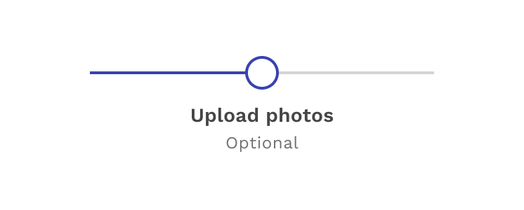
      </figure>
    

    

    

  

### Overflow Content

#### Label and Secondary Label

When there isn’t enough space, the labels will wrap to as many lines as necessary. The space available for a label is impacted by the number of steps in the process and the size of the area the stepper is in. If you don’t want the label to wrap, consider rewording the label or use the “summary view” layout. 

  

    

      <figure>
        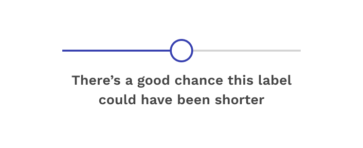
      </figure>
    

    

    

  

---

## Behaviors

### States

Each step within the stepper has four states: completed, active, incomplete, and error.

#### Completed

A step is complete when a user has filled out the required information within a step and progressed to the following step. When possible, use validation to confirm that a step has been completed before the user continues. All steps that have been completed are indicated by an outlined circle with a checkmark and a blue active line.

  

    

      <figure>
        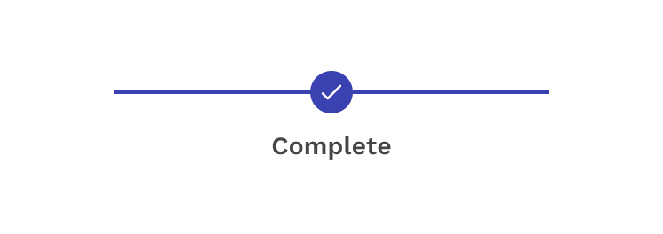
      </figure>
    

    

    

  

#### Active

A step is current when a user is interacting with the information within that step. The current step the user is on is indicated by a half-filled circle and a blue active line.

  

    

      <figure>
        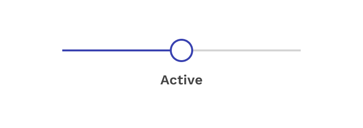
      </figure>
    

    

    

  

#### Incomplete

A step is not started when a user has not yet interacted with that step. Steps the user has not encountered yet, or future steps, are indicated by an outlined circle and a gray active line.

  

    

      <figure>
        
      </figure>
    

    

    

  

#### Error

A step may be in error when a user has entered invalid or incomplete information. There could also be a server-side error. Provide clear information about the error and guidance on how to resolve the issue.

  

    

      <figure>
        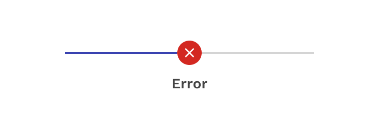
      </figure>
    

    

    

  

### Interactions

Currently, the stepper is not interactive, providing only a visual update of the users’ progress. This type of functionality may be added in the future. As a result, the navigation from step to step must be handled within the content of the step and it is up to the consumer to decide what is best for their application. 

A common example includes buttons labeled as “Next” and “Back”, and often ending with a button labeled “Finish.” But the labels themselves need to make sense for the process being completed, so there isn’t any mandated language to use. You can also choose to not include a “Back” button if you don’t want the user to go back to previous steps. Whatever you do, we suggest conducting usability tests to ensure you have created the best experience possible. 

<figure>
  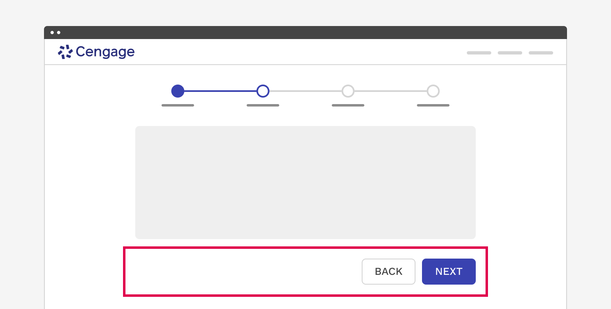
</figure>

### Validation

When possible, use validation to confirm that a step has been completed before the user continues. If any entry is invalid, the stepper should show an error state. Additionally, the invalid entry should be marked with an error state and include an inline error message that helps the user understand the problem and how to fix it. 

If the user cannot proceed due to a server-side issue, then an inline alert should appear. 

<figure>
  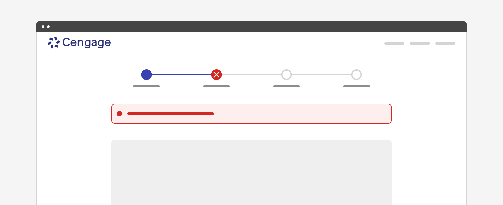
</figure>

### Responsive Behavior

The variable nature of the stepper makes it difficult to mandate just one set of changes or behaviors for small screens. For this reason we allow the consumer to not only pick the break point, but also three choices for what happens to the stepper as the screen gets smaller, or the user zooms in enough to trigger it.

#### Standard Labels 

If you don’t have very many steps and the labels are short, it is very possible for this format to work even on small screens. 

<figure>
  

    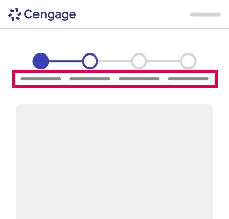
  

</figure> 

#### Hide Labels 

Hiding the labels on small screens is acceptable, but only if you are using very clear titles to make up for their absence. 

<figure>
  

    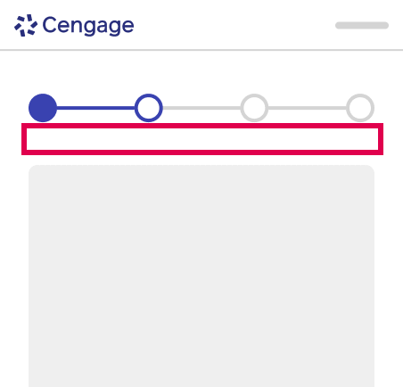
  

</figure>

#### Step Summary 

This may be the most common format for small screens or zooming in. You only display the specific information necessary at that moment, but you aren’t losing the context of what number step you are on, and how many are left. 

<figure>
  

    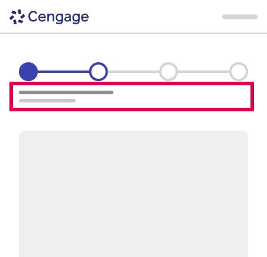
  

</figure>  

---

## Accessibility

- <a href="https://www.w3.org/WAI/tutorials/forms/multi-page/">W3C Web Accessibility Tutorial for Multi-Page Forms</a> provides examples of how to create accessible progress indicators.

**WCAG requirements:**

- Info and Relationships (WCAG Success Criteria <a href="https://www.w3.org/WAI/WCAG21/Understanding/info-and-relationships">1.3.1</a>)
- Meaningful Sequence (WCAG Success Criteria <a href="https://www.w3.org/WAI/WCAG21/Understanding/meaningful-sequence">1.3.2</a>)
- Headings and Labels (WCAG Success Criteria <a href="https://www.w3.org/WAI/WCAG21/Understanding/headings-and-labels">2.4.6</a>)
- Name, Role, Value (WCAG Success Criteria <a href="https://www.w3.org/TR/UNDERSTANDING-WCAG20/ensure-compat-rsv.html">4.1.2</a>)

</PageContent>
