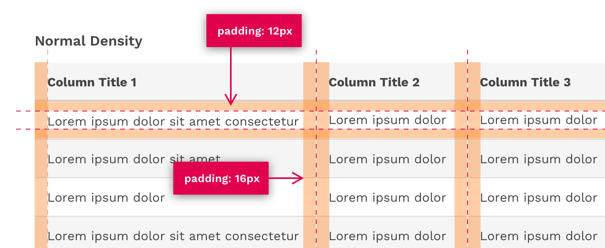
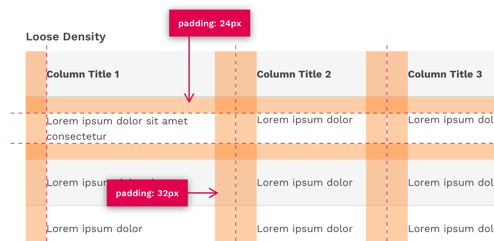
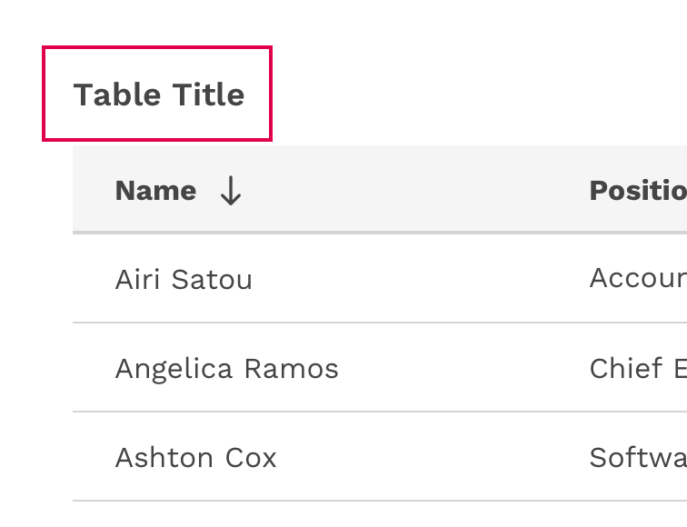
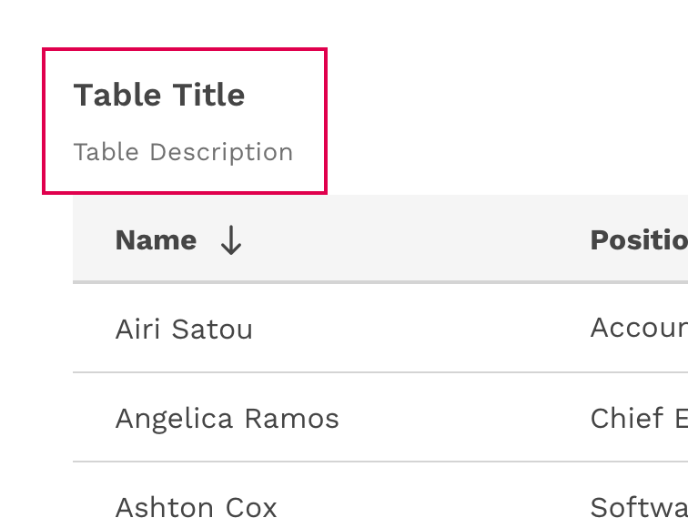
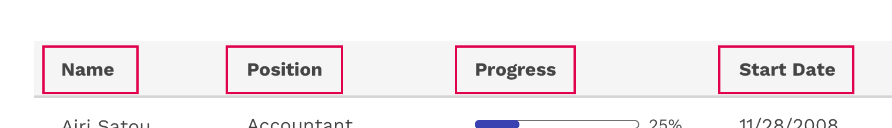
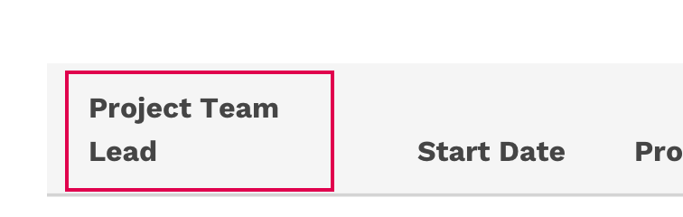
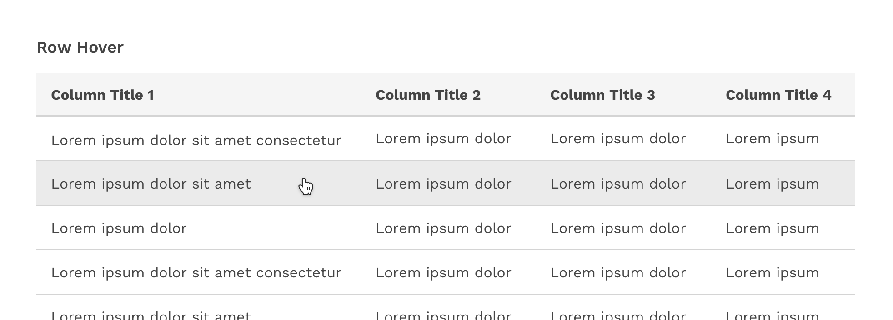
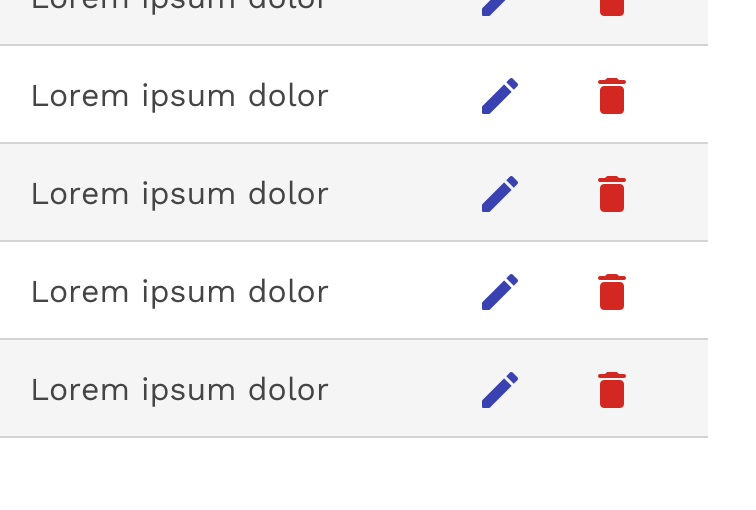

import './design-guidelines-styles.css';

<PageContent componentName="table" type="design">

<LeadParagraph>
  Tables are used to organize and display data efficiently. The table component
  allows for customization with additional functionality, as needed by your
  product’s users.
</LeadParagraph>

## Usage

Tables display information in a grid-like format of rows and columns. They organize information in a way that’s easy to scan so that users can look for patterns and develop insights from data.

**Tables can contain:**

- Interactive components (such as inputs, buttons, or menus)
- Non-interactive elements (such as badges)
- Tools to query and manipulate data

### When to use

- To organize and display data.
- If your user must navigate to a specific piece of data to complete a task.

### When not to use

- When a more complex display of the data or interactions are required.
- As a replacement for a spreadsheet application.

---

## Anatomy

<figure>
  
</figure>

1. Table title
1. Table header
1. Table rows

---

## Sizing

Tables come in three different sizes or densities: compact, normal, and loose. This is applied to the entire table and not just a specific row or cell.

<figure>
  
</figure>

### Compact Density

The compact density can be useful for tables with a relatively large number of columns and rows by allowing you to simply fit more on the screen at once.

<figure>
  
</figure>

### Normal Density

The default padding of tables is optimized for a nice balance between compact and loose densities.

<figure>
  
</figure>

### Loose Density

The loose density can be useful if you have a relatively small amount of data and if the user would benefit from the table having more white-space within it.

<figure>
  
</figure>

---

## Content

### Table Title and Description

- The table title should make it clear to the user what the data is and what purpose it serves in the UI.
- A description can be added under the title to provide more information about the data or its source.

  

    

      <figure>
        
      </figure>
    

    

      <figure>
        
      </figure>
    

  

### Column Titles

- Column titles should stick to one or two words that describe the data in that column.
- In cases where a column title is too long, the text will wrap to two lines.

<figure>
  
</figure>

  

    

      <figure>
        
        <figcaption>
          
Incorrect

          
Don't truncate column titles.

        </figcaption>
      </figure>
    

    

      <figure>
        
        <figcaption>
          
Correct

          
Let long column titles wrap naturally.

        </figcaption>
      </figure>
    

  

### Table Cells

- Table cells can contain just about any kind of content: Text, numbers, images, buttons, inputs, and more.
- The content within a cell should be left or right aligned. Using center-alignment could make it difficult for a user to scan the column of data.
- Columns of numbers should typically be right-aligned for better scanning.

---

## Behavior

### Striped Rows

Striped rows (zebra striping) is an optional styling you may apply to your table. This can make data-heavy tables easier for your user to read, as the stripes help guide the eye across the table and then back to the next row.

<figure>
  
</figure>

### Hover

The table’s row hover state can help your user visually scan the columns of data in a row even if the row is not interactive. This feature is optional and is easily enabled for any table, and may be used in combination with striped rows.

<figure>
  
</figure>

### Sorting

Columns can be sorted in ascending or descending order. Sorting controls are located in the column headers and indicated with an arrow icon to the right of the label.

A sorted table has three states: unsorted (sort-double-arrow), sorted-up (arrow-upward) or sorted-down (arrow-downward). The icon indicates the current sorted state. All sortable columns display an arrow icon, but only one can be actively sorted at a time.

<figure>
  
</figure>

### Inline Actions

Inline actions are functions that may be performed on a specific table row. In order to save space, inline actions can be condensed under a single overflow menu.

  

    

      <figure>
        
      </figure>
    

    

      <figure>
        
      </figure>
    

  

</PageContent>
