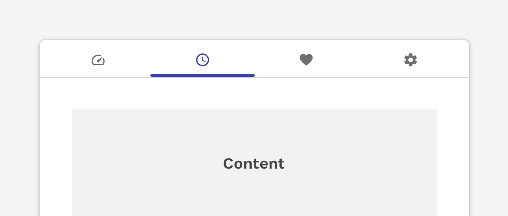
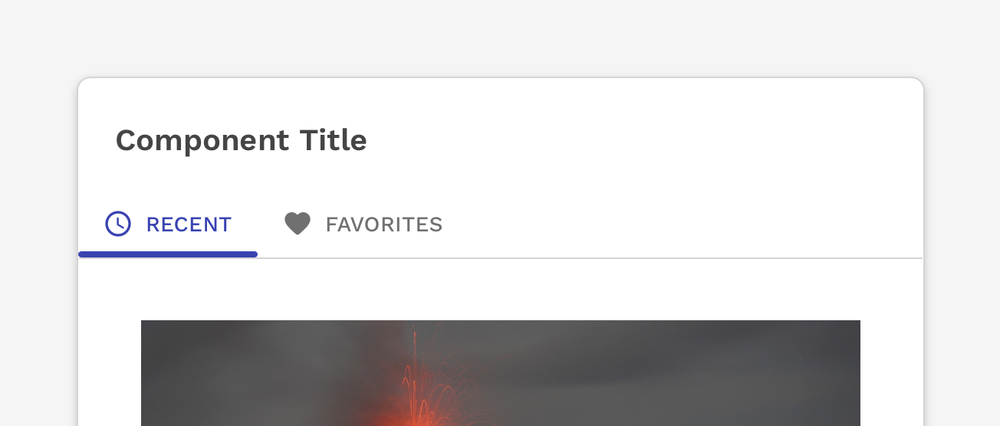
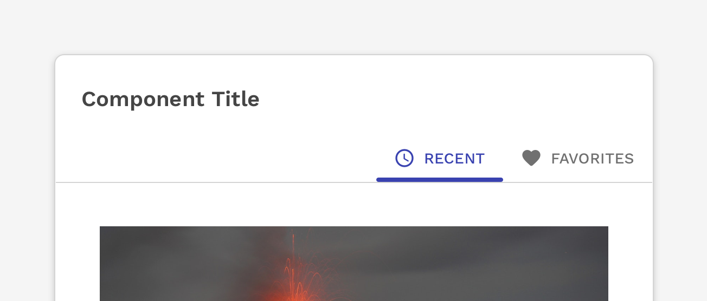
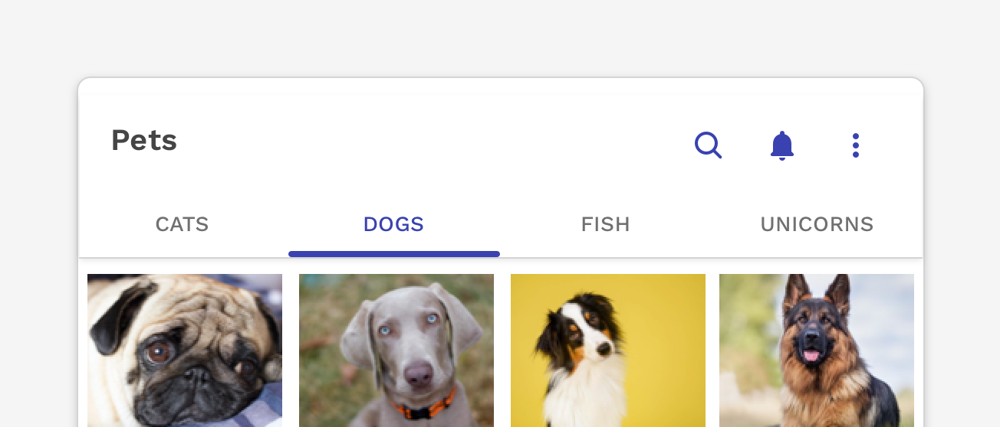

import { Link } from 'gatsby';
import { DocsHeading } from '../../components/DocsHeading';
import './design-guidelines-styles.css';
import { LeadParagraph } from '../../components/LeadParagraph';
import { Button } from 'react-magma-dom';

<DocsHeading to="/api/tabs/" type="design">
  Tabs
</DocsHeading>

<LeadParagraph>
  Tabs allow navigation between different sets of related content or can be used
  to navigate an entire application.
</LeadParagraph>

---

## Anatomy

<figure>
  
</figure>

1. Tab
1. Active Tab Icon
1. Active Tab Label
1. Active Tab Indicator
1. Inactive Tab Icon
1. Inactive Tab Label

### Text Label

Text labels should clearly and succinctly describe the content they represent. Tabs have a max-width of 250px by default, and long labels will wrap, but this obviously has a drastic impact on the presentation so we should take great care with the words we choose.

  

    

      <figure>
        
        <figcaption>
          
Caution

          

            Be careful how much text you use in your tab labels. The text will
            wrap, but it has a drastic impact on the presentation of your tabs.
          

        </figcaption>
      </figure>
    

    

      <figure>
        
        <figcaption>
          
Incorrect

          

            Do not resize the text on a tab to make it fit on a single line.
          

        </figcaption>
      </figure>
    

  

  

    

      <figure>
        
        <figcaption>
          
Incorrect

          

            Do not truncate text on a tab to make it fit on a single line. This
            could make it difficult to understand the true intent of the tab.
          

        </figcaption>
      </figure>
    

    

      <figure>
        
        <figcaption>
          
Incorrect

          

            Do not mix icon-only tabs with text-only tabs. All tabs in a group
            should use the same type of tab consistently.
          

        </figcaption>
      </figure>
    

  

### Icons

Icons can be very helpful in helping identify the type or context of the content the tabs represent.

#### Icon + Text Label

Icons can be placed to the left of the label or on top of the label, depending on the desired outcome or constraints of the layout. The added space required by the icon requires even greater effort to make the text label as short as possible.

<figure>
  
  <figcaption>
    

      Icons and text labels can be used together to help communicate what the
      content is.
    

  </figcaption>
</figure>

<figure>
  
  <figcaption>
    

      Icons can be stacked on top of the label which saves horizontal space, but
      also increases the vertical footprint.
    

  </figcaption>
</figure>

#### Icon Only

Icon-only tabs can be very useful for communicating the content they represent, especially in small areas or on small devices.

<figure>
  
  <figcaption>
    
Caution

    

      Icons used on their own should only be done if testing proves that the
      icons being used are clear and easy to understand or learn quickly.
    

  </figcaption>
</figure>

### Active Tab Indicator

The active tab indicator helps make it very clear which tab is currently selected.

  

    

      <figure>
        
        <figcaption>
          
Correct

          
The indicator appears on the bottom of the tab by default.

        </figcaption>
      </figure>
    

    

      <figure>
        
        <figcaption>
          
Caution

          

            Displaying tabs below their associated content panel is most
            commonly used for navigation that appears at the bottom of the
            viewport on mobile devices. Using this same pattern for a simple set
            of tabbed content on a page could be unfamiliar and confusing to the
            user, and should not be used without proper user-testing.
          

        </figcaption>
      </figure>
    

  

---

## States

<figure>
  
</figure>

1. Inactive
1. Active
1. Disabled
1. Hover
1. Focus

---

## Placement

Tabs are displayed in a single row or column, with each tab connected to the content they represent. Tabs can be attached to headers, main content areas, side panels, and nestled into cards.

<figure>
  
  <figcaption>
    
Example of tabs in the header of a panel.

  </figcaption>
</figure>

<figure>
  
  <figcaption>
    
Example of tabs in a column.

  </figcaption>
</figure>

  

    

      <figure>
        
        <figcaption>
          
Incorrect

          
Don't nest tabs to create multiple levels.

        </figcaption>
      </figure>
    

    

      <figure>
        
        <figcaption>
          
Incorrect

          
Don't stack tabs meant to be horizontal on top of each other.

        </figcaption>
      </figure>
    

  

---

## Tab Layout

### Auto-Width Tabs

The default width of a tab is undefined and is determined by the content within the tab plus 20px of padding on either side. There is, however, a max-width of 250px which could cause the text within a tab to wrap to multiple lines.

#### Alignment

Auto-width tabs can be left-aligned, right-aligned, or centered.

<figure>
  
  <figcaption>
    
By default, auto-width tabs are left aligned.

  </figcaption>
</figure>

<figure>
  
  <figcaption>
    
You may also right-align the tabs with the content below or above.

  </figcaption>
</figure>

<figure>
  
  <figcaption>
    
On wider layouts, centering the tabs may work well.

  </figcaption>
</figure>

#### Scrolling Horizontal Tabs

The tab container for auto-width tabs will automatically scroll if the container becomes too small to show all the tabs. Buttons to scroll left and right will automatically be added, but users with touch-based devices will also be able to drag the tab container left and right.

<figure>
  
  <figcaption>
    

      If there are more tabs to see beyond the edge of the container, you will
      see an arrow appear at the right side of the tabs container.
    

  </figcaption>
</figure>

### Full-Width Tabs

Full-width tabs can be calculated by the width of the container divided by the number of tabs. Full-width tabs should only be used if you can guarantee that all tabs will be visible without truncation regardless of the size of the container.

<figure>
  
  <figcaption>
    
Simple example of full-width tabs, each tab being of equal width.

  </figcaption>
</figure>

<figure>
  
  <figcaption>
    
Caution

    

      Be careful with how the content aligns with the tabs themselves. In this
      example, the alignment could cause users to misunderstand what the tabs
      represent.
    

  </figcaption>
</figure>

### Vertical Tabs

Tabs may also be placed to the left of their corresponding content in a vertical layout.

**NOTE:** There isn’t any default Responsive behavior for when the content area gets too narrow to display the tabs next to the content. You are encouraged to reuse solutions from other instances of vertical tabs. In the event no solution exists that will work in your scenario, a new solution will have to be designed.

<figure>
  
  <figcaption>
    
Simple example of vertical tabs on the left side of the content.

  </figcaption>
</figure>

#### Scrolling Vertical Tabs

Vertical tabs will also automatically scroll when the height of their container is too small to display all of the tabs.

<figure>
  
  <figcaption>
    

      If there are more tabs to see beyond the bottom of the container, you will
      see an arrow appear at the bottom of the tabs container.
    

  </figcaption>
</figure>

---

## Inverse Styling

The tabs have inverse styling available for use on dark backgrounds. Take care with the color you choose for the background to make sure the necessary contrast ratios are upheld for accessibility compliance.

<figure>
  
  <figcaption>
    
Example of tabs on a dark blue background.

  </figcaption>
</figure>
