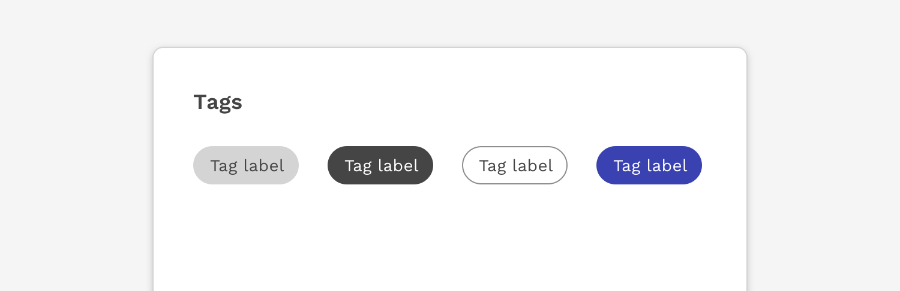
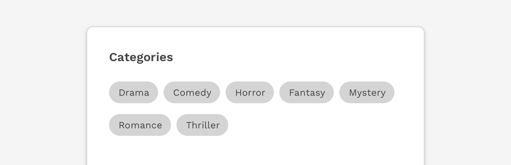
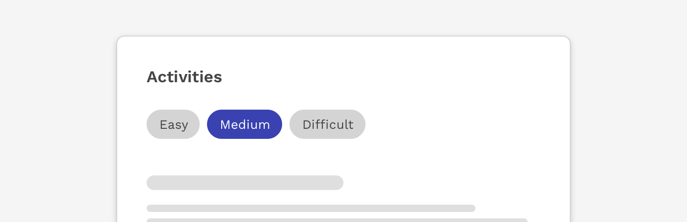
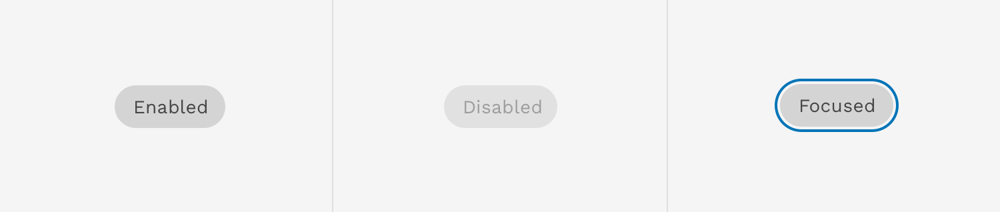
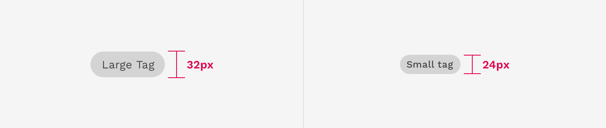
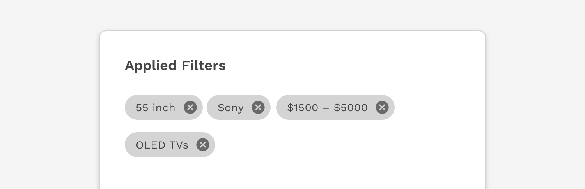

import './design-guidelines-styles.css';
import { DocsHeading } from '../../components/DocsHeading';
import { LeadParagraph } from '../../components/LeadParagraph';

<PageContent componentName="tag" type="design">

<LeadParagraph>
  Use tags to label, categorize, or organize items using keywords that describe them.
</LeadParagraph>

## Usage

Multiple or single tags can be used to categorize items.

Use short labels for easy scanning. Use two or more words only if necessary.

### When to use

#### Categories

Use tags when content belongs to multiple categories, and the user needs a way to differentiate between them.

#### Filters

Tags can also be used as a method of filtering data, to show only items within that particular category.

---

## Styles

### Default

The default is medium contrast and has a totally neutral context.  This should be used by default unless there’s a specific use case.

### High Contrast

This variant is for if you need higher contrast than the default.

### Low Contrast

This variant provides lower contrast or weight on light backgrounds.

### Primary

This variant can be used for appearing more “active” than the default, but still has a neutral context.  It is referred to as “primary” not because it is the style that should be used by default, but instead because it uses the primary brand color from the color palette.

### Success & Danger

These variants should be used only when it's helpful to communicate a positive or negative context.  They communicate these meanings using color alone so for optimal accessibility they should not be relied on to communciate anything critical to the user's use or understanding of a function.

---

## States

In addition to a tag’s default state, a tag may also display the following states.

### Focused

When a tag can be interacted with, it may receive focus and therefore will display the same focus state used on other components.

### Disabled

Interactive tags may be disabled to make it clear they can not be interacted with at that time.

---

## Sizes

Tags have two sizes available.  The default size is designed to fit most scenarios and a smaller size can be used for scenarios where space is limited for the number of tags that need to be displayed.

---

## Tags With Icons

A leading icon may be added to the tag.  This can help clarify the meaning of a tag or what it represents.

 

---

## Dismissable Tags

Tags can include a close button on the right side.  Using this close button completely removes it from the UI.  This can be especially useful for something like search filters.  In this scenario, a tag could be used when applying a filter to a list of search results, and then dismissing the tag removes the filter.

</PageContent>