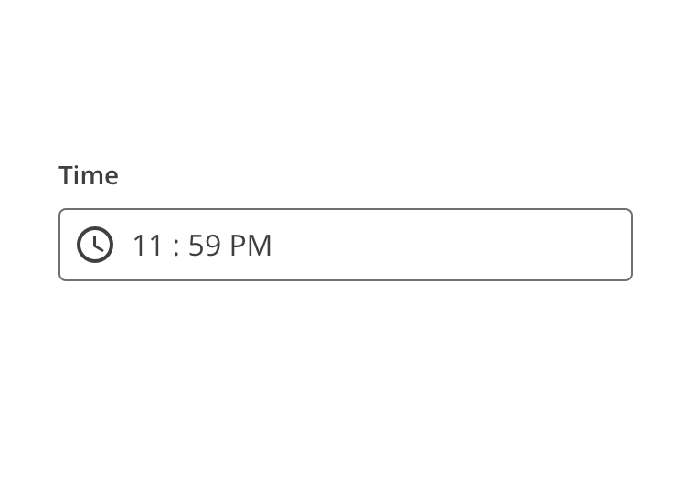
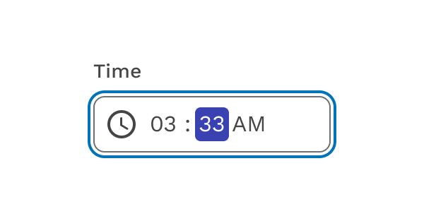

import { LeadParagraph } from '../../components/LeadParagraph';
import { Link } from 'gatsby';

<PageContent componentName="time_picker" type="design">

<LeadParagraph>
  Capture time from the user
</LeadParagraph>

## Usage

The Time input gives the user the ability to input a time in a format the developer can control.

<figure>
  

    
  

</figure>

## Keyboard controls

You can tab into the Time input to individually manipulate the hours, minutes, and AM/PM indicator. Use the up and down arrows to change their values.

<figure>
  

    
  

</figure>

</PageContent>
