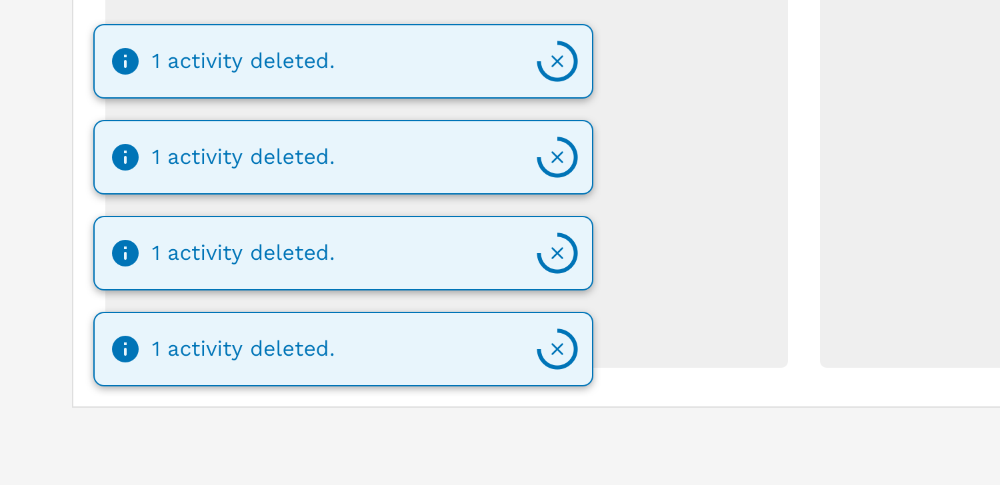
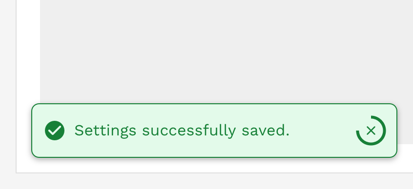

import './design-guidelines-styles.css';

<PageContent componentName="toast" type="design">

<LeadParagraph>
  Toasts are lightweight notifications designed to mimic the push notifications
  that have been popularized by mobile and desktop operating systems.
</LeadParagraph>

## Usage

Toasts are the least intrusive of the three types of alerts and are used primarily for communicating non-critical information to the user. Toasts appear in the lower-left corner of the viewport.

<figure>
  
</figure>

---

## Anatomy

The basic anatomy of the alert is the same across all three types (banner, inline, toast).

<figure>
  
</figure>

1. Container
1. Message
1. Icon (automatically changes depending on the alert variant)
1. Close button (optional)
1. Dismissal timer (only available on toasts)

---

## Stacking

If multiple toasts are triggered, they will automatically stack vertically. When at all possible, try to group batch-like actions into a single toast instead of triggering multiple alerts.

<figure>
  
  <figcaption>
    
Incorrect

    

      Do not trigger multiple toasts when a single action processes multiple
      identical results
    

  </figcaption>
</figure>
<figure>
  
  <figcaption>
    
Correct

    
Combine the results from a single action into a single toast alert.

  </figcaption>
</figure>

---

## Auto-Dismiss

Because toasts are intended to be the least disruptive type of alert, you can generally allow them to dismiss themselves automatically. A timer will be displayed showing the user how long they have unless they dismiss it manually before the timer runs out. The default duration of a toast is 5 seconds (5000 milliseconds), but this may be easily extended for longer or more complex messages.

Avoid displaying errors or warnings with toasts, but if you have to, then these should not auto-dismiss. Errors and warnings are generally considered critical, and you don't want the user to miss the notification. The user has to manually dismiss these messages when they are ready, or when the issue is resolved.

  

    

      <figure>
        
        <figcaption>
          
Correct

          

            Toasts displaying error messages or warnings should only be manually
            dismissible.
          

        </figcaption>
      </figure>
    

    

      <figure>
        
        <figcaption>
          
Correct

          

            Toasts displaying general information or success messages may be set
            to auto-dismiss.
          

        </figcaption>
      </figure>
    

  

---

## Content Considerations

Unlike the other alert types, toasts will not grow vertically to accommodate long messages. They are set at a specific height, and the message is allowed to wrap to a second line without issue. The text will continue to wrap beyond 2 lines, but you will start seeing the text spill out of the toast and that is expected.

Take the following guidelines into consideration when crafting your message:

- Limit your message to approximately 80 characters or less to ensure your message fits when the toast is at its smallest on mobile devices.
- The character limit may need to be less than 80 characters if you also include a link or action button.
- If you require a longer message, then consider using a different alert type.

---

## Responsive Behavior

When the viewport is 600px wide and smaller, we automatically reduce the icon and font size to optimize the amount of space given to the message and optional links or buttons in the alert. The toast will also automatically stretch to 100% of the viewport width with spacing around it.

<figure>
  
</figure>

---

## Accessibility

(WAI-ARIA: <a href="https://www.w3.org/WAI/ARIA/apg/patterns/alert/">https://www.w3.org/WAI/ARIA/apg/patterns/alert/</a>)

Alerts have a number of measures built into them to improve accessibility. Starting with the colors, we make sure that text always has at least a 4.5:1 contrast ratio with the background color. All of the alerts can be navigated with a keyboard or screen reader.

</PageContent>
