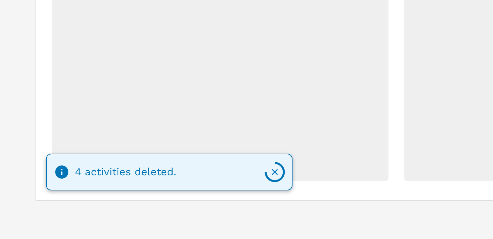
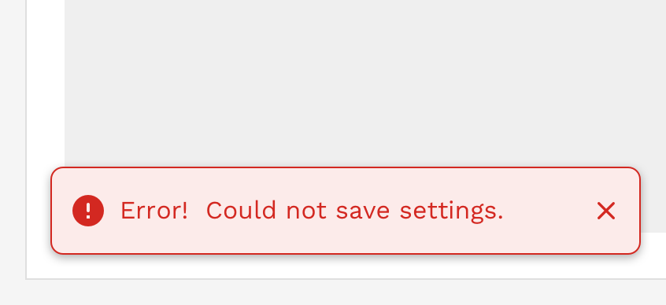

import { Link } from 'gatsby';
import './design-guidelines-styles.css';
import { LeadParagraph } from '../../components/LeadParagraph';

<PageContent componentName="toast" type="design">

<LeadParagraph>
  Toasts are the least intrusive of the three types of alers and are used
  primarily for communicating non-critical information to the user. Toasts
  appear in the lower-left corner of the viewport. They are always triggered by
  the action of a user, such as when they add or delete something, and shouldn't
  require additional actions from the user.
</LeadParagraph>

## Usage

Use alerts to inform users of updates, changes to system status, or as feedback to an action they have taken. Proactively communicating with users and providing immediate feedback is important for building trust and maintaining a constant awareness of the system status. While alerts are an effective method of communicating with users, they have the potential to be disruptive and should be used with care.

<figure>
  
</figure>

If multiple toasts are triggered, they will automatically stack vertically. When at all possible, try to group batch-like actions into a single toast instead of triggering multiple alerts.

<figure>
  
  <figcaption>
    
Incorrect

    

      Do not trigger multiple toasts when a single action processes multiple
      identical results
    

  </figcaption>
</figure>
<figure>
  
  <figcaption>
    
Correct

    
Combine the results from a single action into a single toast alert.

  </figcaption>
</figure>

#### Auto-Dismiss

Because toasts are intended to be the least disruptive type of alert, you can generally allow them to dismiss themselves automatically. A timer will be displayed showing the user how long they have unless they dismiss it manually before the timer runs out. The default duration of a toast is 5 seconds (5000 milliseconds), but this may be easily extended for longer or more complex messages.

Avoid displaying errors or warnings with toasts, but if you have to, then these should not auto-dismiss. Errors and warnings are generally considered critical, and you don't want the user to miss the notification. The user has to manually dismiss these messages when they are ready, or when the issue is resolved.

  

    

      <figure>
        
        <figcaption>
          
Correct

          

            Toasts displaying error messages or warnings should only be manually
            dismissable.
          

        </figcaption>
      </figure>
    

    

      <figure>
        
        <figcaption>
          
Correct

          

            Toasts displaying general information or success messages may be set
            to auto-dismiss.
          

        </figcaption>
      </figure>
    

  

#### Content Considerations

Unlike the other alert types, toasts will not grow vertically to accommodate long messages. They are set at a specific height, and the message is allowed to wrap to a second line without issue. The text will continue to wrap beyond 2 lines, but you will start seeing the text spill out of the toast and that is expected.

Take the following guidelines into consideration when crafting your message:

- Limit your message to approximately 80 characters or less to ensure your message fits when the toast is at its smallest on mobile devices.
- The character limit may need to be less than 80 characters if you also include a link or action button.
- If you require a longer message, then consider using a different alert type.

#### Responsive Behavior

When the viewport is 600px wide and smaller, we automatically hide the icon and reduce the font size to optimize the amount of space given to the message and optional links or buttons in the alert. The toast will also automatically stretch to 100% of the viewport width with spacing around it.

<figure>
  
</figure>

</PageContent>
