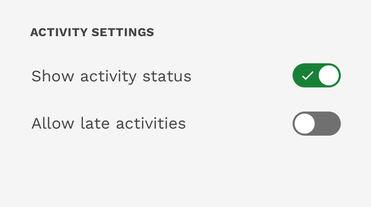
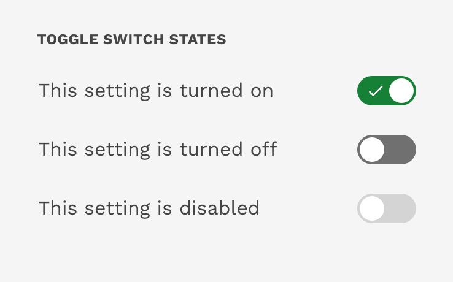

import './design-guidelines-styles.css';

<PageContent componentName="toggle" type="design">

<LeadParagraph>
  Toggle switches toggle the state of a single setting on or off.
</LeadParagraph>

## Usage

Toggle switches are a great way to adjust settings when you are simply turning something on and off. The option that the switch controls, as well as the state it is in, should be made clear from the corresponding inline label.

<figure>
  

    
  

  <figcaption>
    
Toggle switches

  </figcaption>
</figure>

## States

Toggles can be on, off, or disabled.

<figure>
  

    
  

  <figcaption>
    
Toggle switch states

  </figcaption>
</figure>

</PageContent>
